## Results:

### MNIST:

#### LeNet-4:

| Activation Function  | Accuracy (20*) |  Loss (20*) | GPU-Utilization (20*) |CPU-RAM Utilization** (20*)| Training Time (20*) | Inference Time (20*)| Top 5 Accuracy (20*) | Top 3 Accuracy (20*)|
| ------------- | ------------- | ---|---|---|---|---|---|---|
| ReLU  | **98.65%**  |**0.368%**|5%|**11.4GB**|**51.67 seconds**|**0.197 seconds**|**100%**|**99.94%**|
| Swish-1  | 98.42%  |0.385%|5%|**11.4GB**|65.11 seconds|0.2157 seconds|99.99%|99.9%|
| Mish  | 98.64%  |**0.368%**|5%|11.2GB|81.12 seconds|0.2967 seconds|**100%**|**99.94%**|

<em> *The number indicates the Number of Epochs
</em> 
<em> **This shows the amount of RAM Free.
</em> 

### SVHN: 

|Activation Function| Top-1 Accuracy|Loss| Top-3 Accuracy| Top-5 Accuracy| 
|---|---|---|---|---|
|Mish|89.639%|4.77854%|97.0497%|98.686%|
|Swish-1|90.56%|4.2518%|97.257%|98.759%|
|ReLU|**91.913%**|**4.21139%**|**97.6989%**|**98.935%**|

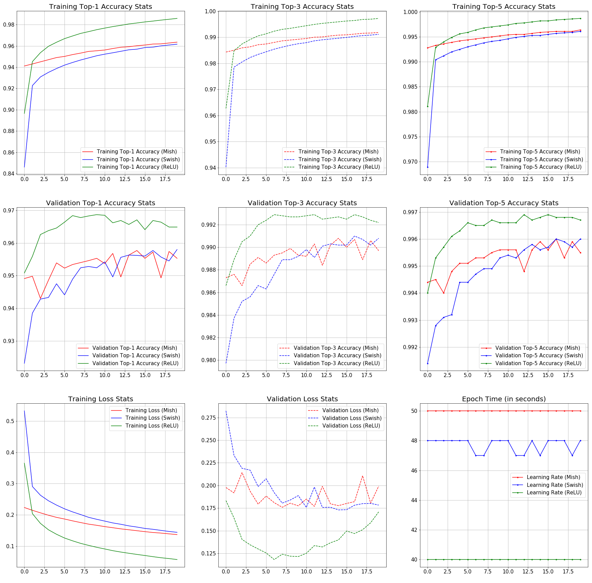

 

### K-MNIST:

|Activation Function| Top-1 Accuracy|
|---|---|
|Mish|95.41%|
|Swish-1|**95.78%**|
|ReLU|95.74%|

Samples obtained during inference of a Custom CNN using Mish:

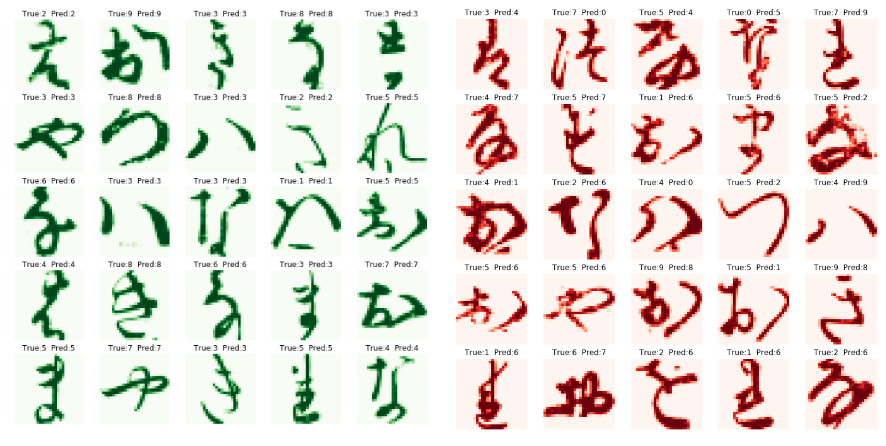

 

Mish Training Graph:

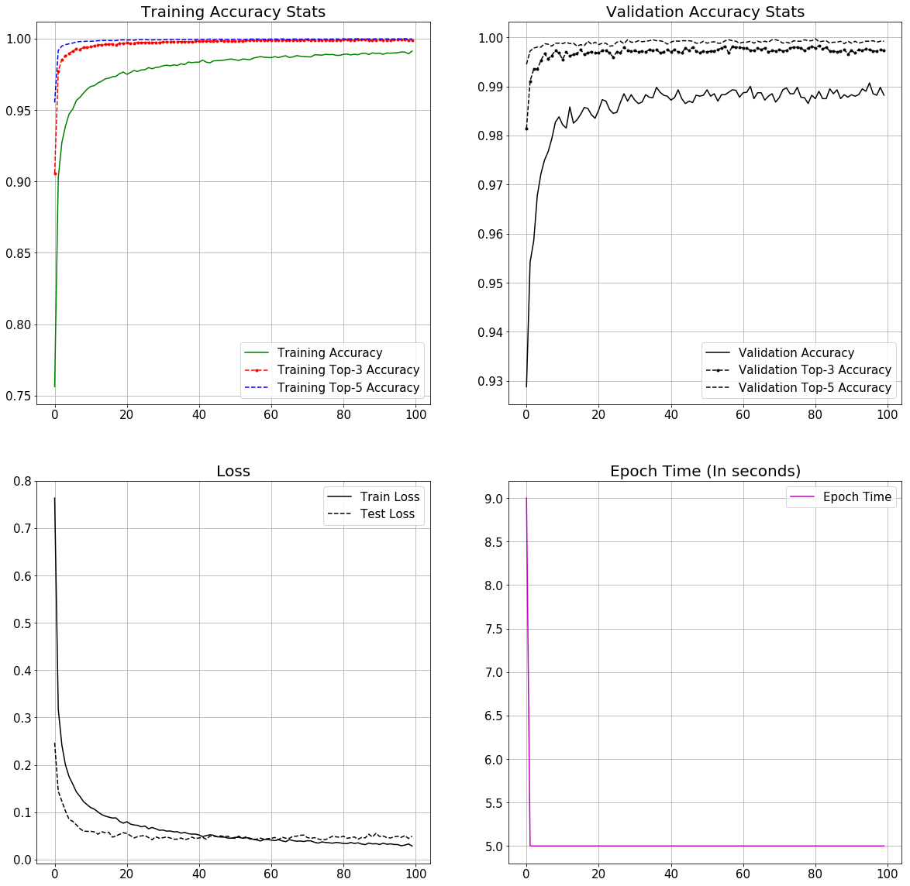

 

### Fashion-MNIST:

#### Mini VGG-Net:

| Activation Function  | Accuracy (25*) |  Loss (25*) | GPU-Utilization (5*) |CPU-RAM Utilization** (5*)| Training Time (5*) | Inference Time (5*)|
| ------------- | ------------- | ---|---|---|---|---|
| ReLU  | 93.19%  |1.895%|33%|**10.1GB**|**261.88 seconds**|**3.51 seconds**|
| Swish-1  | 93.09%  |1.935%|33%|**10.1GB**|271.13 seconds|3.53 seconds|
| Mish  | **93.31%**|**1.859%**|33%|10GB|294.85 seconds|3.78 seconds|

<em> *The number indicates the Number of Epochs
</em> 
<em> **This shows the amount of RAM Free.
</em> 

The evaluation metrics for the Mini-VGG Network with Mish Activation Function is given below: 

| Class Labels  | Precision |  Recall | F1-Score |
| ------------- | ------------- | ---|---|
| top  | 0.90  |0.87|0.88|
| trouser  | 0.99 |0.98|0.99|
| pullover  | 0.93|0.89|0.91|
| dress  | 0.93 |0.94|0.93|
| coat | 0.88  |0.93|0.90|
| sandal | 0.99|0.99|0.99|
| shirt  | 0.79 |0.80|0.80|
| sneaker  | 0.96 |0.98|0.97|
| bag  | 0.99  |0.99|0.99|
| ankle-boot  | 0.98  |0.97|0.97|
| **Average** | **Precision** |**Recall** |**F1-Score**|
| micro average  | 0.93  |0.93|0.93|
| macro average  | 0.93  |0.93|0.93|
| weighted average  | 0.93  |0.93|0.93|

### Iris:

| Activation Function  | Accuracy (4000*) |  Loss (4000*) |
| ------------- | ------------- | ---|
| ReLU  | 96.67%  |2.84%|
| Swish-1  | 97.33%  |**2.32%**|
| Mish  | **98%**|2.66%|

<em> *The number indicates the Number of Epochs
</em> 

### CIFAR-10:

#### ResNet v1:

##### ResNet-20:

|Activation Function| Top-1 Accuracy| Loss|
|---|---|---|
|Mish|91.81%|4.47284%|
|Swish-1|**91.95%**|**4.440651%**|
|ReLU|91.5%|4.94356%|

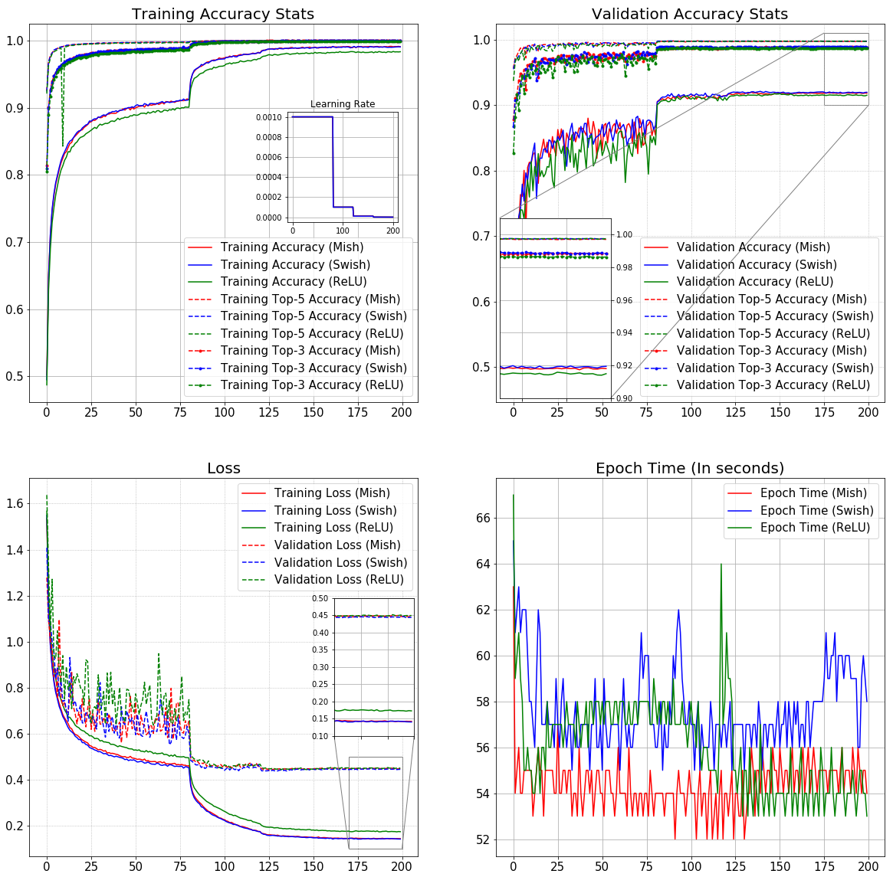

 

##### ResNet-32: 

|Activation Function| Top-1 Accuracy| Loss|
|---|---|---|
|Mish|92.29%|4.3543639%|
|Swish-1|**92.3%**|**4.31110565%**|
|ReLU|91.78%|4.51267568%|

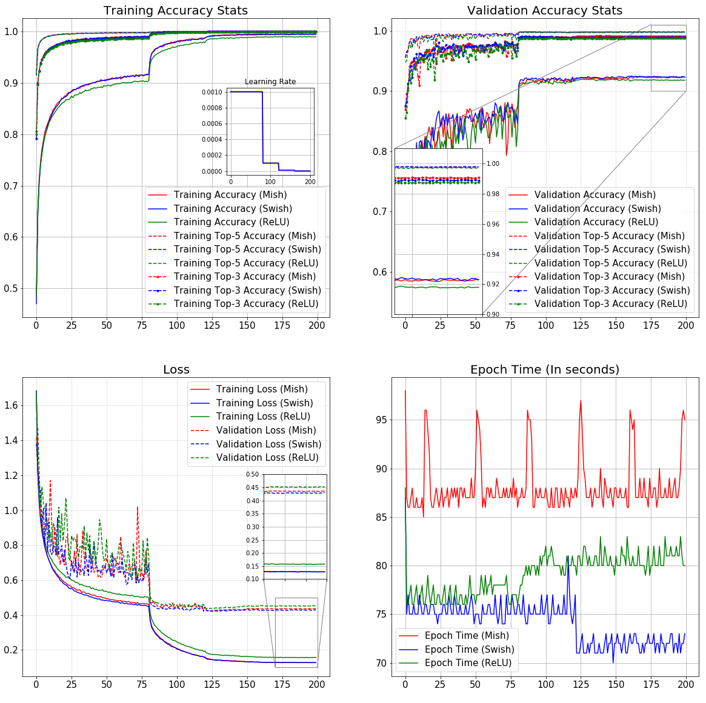

 

##### ResNet-44:

|Activation Function| Top-1 Accuracy|Loss| Top-3 Accuracy| Top-5 Accuracy| 
|---|---|---|---|---|
|Mish|92.46%|4.4195%|**99%**|**99.82%**|
|Swish-1|**92.84%**|**4.1272%**|98.96%|**99.82%**|
|ReLU|92.33%|4.30961%|98.89%|99.73%|

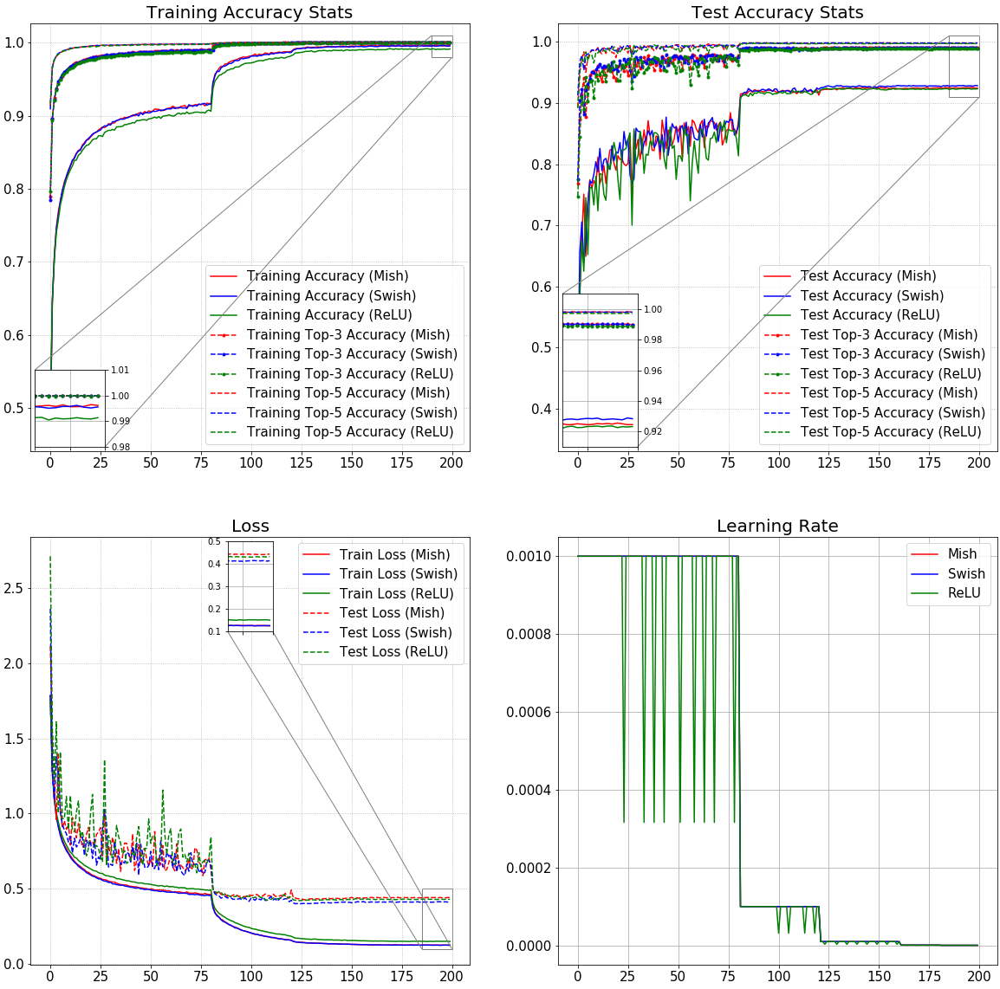

 

##### ResNet-56:

|Activation Function| Top-1 Accuracy|Loss| Top-3 Accuracy| Top-5 Accuracy| 
|---|---|---|---|---|
|Mish|**92.21%**|4.3387%|**99.09%**|**99.85%**|
|Swish-1|91.85%|**4.33817%**|98.92%|**99.85%**|
|ReLU|91.97%|4.34036%|98.91%|99.74%|
|ELU(α=1.0)|91.48%|4.39%|98.88%|99.78%|
|SELU|90.41%|4.56946%|98.8%|99.75%|

##### ResNet-110:

|Activation Function| Top-1 Accuracy| Loss|Top-3 Accuracy| Top-5 Accuracy| 
|---|---|---|---|---|
|Mish|91.44%|4.672%|98.75%|99.6%|
|Swish-1|91.34%|4.7418%|98.86%|99.76%|
|ReLU|**91.69%**|4.4194%|98.9%|**99.77%**|
|ELU(α=1.0)|91.66%|**4.171%**|**98.92%**|99.67%|

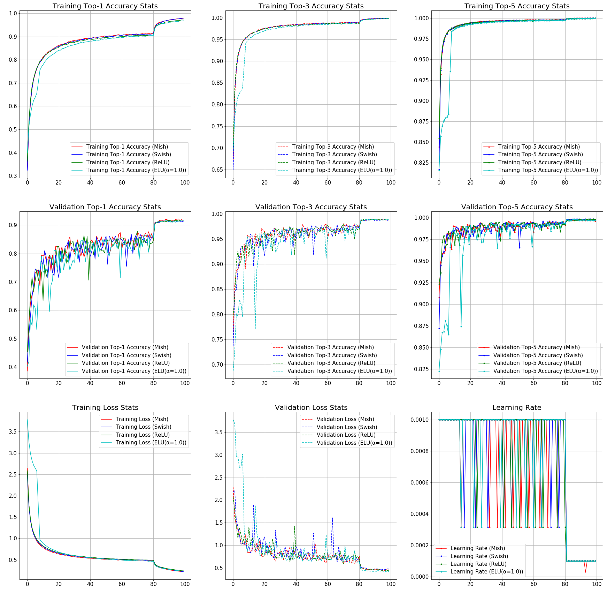

##### ResNet-164:

|Activation Function| Top-1 Accuracy| Loss|Top-3 Accuracy| Top-5 Accuracy| 
|---|---|---|---|---|
|Mish|**83.62%**|**7.7867%**|**96.81%**|99.11%|
|Swish-1|82.19%|9.046%|96.43%|**99.18%**|
|ReLU|82.37%|8.09783%|95.48%|98.48%|

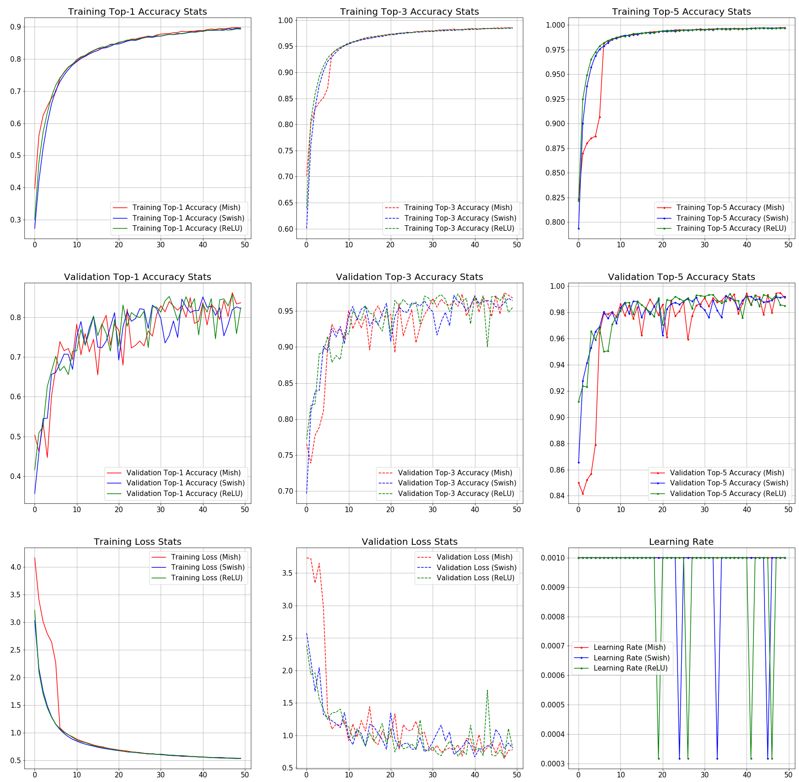

#### ResNet v2:

##### ResNet-20:

|Activation Function|Testing Top-1 Accuracy|Testing Loss|
|---|---|---|
|Aria-2(β = 1, α=1.5)|91.73%|4.25074%|
|Bent's Identity|89.1%|4.52398%|
|ELU(α=1.0)|91.58%|**4.05194%**|
|Hard Sigmoid|87.42%|4.86469%|
|Leaky ReLU(α=0.3)|90.57%|4.093131%|
|Mish|**92.02%**|4.19176%|
|PReLU(Default Parameters)|91.25%|4.403224%|
|ReLU|91.71%|4.08291%|
|SELU|90.59%|4.36311%|
|Sigmoid|89.27%|4.474636%|
|SoftPlus|91.39%|4.2238%|
|SoftSign|90.45%|4.402751%|
|Swish-1|91.61%|4.295542%|
|TanH|90.99%|4.3992%|
|Thresholded ReLU(θ=1.0)|76.22%|7.37498%|

##### ResNet-56:

Number of Epochs were varied to observe the computational cost and training time of the networks. The table below provides all the information regarding the same. 

- For Batch Size = 32, Number of Steps= 1563, Number of Epochs= 10:

|Activation Function |Training Accuracy|Training Loss|Validation Accuracy|Validation Loss|Testing Accuracy|Testing Loss|Average Per Epoch Time|Inference Time (Per Sample)|Average Per Step Time|Average Forward Pass Time|
|---|---|---|---|---|---|---|---|---|---|---|
|ReLU|73.10%|15.1%|71.9%|15.35%|73.34%|15.34%|**130.8 seconds**|**2 seconds (487 micro seconds)**|**83.8 milli seconds**|**669.9 micro- seconds**|
|Swish-1|**77.65%**|**14.04%**|75.58%|14.77%|75.88%|14.68%|155.1 seconds|3 seconds (550 micro-seconds)|99.3 milli-seconds|775.2 micro-seconds|
|Mish|76.93%|14.08%|**76.58%**|**14%**|**76.46%**|**13.98%**|158.5 seconds|3 seconds (590 micro-seconds)|101.4 milli-seconds|830.4 micro-seconds|

- For Batch Size = 32, Number of Steps= 1563, Number of Epochs= 50: (Best of 2 runs)

|Activation Function |Testing Accuracy|Testing Loss|Inference Time (Per Sample)| 
|---|---|---|---|
|ReLU|83.86%|9.945%|3 seconds (559 micro-seconds)|
|Swish-1|86.36%|8.81%|3 seconds (618 micro-seconds)|
|Mish|**87.18%**|**8.62%**|3 seconds (653 micro-seconds)|

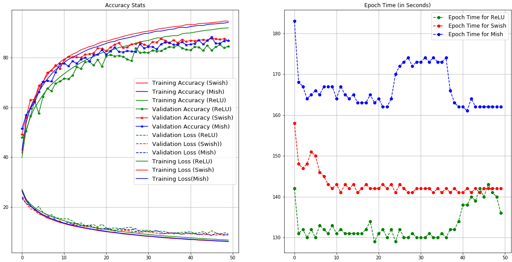

 

The Confusion Matrix obtained after 100 epoch training of ResNet v2 with Mish on CIFAR-10 is shown below:

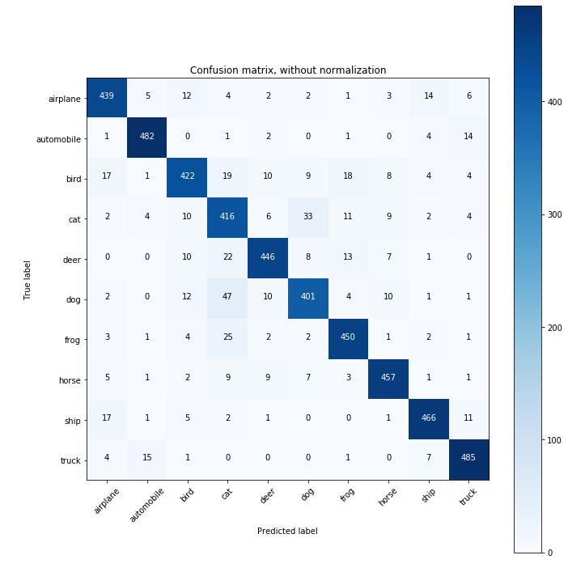

 

##### ResNet-110:

|Activation Function| Top-1 Accuracy| Loss|Top-3 Accuracy| Top-5 Accuracy| 
|---|---|---|---|---|
|Mish|**92.58%**|4.16525%|98.97%|99.72%|
|Swish-1|92.22%|**4.16021%**|**98.99%**|**99.75%**|
|ReLU|91.93%|4.22357%|98.85%|99.75%|

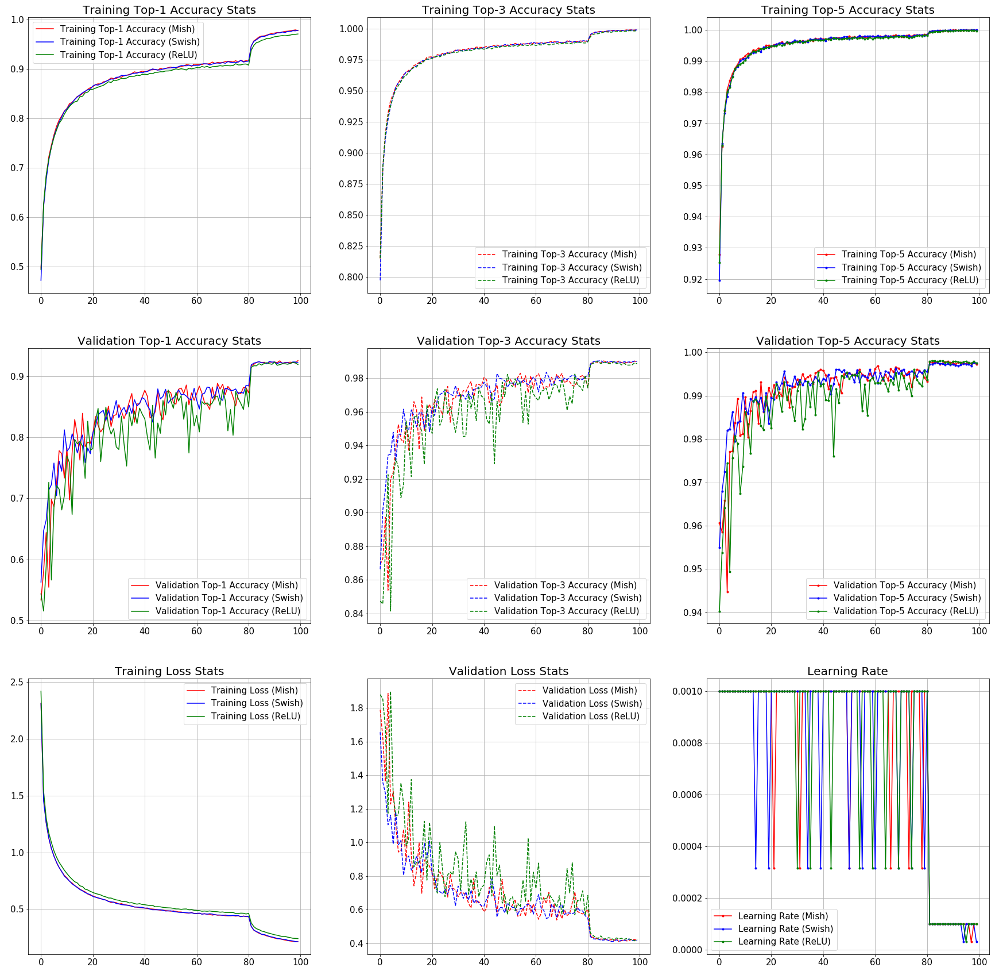

##### ResNet-164: 

|Activation Function| Top-1 Accuracy| Loss|Top-3 Accuracy| Top-5 Accuracy| 
|---|---|---|---|---|
|Mish|**87.74%**|**5.7284%**|**98.07%**|**99.61%**|
|Swish-1|86.13%|6.4354%|97.55%|99.4%|
|ReLU| 83.59%| 7.3899%|96.86%|99.41%|

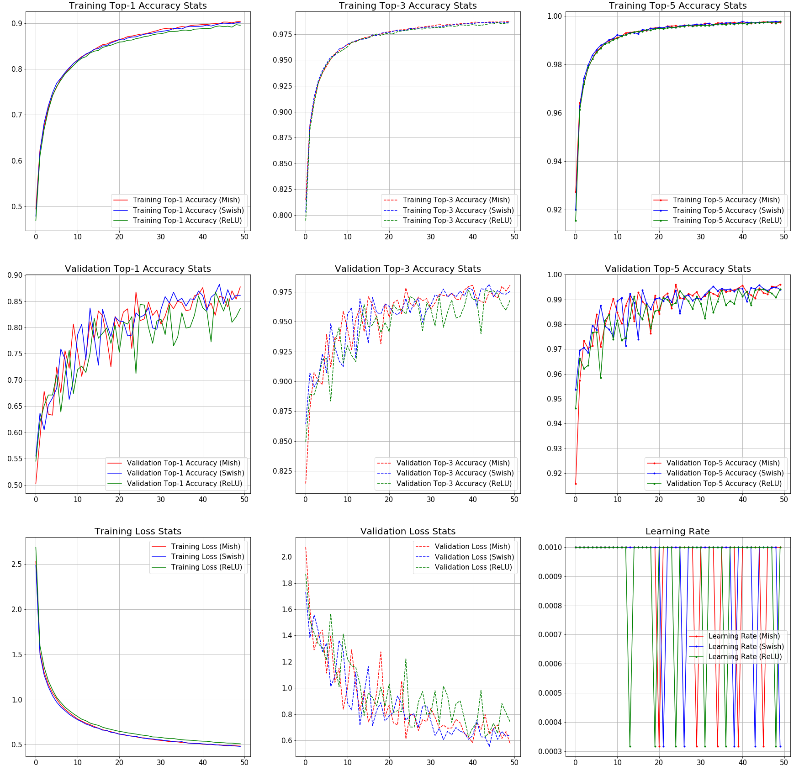

##### ResNet-245:

|Activation Function| Top-1 Accuracy| Loss|Top-3 Accuracy| Top-5 Accuracy| 
|---|---|---|---|---|
|Swish-1|85.41%|6.6752%|97.56%|99.38%|
|Mish|**86.87%**|**6.07021%**|**97.88%**|**99.53%**|
|ReLU|86.32%|6.11834%|97.64%|99.45%|

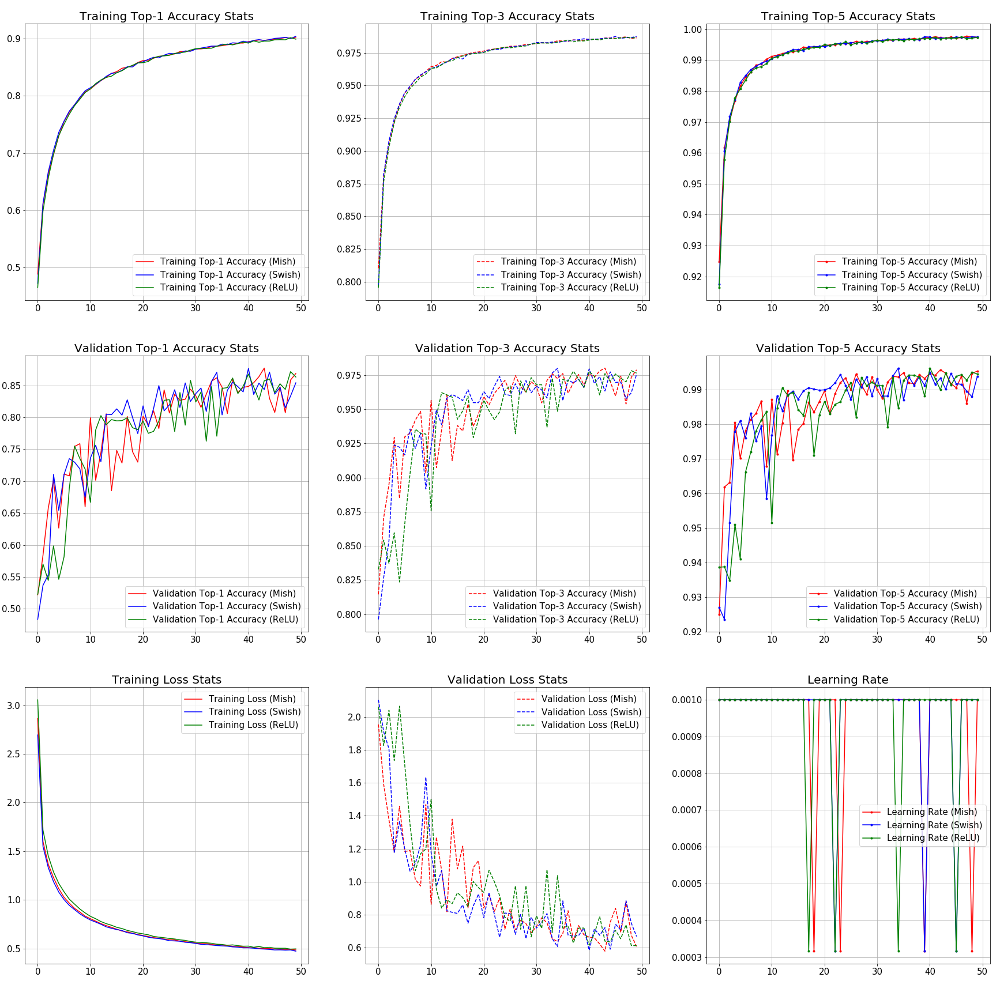

#### Wide Residual Networks (WRN):

##### WRN 10-2:

|Activation Function |Accuracy|Loss|
|---|---|---|
|ReLU|84.52%|6.298%|
|Swish-1|86.56%|5.726%|
|Mish|**86.83%**|**5.712%**|

<em> *Number of Epochs=50, Batch Size= 128.
</em> 

##### WRN 16-4:

|Activation Function |Accuracy|Loss|
|---|---|---|
|ReLU|**90.74%**|5.644%|
|Swish-1|90.07%|**5.014%**|
|Mish|90.54%|5.104%|

<em> *Number of Epochs=50, Batch Size= 128.
</em> 

##### WRN 22-10:

|Activation Function |Accuracy|Loss|
|---|---|---|
|ReLU|**91.28%**|5.588%|
|Swish-1|90.17%|5.136%|
|Mish|90.38%|**4.961%**|

<em> *Number of Epochs=50, Batch Size= 128.
</em> 

#### SimpleNet:

|Activation Function |Accuracy|Loss| Top 3 Accuracy| Top 5 Accuracy|
|---|---|---|---|---|
|ReLU|91.16%|2.897%|98.62%|99.65%|
|Swish-1|91.44%|2.944%|**98.87%**|**99.77%**|
|Mish|**91.70%**|**2.759%**|98.85%|99.75%|

<em> *Number of Epochs=50, Batch Size=128, Network Parameters= 5.59 M
</em> 

#### Xception Network:

|Activation Function |Testing Top-1 Accuracy|Testing Loss|
|---|---|---|
|Mish|**88.73%**|5.44975%|
|Swish-1|88.56%|5.410996%|
|ReLU|88.38%|**5.400312%**|

#### Capsule Network:

|Activation Function |Testing Top-1 Accuracy|Testing Top-3 Accuracy|Testing Top-5 Accuracy|Testing Loss (Margin Loss)|
|---|---|---|---|---|
|ELU(α=1.0)|71.7%|90.72%|95.85%|2.3819%|
|Mish|83.15%|94.62%|97.2%|1.51671%|
|Swish-1|82.48%|94.7%|97.11%|1.5232%|
|ReLU|82.19%|94.88%|97.48%|**1.51009%**|
|SELU|80.24%|94.3%|97.56%|1.9122%|
|Leaky ReLU(α=0.3)|**83.42%**|**95.48%**|**97.96%**|1.5393%|

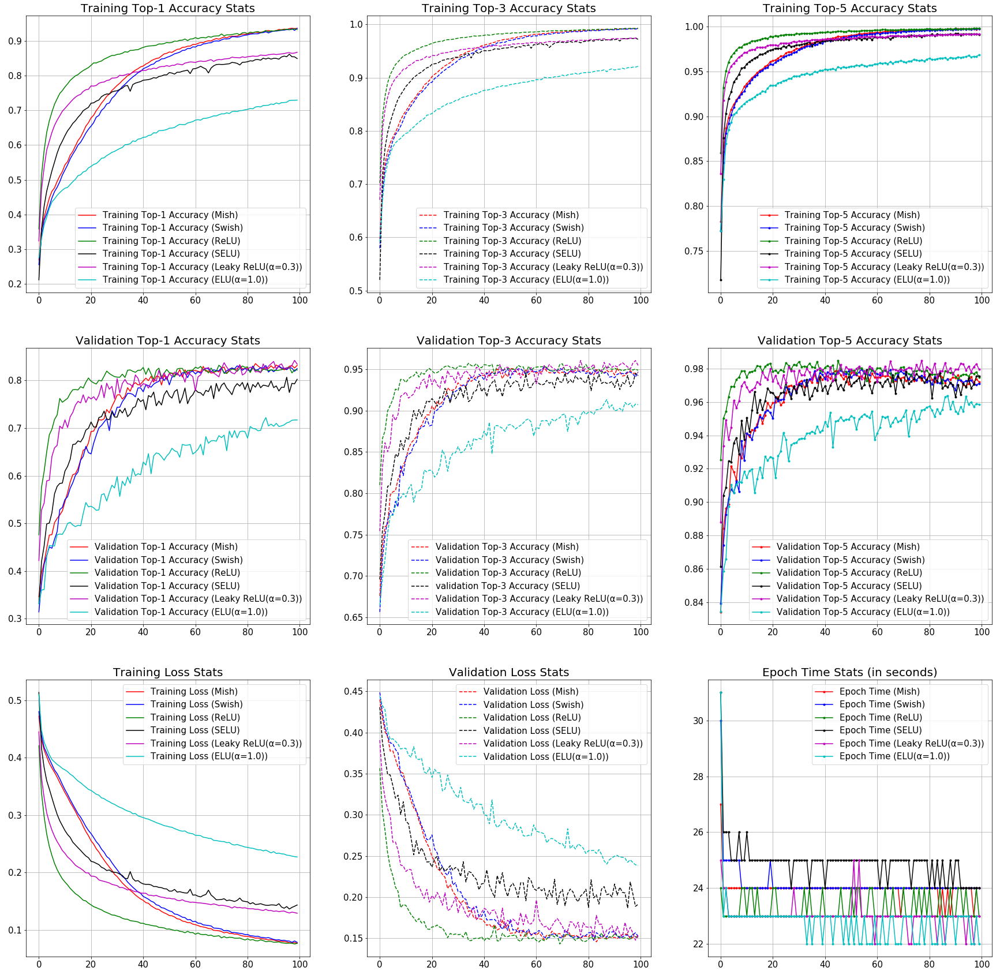

#### Inception-ResNet-v2:

|Activation Function |Testing Top-1 Accuracy|Testing Top-3 Accuracy|Testing Top-5 Accuracy|Testing Loss|
|---|---|---|---|---|
|Mish|**85.21%**|97.13%|99.22%|4.6409%|
|Swish-1|84.96%|97.29%|99.29%|4.8955%|
|ELU(α=1.0)|83.93%|96.96%|99.11%|4.884%|
|ReLU|82.22%|95.87%|98.65%|5.3729%|
|Leaky ReLU(α=0.3)|84.67%|**97.35%**|**99.42%**|**4.5577%**|
|TanH|76.29%|94.65%|98.42%|6.7464%|
|PReLU(Default Parameters)|81.99%|96.01%|99.04%|5.50853%|
|SELU|83.27%|96.61%|99.04%|5.1101%|
|Softsign|79.76%|95.15%|98.61%|6.0377%|

#### DenseNet

##### DenseNet-121:

|Activation Function | Testing Top-1 Accuracy|Loss|Testing Top-3 Accuracy|
|---|---|---|---|
|ReLU|91.0997%|4.40764%|98.6946%|
|Swish-1|90.9217%|4.54128%|98.7144%|
|Mish|91.2678%|4.60893%|98.665%|
|E-Swish (β = 1.75)|90.6349%|4.89817%|98.6551%|
|Aria-2(β = 1, α=1.5)|91.23%|4.339%|98.86%|
|ELisH|90.62%|4.72%|98.66%|
|SineReLU (ε = 0.001)|**91.54%**|**4.266%**|98.75%|
|Hard ELisH|91.16%|4.694%|98.65%|
|Flatten T-Swish|90.87%|4.659%|98.66%|
|SQNL|90.69%|4.472%|98.68%|
|ISRU(α=1.0)|90.06%|4.819%|98.52%|
|Bent's Identity|90.53%|4.919%|98.76%|
|ISRLU(α=1.0)|90.7%|4.668%|98.69%|
|Soft Clipping (α=0.5)|89.92%|5.068%|98.31%|
|LeCun's TanH|91.35%|4.507%|**98.91%**|
|ELU(α=1.0)|90.47%|4.833%|98.53%|
|HardShrink(λ=0.5)|89.72%|4.981%|98.42%|
|HardTanh|90.2%|4.792%|98.5%|
|LogSigmoid|90.81%|4.791%|98.79%|
|LeakyReLU (α=0.3)|90.86%|4.825%|98.74%|
|PReLU|89.62%|5.518%|98.53%|
|ReLU6|90.57%|4.865%|98.6%|
|SELU|91%|4.505%|98.63%|
|RReLU|90.92%|4.22%|98.93%|
|Sigmoid|89.74%|4.811%|98.58%|
|CELU (α=1.0)|90.8%|4.505%|98.75%|
|Softplus(β = 1)|90.52%|4.944%|98.63%|
|Softshrink(λ=0.5)|90.2%|4.969%|98.49%|
|Softsign|89.86%|4.765%|98.74%|
|Tanh|89.98%|4.744%|98.72%|
|Tanhshrink|91.16%|4.368%|98.78%|
|SReLU|90.35%|5.014%|98.52%|
|Weighted TanH (Weight = 1.7145)|90.6%|4.75%|98.81%|

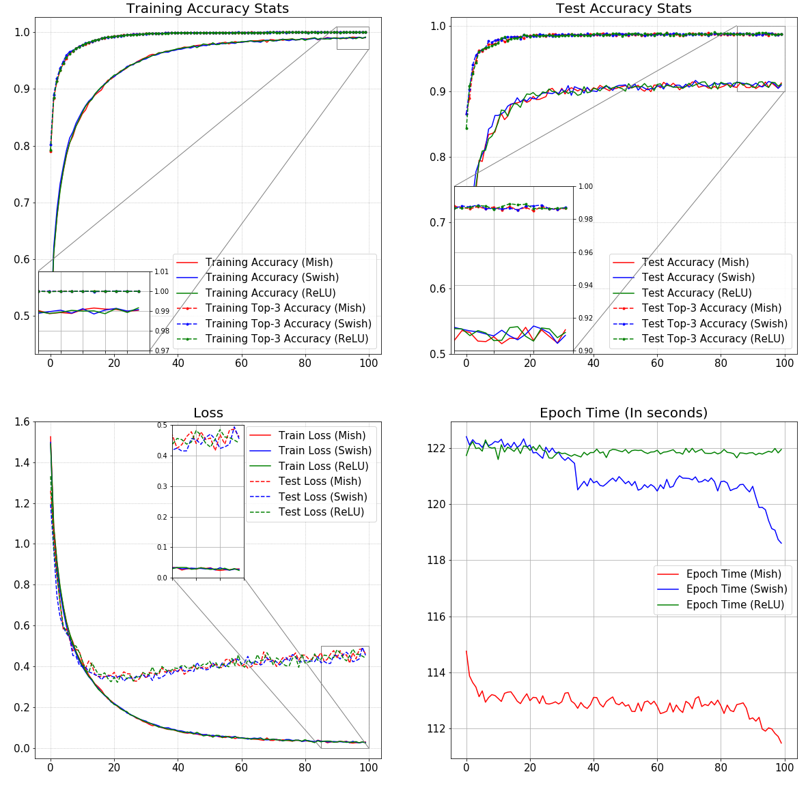

##### DenseNet-161:

|Activation Function | Testing Top-1 Accuracy|Loss|Testing Top-3 Accuracy|
|---|---|---|---|
|ReLU|91.0206%|4.89679%|98.6452%|
|Swish-1|90.1602%|4.85416%|98.665%|
|Mish|90.8228%|4.95727%|98.8034%|
|E-Swish (β = 1.75)|90.6547%|5.01813%|98.4771%|
|GELU|90.92%|4.662%|98.67%|
|Aria-2(β = 1, α=1.5)|90.24%|5.056%|98.53%|
|Bent's Identity|**91.72%**|**4.227%**|**98.81%**|
|SQNL|90.18%|5.046%|98.62%|
|ELisH|91.36%|4.78%|98.83%|
|Flatten T-Swish|90.95%|4.794%|98.66%|
|ISRU (α=1.0)|89.18%|5.416%|98.39%|
|ISRLU (α=1.0)|91.07%|4.743%|98.7%|
|Soft Clipping (α=0.5)|91.29%|4.826%|98.7%|
|Hard ELisH|90.6%|5.044%|98.79%|
|SineReLU (ε = 0.001)|91.3%|4.82%|98.82%|
|Weighted TanH (Weight = 1.7145)|89.81%|5.339%|98.39%|
|LeCun's TanH|89.73%|5.521%|98.54%|
|SReLU|90.96%|4.505%|98.76%|
|ELU(α=1.0)|90.55%|4.671%|98.69%|
|HardShrink(λ=0.5)|88.79%|5.469%|98.43%|
|HardTanh|90.33%|5.115%|98.51%|
|Softshrink (λ=0.5)|91.14%|4.517%|98.75%|
|SELU|90.21%|4.704%|98.54%|

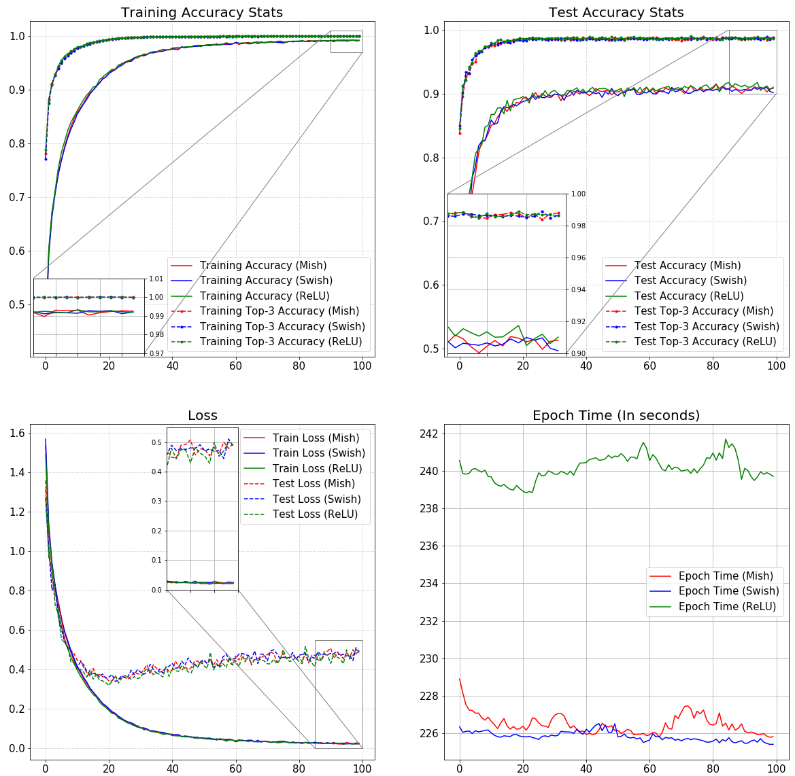

##### DenseNet-169:

|Activation Function | Testing Top-1 Accuracy|Loss|Testing Top-3 Accuracy|
|---|---|---|---|
|ReLU|**91.6535%**|**4.30486%**|**98.8726%**|
|Swish-1|90.6744%|4.8451%|98.5562%|
|Mish|90.5063%|4.74986%|98.6353%|
|E-Swish (β = 1.75)|90.9019%|4.83638%|98.6155%|
|Weighted TanH (Weight = 1.7145)|90.74%|4.977%|98.47%|
|Aria-2(β = 1, α=1.5)|90.86%|4.864%|98.7%|
|E-Swish (β = 1.75)|90.59%|5.157%|98.68%|
|ELisH|91.16%|4.659%|98.68%|
|Hard ELisH|90.7%|4.762%|98.63%|
|SineReLU (ε = 0.001)|90.5%|5.101%|98.47%|
|FTS|90.19%|5.169%|98.42%|

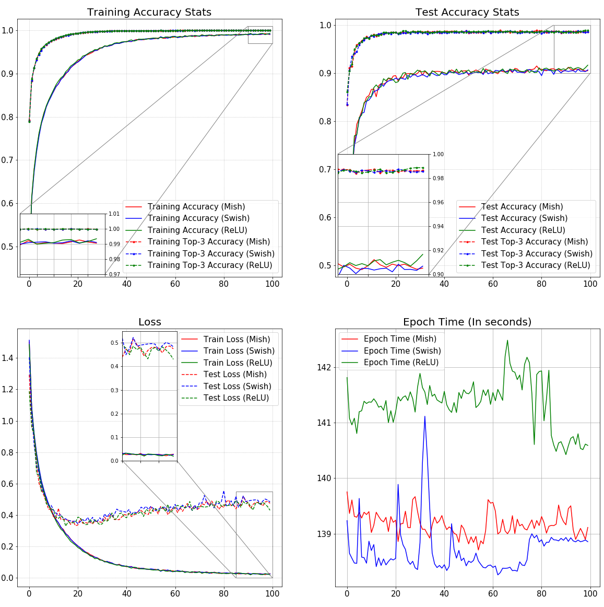

##### DenseNet-201: 

|Activation Function | Testing Top-1 Accuracy|Loss|Testing Top-3 Accuracy|
|---|---|---|---|
|ReLU|90.7239%|5.02072%|**98.6946%**|
|Swish-1|**91.0107%**|**4.76944%**|98.665%|
|Mish|90.7338%|4.81563%|98.5364%|
|E-Swish (β = 1.75)|90.6349%|4.89817%|98.6551%|

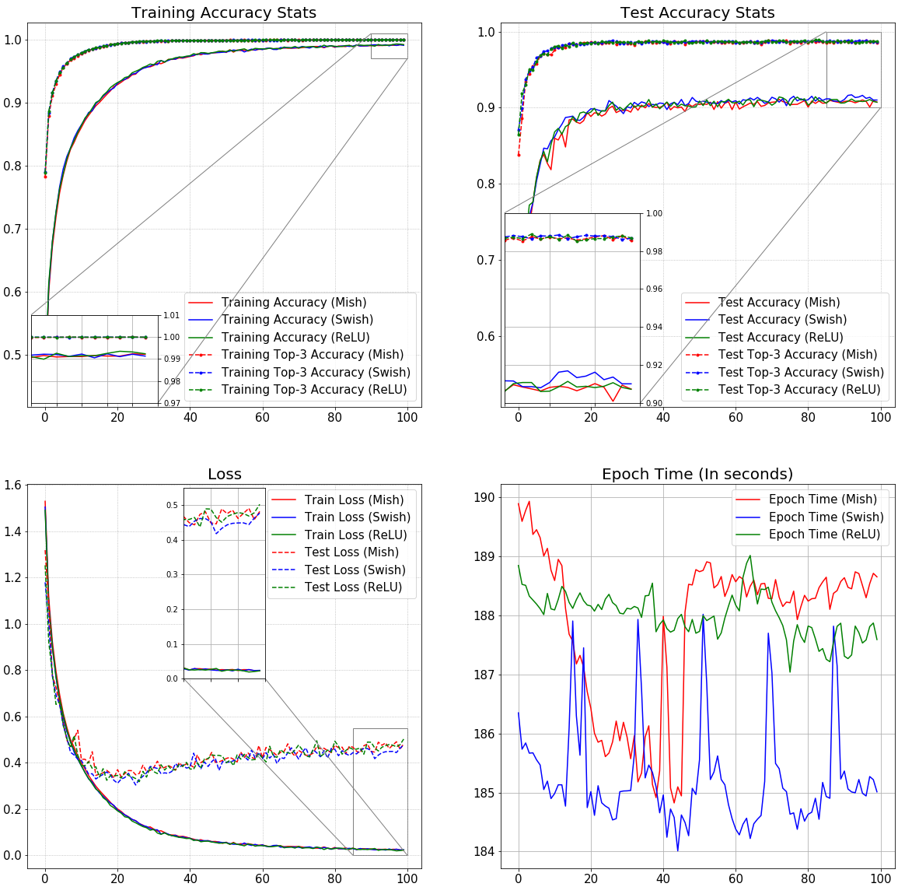

#### ResNext

##### ResNext-50:

|Activation Function | Testing Top-1 Accuracy|Loss|Testing Top-3 Accuracy|
|---|---|---|---|
|ReLU|89.3592%|5.55392%|98.4771%|
|Swish-1|**91.6238%**|**4.18871%**|98.665%|
|Mish|90.8327%|4.61261%|98.5364%|
|E-Swish (β = 1.75)|91.4557%|4.67145%|**98.7441%**|

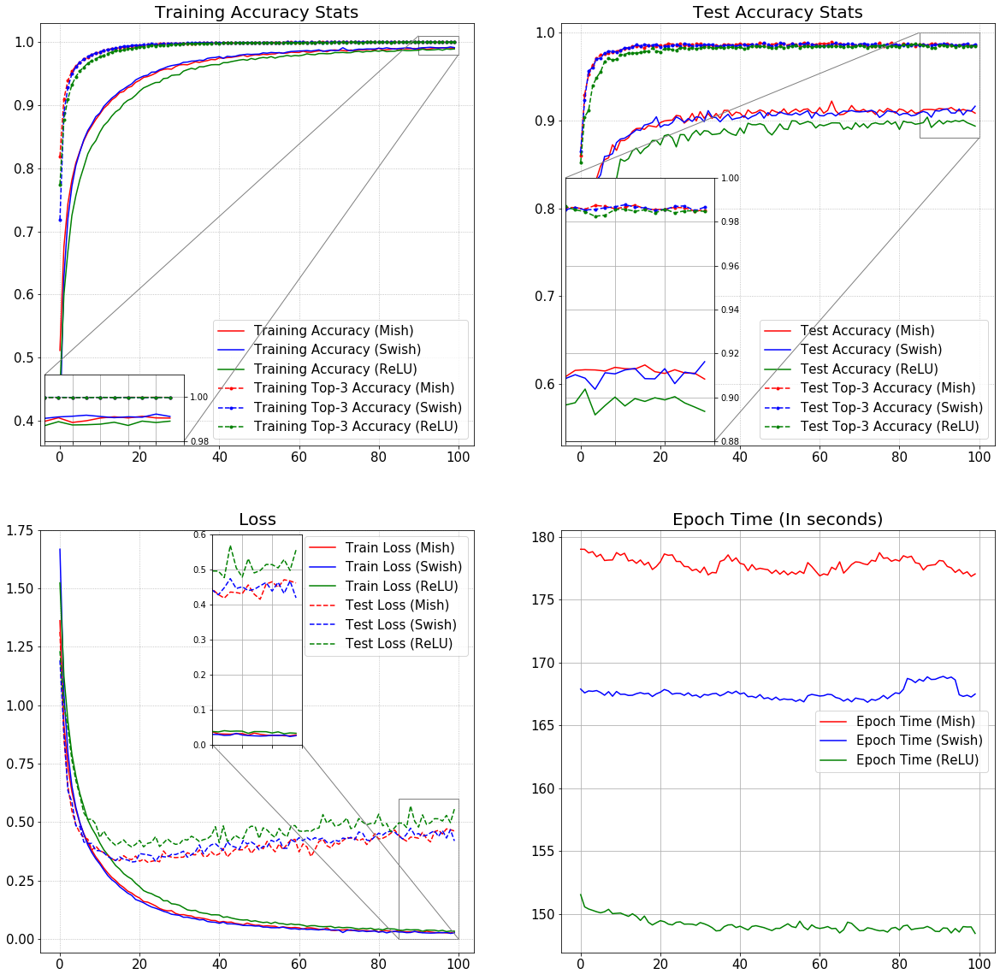

#### MobileNet:

##### MobileNet V1:

|Activation Function | Testing Top-1 Accuracy|Loss|Testing Top-3 Accuracy|
|---|---|---|---|
|ReLU|84.1179%|6.71502%|96.9937%|
|Swish-1|85.6903%|7.05216%|96.9937%|
|Mish|85.2749%|6.99848%|97.0926%|
|E-Swish(β = 1.75)|85.58|6.927%|96.91%|
|GELU|85.28%|7.13%|96.81%|
|ELU(α=1.0)|84.16%|6.802%|97.06%|
|HardShrink(λ=0.5)|63.23%|10.535%|87.74%|
|Hardtanh|80.32%|9.113%|95.66%|
|LeakyReLU (α=0.3)|85.44%|6.978%|97.34%|
|LogSigmoid|84.37%|7.363%|96.71%|
|PReLU (Default Parameters)|85.31%|6.656%|97.16%|
|ReLU6|84.38%|6.823%|96.85%|
|RReLU|85.09%|6.74%|97.18%|
|SELU|83.43%|7.305%|96.45%|
|CELU(α=1.0)|85.1%|7.002%|97.03%|
|Sigmoid|80.33%|7.106%|95.48%|
|Softplus(β = 1)|84.54%|7.295%|96.82%|
|Softshrink(λ=0.5)|81.29%|7.230%|95.80%|
|Softsign|81.48%|8.392%|95.96%|
|Tanh|80.96%|9.178%|95.58%|
|Tanhshrink|80.47%|6.979%|95.76%|
|Aria-2(β = 1, α=1.5)|82.66%|7.001%|96.53%|
|SQNL|80.43%|9.198%|95.52%|
|Bent's Identity|**86.65%**|6.196%|**97.56%**|
|Flatten T-Swish|83.65%|7.933%|96.17%|
|ELisH|85.02%|7.223%|96.58%|
|SineReLU (ε = 0.001)|85.03%|6.744%|97.06%|
|ISRU (α=1.0)|80.65%|9.272%|95.66%|
|ISRLU (α=1.0)|85.87%|6.517%|97.21%|
|Soft Clipping (α=0.5)|83.93%|**5.33%**|97.27%|
|SReLU|85.34%|6.498%|97.14%|
|Weighted TanH (Weight = 1.7145)|75.04%|11.268%|93.44%|
|Le Cun's TanH|81.89%|9.99%|95.9%|
|Hard ELisH|84.89%|6.54%|96.97%|

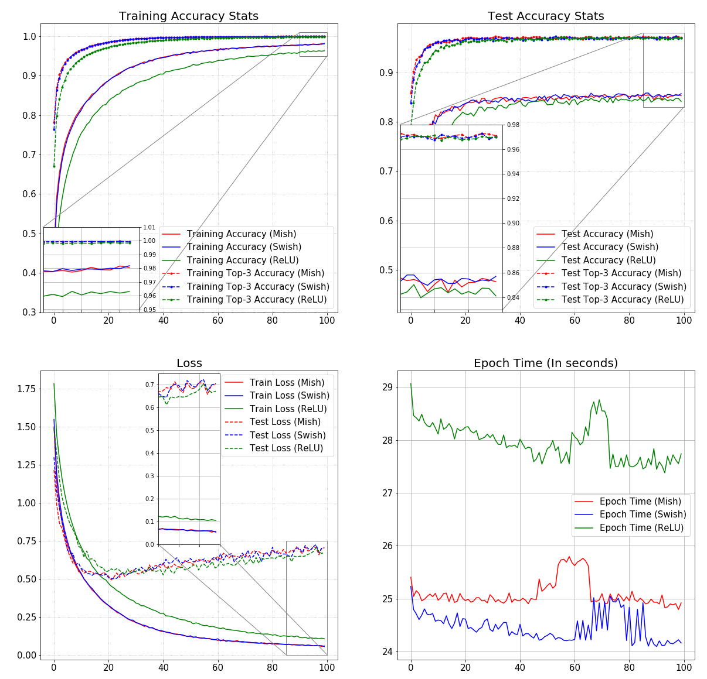

##### MobileNet V2:

|Activation Function | Testing Top-1 Accuracy|Loss|Testing Top-3 Accuracy|
|---|---|---|---|
|Mish|86.0463%|5.06381%|97.5574%|
|ReLU|85.94%|5.294%|97.35%|
|Swish-1|86.0759%|5.43845%|97.4684%|
|Mish|86.254%|5.26875%|97.5376%|
|E-Swish (β = 1.75)|86.36%|5.269%|**97.80%**|
|GELU|86.13%|5.465%|97.37%|
|ELU(α=1.0)|85.51%|5.287%|97.38%|
|HardShrink(λ=0.5)|67.37%|9.168%|91.64%|
|Hardtanh|82.97%|5.785%|96.65%|
|LeakyReLU (α=0.3)|86.63%|4.830%|97.57%|
|LogSigmoid|85.27%|5.224%|97.18%|
|PReLU|86.32|4.834%|97.56%|
|ReLU6|85.86%|5.418%|97.42%|
|RReLU|87.18%|4.637%|97.78%|
|SELU|84.36%|5.098%|97.32%|
|CELU(α=1.0)|85.70%|5.145%|97.36%|
|Sigmoid|79.80%|6.422%|95.25%|
|Softplus(β = 1)|85.89%|4.901%|97.60%|
|Softshrink(λ=0.5)|82.53%|6.43%|96.52%|
|Softsign|82%|6.476%|96.33%|
|TanH|83.51%|5.843%|96.65%|
|Tanhshrink|82.87%|6.299%|96.97%|
|Bent's Identity|85.82%|**4.818%**|97.46%|
|SQNL|82.45%|6.5525|96.41%|
|Aria-2(β = 1, α=1.5)|82.31%|6.161%|96.4%|
|Flatten T-Swish|**86.71%**|5.494%|97.31%|
|ELisH|86.6%|5.406%|97.59%|
|SineReLU (ε = 0.001)|85.98%|5.294%|97.35%|
|ISRU (α=1.0)|82.32%|6.287%|96.66%|
|ISRLU (α=1.0)|85.87%|5.462%|97.45%|
|Soft Clipping (α=0.5)|77.73%|7.219%|94.53%|
|SReLU|84.98%|5.43%|97.09%|
|Weighted TanH (Weight = 1.7145)|78.97%|7.661%|95.16%|
|Le Cun's TanH|83.71%|5.924%|96.85%|
|Hard ELisH|85.66%|5.335%|97.56%|

#### SE-Net (Squeeze Excite Network):

##### SE-Net 18: 

|Activation Function | Testing Top-1 Accuracy|Loss|Testing Top-3 Accuracy|
|---|---|---|---|
|Mish|90.526%|4.8468%|98.5635%|
|ReLU|90.1602%|**4.75929%**|98.5562%|
|Swish-1|89.4284%|5.47937%|98.3485%|
|E-Swish (β = 1.75)|90.1997%|5.29145%|98.4572%|
|GELU|90.2294%|5.1879%|98.4078%|
|ELU(α=1.0)|89.7646%|5.3718%|98.19%|
|Hardshrink(λ=0.5)|78.57%|8.19137%|95.2037%|
|Hardtanh|84.08376%|7.7301%|97.7266%|
|PReLU|88.924%|6.0027%|98.2594%|
|LeakyReLU (α=0.3)|89.191%|5.53214%|98.2397%|
|LogSigmoid|89.0921%|5.8761%|98.4276%|
|ReLU6|**90.625%**|4.8782%|**98.6056%**|
|RReLU|89.349%|5.7802%|98.1606%|
|SELU|88.835%|5.6104%|98.279%|
|CELU(α=1.0)|89.4679%|5.3723%|98.299%|
|Sigmoid|43.651%|31.721%|73.3979%|
|Softplus(β = 1)|89.4382%|5.6166%|98.4177%|
|Softshrink(λ=0.5)|87.391%|5.8498%|97.7452%|
|Softsign|84.2266%|7.09453%|97.0826%|
|Tanh|84.76%|7.433%|97.043%|
|Tanhshrink|83.949%|7.9128%|96.7635%|
|Aria-2(β = 1, α=1.5)|78.14%|9.042%|94.69%|
|SQNL|84.525|7.29%|97.25%|
|Flatten T-Swish|90.31%|5.247%|98.22%|
|ISRU (α=1.0)|84.33%|7.35%|97.12%|
|ISRLU (α=1.0)|88.8%|5.474%|98.35%|
|Bent's Identity|88.28%|98.03%|5.713%|
|ELisH|90.17%|5.255%|98.33%|
|SineReLU (ε = 0.001)|89.56%|5.415%|98.19%|
|SReLU|88.18%|6.21%|97.98%|
|Soft Clipping (α=0.5)|40.36%|28.1%|61.79%|
|Le Cun's Tanh|85.33%|7.155%|97.3%|
|Hard ELisH|89.98%|5.017%|98.28%|*

*Hard ELisH scores are based off 88th Epoch, test loss suddenly went to NaN from 89th epoch*

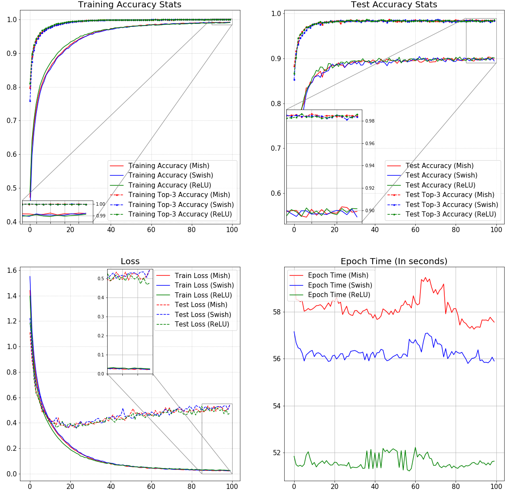

##### SE-Net 34:

|Activation Function | Testing Top-1 Accuracy|Loss|Testing Top-3 Accuracy|
|---|---|---|---|
|Mish|91.0997%|4.9648%|98.6056%|
|ReLU|**91.6733%**|**4.22846%**|**98.825%**|
|Swish-1|89.9624%|5.39445%|98.4177%|
|E-Swish (β = 1.75)|89.2306%|5.8442%|98.1507%|
|GELU|90.9118%|4.66858%|98.7243%|
|ELU(α=1.0)|89.8734%|5.28203%|98.4078%|
|Hardshrink(λ=0.5)|78.945%|8.32715%|95.3619%|
|HardTanh|84.3157%|7.64746%|97.0827%|
|LogSigmoid|89.1515%|5.6424%|98.3979%|
|PReLU|89.88%|5.7114%|98.27%|
|RReLU|90.81%|4.4486%|96.68%|
|ReLU6|90.6052%|4.9408%|98.7242%|
|SELU|88.3999%|5.5257%|98.299%|
|CELU(α=1.0)|89.53%|5.3475%|98.34%|
|Sigmoid|14.84%|43.395%|54.46%|
|Softplus(β = 1)|90.07%|5.8636%|98.18%|
|Tanh|85.79%|6.827%|97.43%|
|Tanhshrink|74.72%|7.661%|94.22%|
|LeakyReLU (α=0.3)|89.89%|4.957%|98.44%|
|Softshrink(λ=0.5)|86.2836%|6.62932%|97.4189%|
|Softsign|84.7211%|6.62071%|97.122%|
|Aria-2(β = 1, α=1.5)|30.61%|31.356%|63.66%|
|SQNL|85.26%|7.421%|97.19%|
|Bent's Identity|89.06%|5.482%|98.37%|
|SineReLU (ε = 0.001)|90.69%|4.698%|98.61%|
|Flatten T-Swish|90.25%|4.931%|98.65%|
|Soft Clipping (α=0.5)|10.02%|54.75%|30.01%
|Le Cun's Tanh|85.28%|7.173%|97.31%|
|Weighted TanH (Weight = 1.7145)|79.69%|9.373%|95.32%|
|ISRU(α=1.0)|84.31%|7.639%|96.91%|
|SReLU|89.76%|5.507%|98.2%|
|ISRLU(α=1.0)|89.52%|5.328%|98.26%|

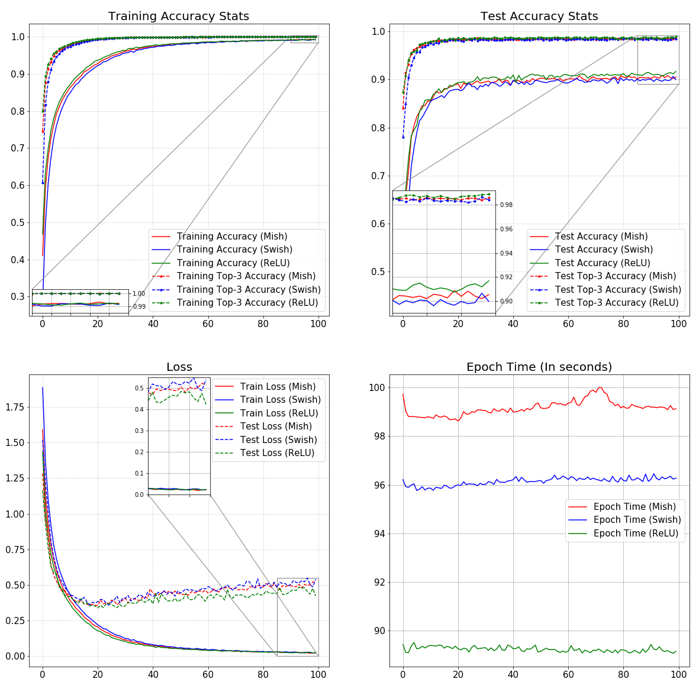

##### SE-Net 50:

|Activation Function | Testing Top-1 Accuracy|Loss|Testing Top-3 Accuracy|
|---|---|---|---|
|Mish|90.7931%|4.75271%|98.5562%|
|Swish-1|90.558%|4.76047%|98.6748%|
|E-Swish (β = 1.75)|90.5063%|5.22954%|98.6946%|
|ReLU|90.447%|4.93086%|98.6155%|
|GELU|90.5063%|5.0612%|98.754%|
|SELU|86.432%|6.89385%|97.8936%|
|ELU(α=1.0)|89.4481%|5.46123%|98.3484%|
|Hardshrink(λ=0.5)|75.5537%|7.6378%|94.334%|
|Hardtanh|84.731%|7.1676%|97.1321%|
|LeakyReLU (α=0.3)|90.5399%|4.6506%|98.5561%|
|LogSigmoid|89.02294%|7.03419%|98.2792%|
|PReLU|89.05261%|5.5455%|98.2298%|
|RReLU|89.84375%|5.12204%|98.566%|
|ReLU6|**90.91%**|**4.528%**|**98.78%**|
|CELU(α=1.0)|88.607954%|6.0473873%|98.50673%|
|Sigmoid|14.87%|83.204%|43.63%|
|Softplus(β = 1)|88.39992%|7.43696%|98.04193%|
|Softshrink(λ=0.5)|81.9%|6.142%|96.73%|
|Softsign|84.74%|7.152%|97.27%|
|TanH|85%|7.572%|97.24%|
|Tanhshrink|76.08%|9.234%|94.71%|

#### Shuffle Net:

##### Shuffle Net v1:

|Activation Function | Testing Top-1 Accuracy|Loss|Testing Top-3 Accuracy|
|---|---|---|---|
|Mish|87.3121%|5.89664%|**97.7354%**|
|Swish-1|86.9462%|6.05925%|97.6859%|
|ReLU|87.0451%|5.81928%|97.5277%|
|E-Swish(β = 1.75)|84.0882%|7.15842%|96.7168%|
|GELU|87.05%|6.126%|97.58%|
|ELU(α=1.0)|87.19%|5.633%|97.69%|
|Hardshrink(λ=0.5)|78.05%|6.637%|95.23%|
|Hardtanh|83.95%|6.043%|96.79%|
|LogSigmoid|86.82%|5.846%|97.67%|
|PReLU|87.15%|5.859%|97.60%|
|RReLU|**87.84%**|**5.309%**|97.71%|
|ReLU6|86.46%|6.096%|97.59%|
|SELU|86.98%|5.62%|97.72%|
|CELU(α=1.0)|87.27%|5.617%|97.76%|
|Sigmoid|42.51%|28.847%|76.09%|
|Softplus(β = 1)|87.33%|5.673%|97.54%|
|Tanh|83.98%|6.046%|97.12%|
|Tanhshrink|81.94%|6.859%|96.33%|
|LeakyReLU(α=0.3)|86.72%|5.897%|97.51%|
|Softshrink(λ=0.5)|84%|6.334%|96.96%|
|Softsign|83.01%|5.976%|96.64%|
|Aria-2(β = 1, α=1.5)|79.9%|6.429%|95.78%|
|Bent's Identity|85.19%|6.894%|97.2%|
|SQNL|84.58%|6.059%|96.94%|
|Flatten T-Swish|86.17%|6.269%|97.36%|
|ELisH|86.96%|5.99%|97.65%|
|SineReLU (ε = 0.001)|86.51%|5.787%|97.58%|
|HardElish|87.1%|5.518%|97.75%|
|ISRU (α=1.0)|84.36%|5.968%|96.7%|
|ISRLU (α=1.0)|87.52%|5.485%|97.66%|
|Soft Clipping (α=0.5)|13.97%|61.918%|80.32%|
|SReLU|87.34%|5.34%|97.69%|
|Weighted TanH (Weight = 1.7145)|82.72%|6.239%|96.45%|
|Le Cun's TanH|86.67%|5.199%|97.63%|

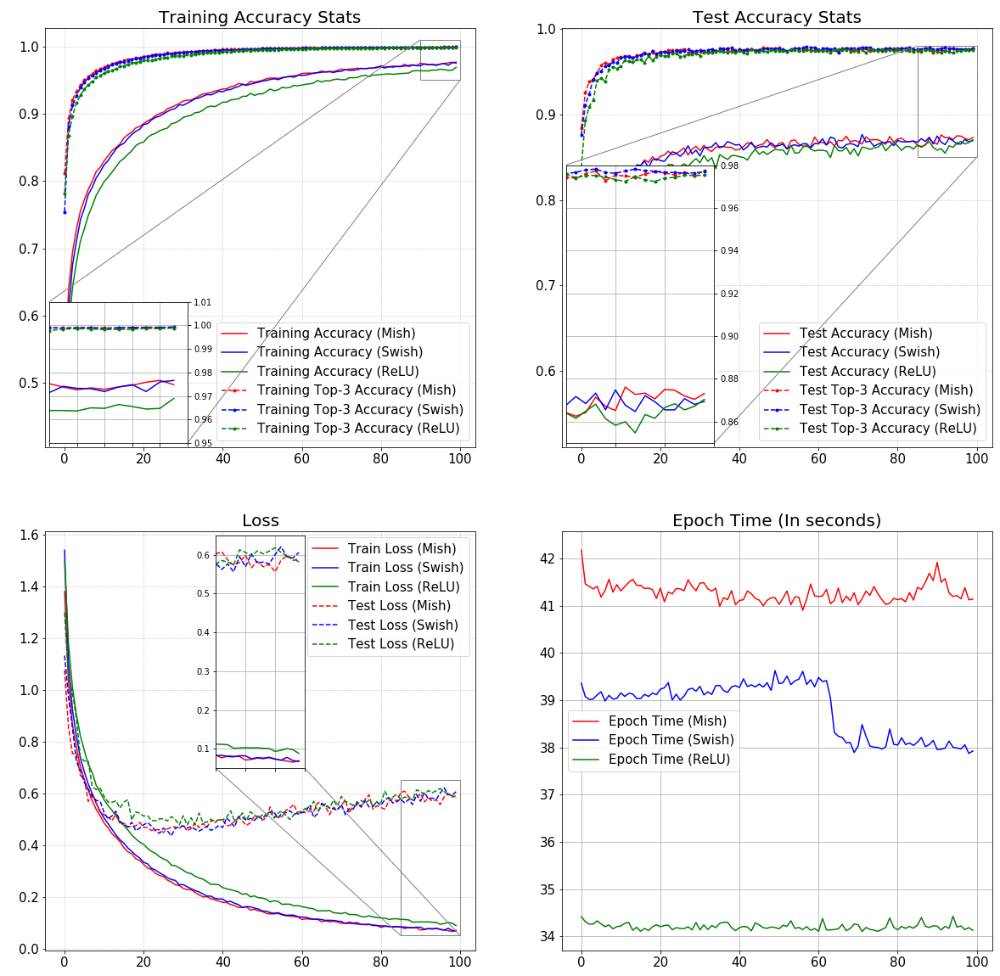

##### Shuffle Net v2:

|Activation Function | Testing Top-1 Accuracy|Loss|Testing Top-3 Accuracy|
|---|---|---|---|
|Mish|87.37%|5.491%|97.77%|
|Swish-1|86.9363%|5.55479%|97.6958%|
|ReLU|87.0055%|5.35336%|97.854%|
|E-Swish(β = 1.75)|86.75%|5.664%|97.48%|
|GELU|86.89%|5.813%|97.72%|
|ELU(α=1.0)|86.73%|5.356%|97.95%|
|HardShrink(λ=0.5)|75.34%|7.302%|94.38%|
|Hardtanh|83.23%|6.142%|96.61%|
|LeakyReLU(α=0.3)|87.05%|5.048%|97.74%|
|LogSigmoid|87.61%|5.758%|98.12%|
|PReLU|86.24%|5.78%|97.35%|
|RReLU|**87.67%**|**4.85%**|**98.04%**|
|ReLU6|87.18%|5.386%|97.73%|
|SELU|85.85%|4.87%|97.78%|
|CELU(α=1.0)|86.43%|5.51%|97.7%|
|Sigmoid|83.48%|5.328%|96.74%|
|Softplus(β = 1)| 86.64%|5.289%|97.77%|
|Softshrink(λ=0.5)|82.77%|6.701%|96.38%|
|Tanh|83.52%|6.280%|96.57%|
|Softsign|83.86%|5.767%|97.15%|
|Tanhshrink|80.2%|7.852%|95.38%|
|Aria-2(β = 1, α=1.5)|85.7%|5.057%|97.55%|
|Bent's Identity|86.24%|4.892%|97.56%|
|SQNL|84.08%|5.977%|97.11%|
|ELisH|86.58%|6.209%|97.7%|
|Hard ELisH|87.01%|5.551%|97.68%|
|ISRLU (α=1.0)|86.63%|5.195%|97.7%|
|SineReLU (ε = 0.001)|86.35%|5.823%|97.54%|
|Flatten T-Swish|86.92%|5.844%|97.78%|
|Weighted TanH (Weight = 1.7145)|81.05%|7.425%|95.9%|
|SReLU|86.13%|5.457|97.49%|
|Le Cun's TanH|82.69%|6.973%|96.62%|
|ISRLU (α=1.0)|82.07%|7.084%|96.45%|
|Soft Clipping (α=0.5)|84.74%|4.881%|97.42%|

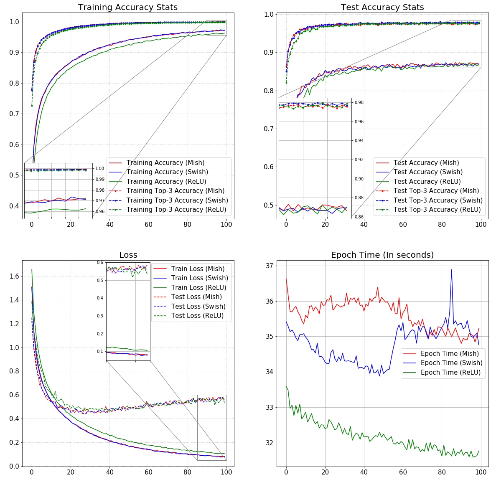

#### Squeeze Net:

|Activation Function | Testing Top-1 Accuracy|Loss|Testing Top-3 Accuracy|
|---|---|---|---|
|Mish|88.13%|4.937%|98.10%|
|ReLU|87.8461%|4.94529%|98.2002%|
|Swish-1|88.3703%|4.66536%|98.2793%|
|E-Swish(β = 1.75)|88.37%|4.862%|98.19%|
|GELU|87.75%|5.169%|98.15%|
|ELU(α=1.0)|87.52%|4.656%|98.08%|
|HardShrink(λ=0.5)|79.02%|6.186%|95.48%|
|Hardtanh|84.31%|5.182%|97.07%|
|LeakyReLU(α=0.3)|**88.47%**|**4.225%**|**98.34%**|
|LogSigmoid|83.31%|6.387%|96.90%|
|PReLU|86.26%|6.018%|97.63%|
|RReLU|88.09%|4.559%|98.12%|
|ReLU6|87.48%|4.921%|97.97%|
|SELU|86.72%|4.47%|97.76%|
|CELU(α=1.0)|87.33%|4.624%|98.15%|
|Sigmoid|81.04%|6.566%|95.4%|
|Softplus(β = 1)|85.55%|5.874%|97.65%|
|Softshrink(λ=0.5)|87.95%|5.308%|97.96%|
|Softsign|88.26%|4.748%|98.07%|
|Tanh|84.92%|5.444%|97.38%|
|Tanhshrink|84.17%|6.118%|96.86%|
|Flatten T-Swish|87.28%|5.267%|97.77%|
|ELisH|87.57%|5.134%|98.09%|
|SineReLU (ε = 0.001)|87.35%|5.012%|97.71%|
|ISRU (α=1.0)|84.82%|5.428%|97.17%|
|ISRLU (α=1.0)|87.88%|4.619%|97.81%|
|Soft Clipping (α=0.5)|58.97%|23.518%|81.42%|
|SReLU|86.63%|4.628%|97.8%|
|Weighted TanH (Weight = 1.7145)|84.91%|5.232%|97.16%|
|Le Cun's TanH|85.02%|5.024%|97.41%|
|Hard ELisH|86.61%|4.883%|97.83%|

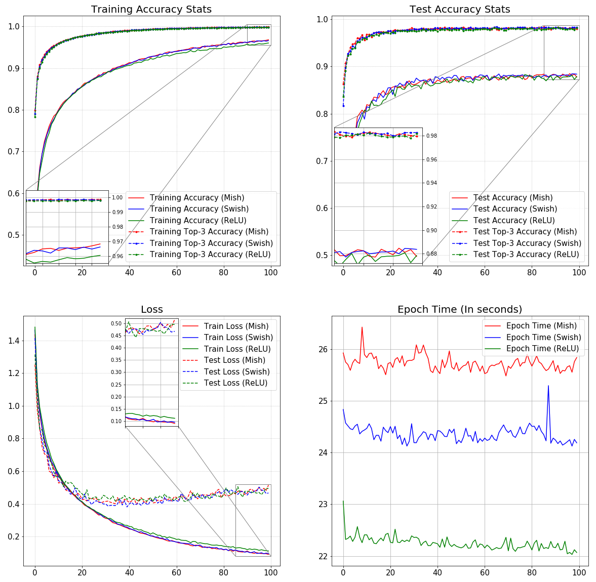

#### Inception Net:

##### Inception v3:

|Activation Function | Testing Top-1 Accuracy|Loss|Testing Top-3 Accuracy|
|---|---|---|---|
|Mish|91.8314%|3.8056%|98.8627%|
|ReLU|90.8426%|4.54385%|98.4968%|
|Swish-1|91.1788%|3.80319%|98.6551%|
|E-Swish (β = 1.75)|91.604%|3.72613%|98.8232%|
|GELU|90.8623%|4.19958%|98.4276%|
|ELU(α=1.0)|91.0502%|3.4677%|98.6451%|
|HardShrink(λ=0.5)|78.1546%|6.5938%|95.2729%|
|HardTanH|87.47%|5.3546%|97.92%|
|LogSigmoid|91.07%|3.8678%|98.68%|
|RReLU|91.42%|3.402%|98.87%|
|PReLU|90.46%|4.4049%|98.70%|
|Tanhshrink|84.65%|5.621%|97.04%|
|Tanh|86.98%|5.305%|98.05%|
|Softplus(β = 1)|90.01%|4.732%|98.56%|
|Sigmoid|81.32%|7.664%|95.86%|
|SELU|89.46%|4.401%|98.63%|
|CELU(α=1.0)|90.76%|3.899%|98.5%|
|Softshrink(λ=0.5)|86%|5.569%|97.8%|
|ReLU6|**92%**|3.846%|**98.98%**|
|LeakyReLU (α=0.3)|91.6%|**3.331%**|98.86%|
|Softsign|84.75%|6.212%|97.09%|

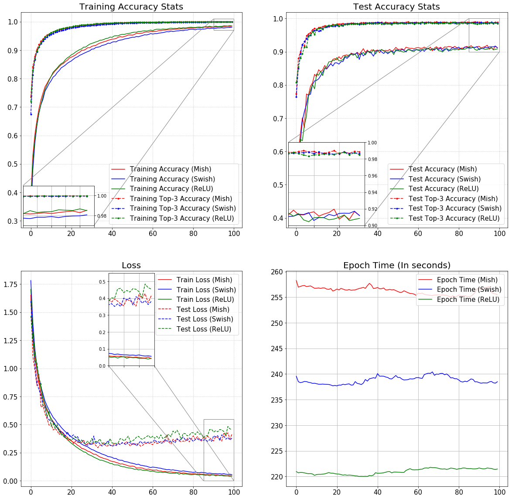

#### EfficientNet:

##### EfficientNet B0:

|Activation Function | Testing Top-1 Accuracy|Loss|Testing Top-3 Accuracy|
|---|---|---|---|
|Mish|**80.7358%**|6.36222%|**96.0542%**|
|ReLU|79.3117%|7.41779%|95.2828%|
|Swish-1|79.371%|7.69936%|95.3718%|
|ELU(α=1.0)|79.61%|7.836%|95%|
|E-Swish (β = 1.75)|79.38%|7.983%|94.56%|
|GELU|80.66%|7.475%|95.36%|
|LogSigmoid|80.66%|**6.238%**|95.86%|
|HardShrink(λ=0.5)|58.53%|11.677%|84.92%|
|Hardtanh|75.52%|8.375%|93.57%|
|LeakyReLU (α=0.3)|79.62%|8.096%|95.09%|
|PReLU|79.98%|7.831%|95.05%|
|RReLU|78.34%|8.619%|94.92%|
|ReLU6|80%|6.983%|95.47%|
|SELU|75.97%|9.468%|93.83%|
|CELU(α=1.0)|79.3%|7.68%|95.22%|
|Sigmoid|69.51%|10.083%|90.11%|
|Softplus(β = 1)|78%|7.651%|95.22%|
|Tanhshrink|67.69%|41.58%|91.08%|
|Tanh|74.78%|8.957%|93.38%|
|Softshrink(λ=0.5)|72.28%|10.8%|92.64%|
|Softsign|77.06%|8.214%|94.24%|
|Aria-2(β = 1, α=1.5)|77.07%|7.93%|94.43%|
|SQNL|75.08%|7.686%|94.39%|
|Bent's Identity|75.25%|8.143%|94.03%|

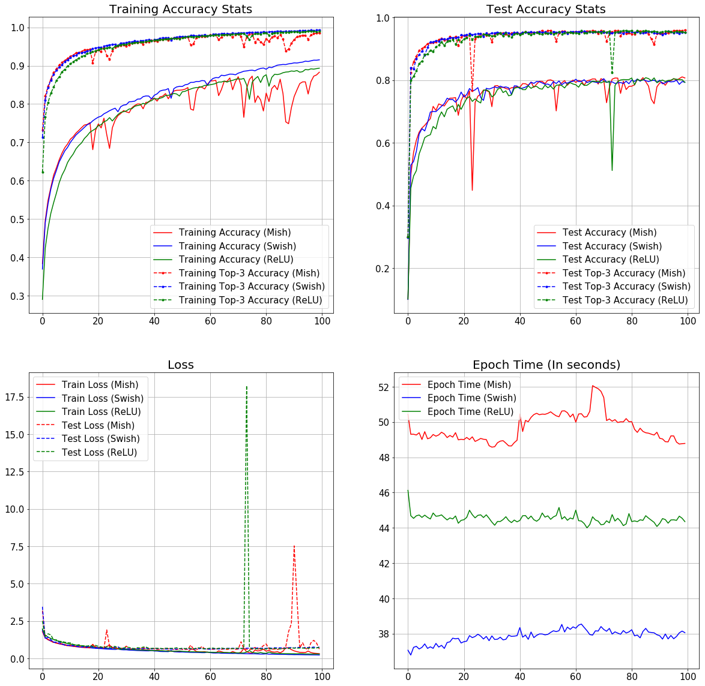

##### EfficientNet B1:

|Activation Function | Testing Top-1 Accuracy|Loss|Testing Top-3 Accuracy|
|---|---|---|---|
|Mish|80.9632%|14.67869%|94.8477%|
|ReLU|**82.4367%**|**6.01114%**|96.1926%|
|Swish-1|81.9818%|6.49295%|**96.2718%**|

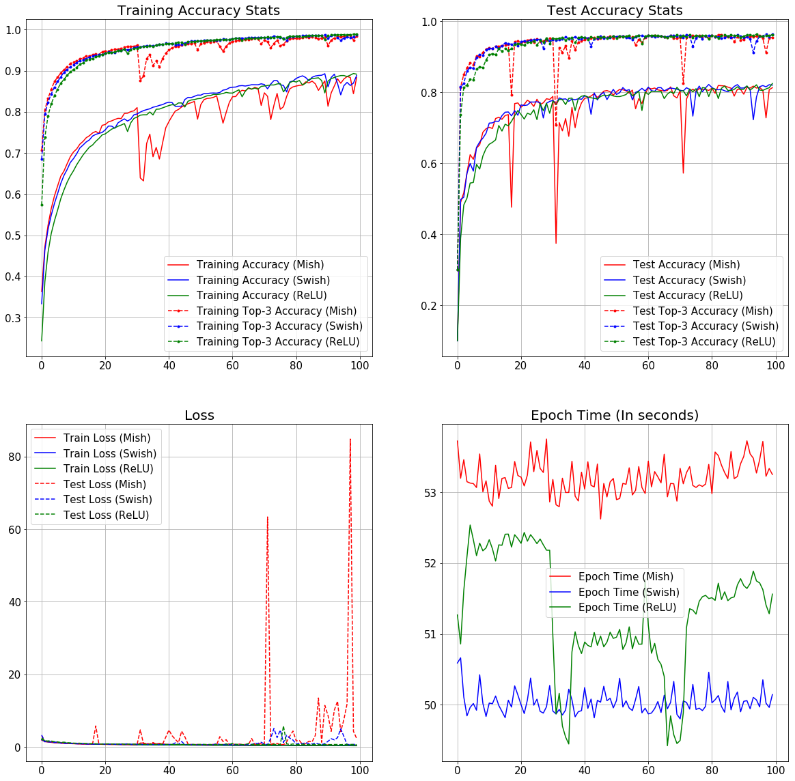

##### EfficientNet B2:

|Activation Function | Testing Top-1 Accuracy|Testing Top-3 Accuracy|
|---|---|---|
|Mish|81.2006%|95.6586%|
|ReLU|**81.7148%**|**95.9454%**|
|Swish-1|80.9039%|95.5696%|

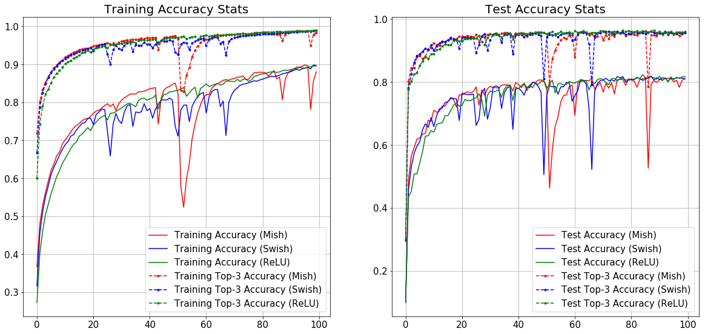

### CIFAR-100:

#### ResNet-v1:

##### ResNet-20:

|Activation Function|Top-1 Accuracy|Top-3 Accuracy|Top-5 Accuracy|Loss|
|---|---|---|---|---|
|Mish|**67.26%**|84.77%|90.08%|16.10206%|
|Swish-1|67.1%|84.68%|90.24%|16.11301634%|
|ReLU|67%|**85.08%**|**90.28%**|**15.653861%**|

##### ResNet-32:

|Activation Function|Top-1 Accuracy|Top-3 Accuracy|Top-5 Accuracy|Loss|
|---|---|---|---|---|
|Mish|**69.44%**|**86.25%**|**91.27%**|16.9508%|
|Swish-1|68.84%|85.89%|90.96%|17.09074%|
|ReLU|68.45%|85.94%|91.05%|**16.64781%**|

##### ResNet-44:

|Activation Function|Top-1 Accuracy|Top-3 Accuracy|Top-5 Accuracy|Loss|
|---|---|---|---|---|
|Mish|69.37%|85.87%|90.97%|18.04521%|
|ReLU|**69.73%**|86%|**91.13%**|**16.77497%**|
|Swish-1|69.62%|**86.22%**|91.08%|18.04978%|

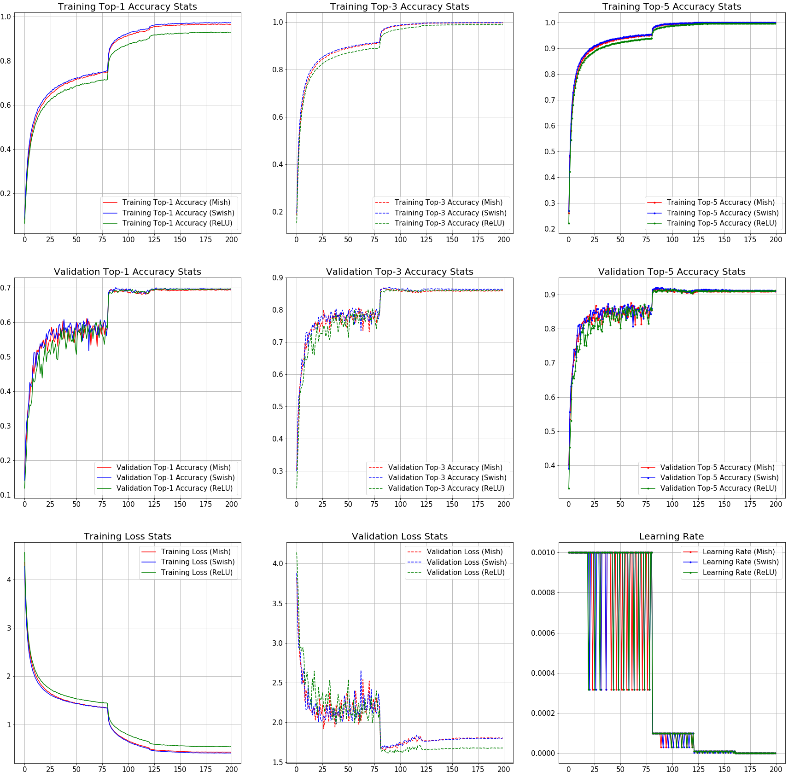

 

##### ResNet-56:

|Activation Function|Top-1 Accuracy|Top-3 Accuracy|Top-5 Accuracy|Loss|
|---|---|---|---|---|
|Mish|**70.13%**|**86.7%**|**91.56%**|18.06037%|
|Swish-1|70.02%|86.09%|91.03%|17.73429%|
|ReLU|69.6%|86.06%|91.07%|**17.32434%**|

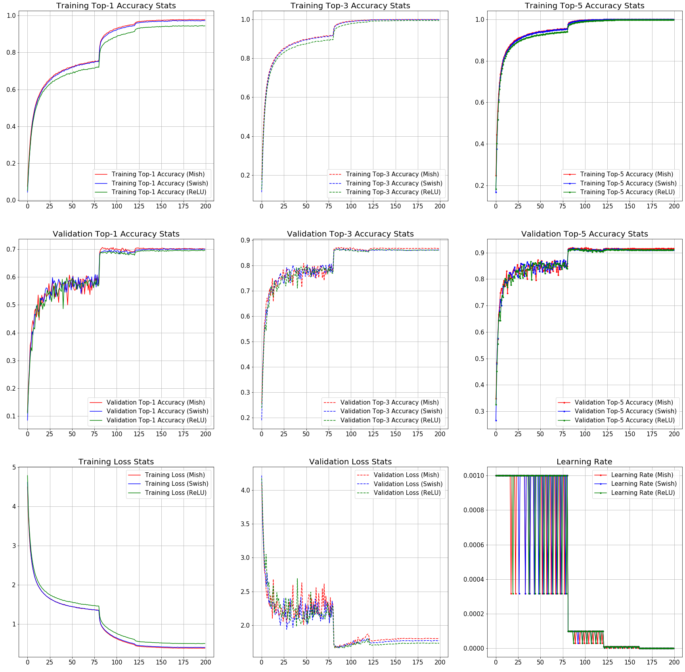

 

##### ResNet-110:

|Activation Function|Top-1 Accuracy|Top-3 Accuracy|Top-5 Accuracy|Loss|
|---|---|---|---|---|
|Mish|67.64%|85.02%|90.65%|17.18773%|
|ReLU|**68.43%**|**86.43%**|**91.2%**|**16.68934%**|
|Swish-1|67.76%|85.48%|90.74%|17.1041962%|

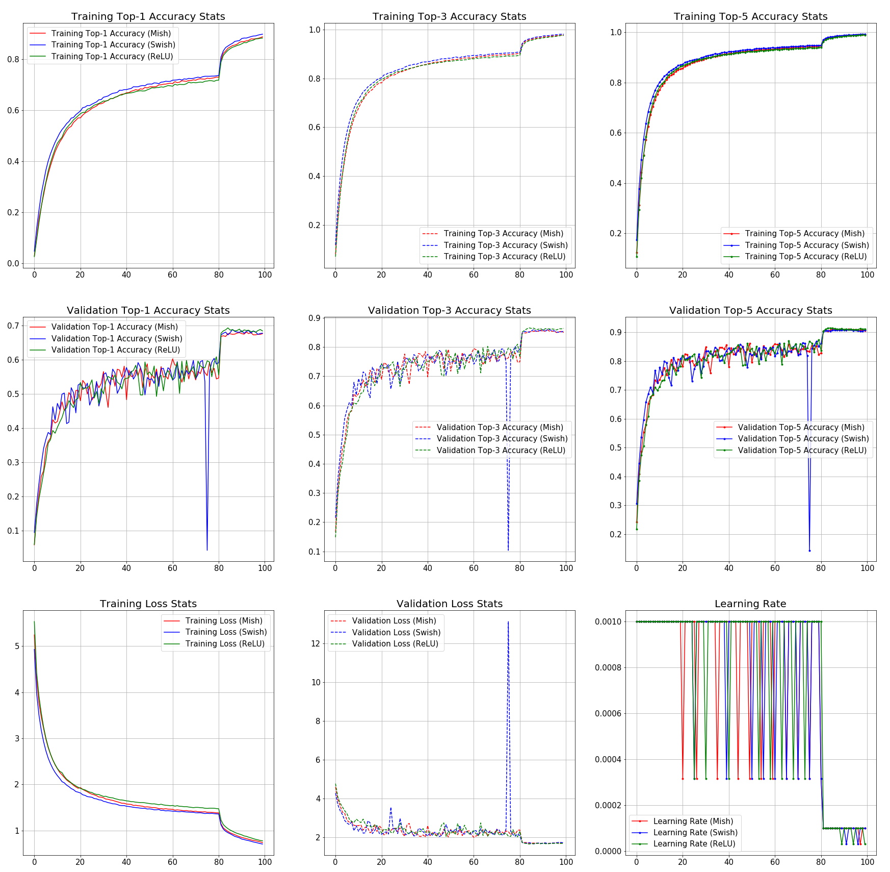

 

##### ResNet-164:

|Activation Function|Top-1 Accuracy|Top-3 Accuracy|Top-5 Accuracy|Loss|
|---|---|---|---|---|
|Mish|52.7%|73.56%|81.25%|24.75166%|
|Swish-1|**55.96%**|**77.2%**|**84.3%**|**21.59843%**|
|ReLU|52.6%|73.58%|81.63%|23.473348%|

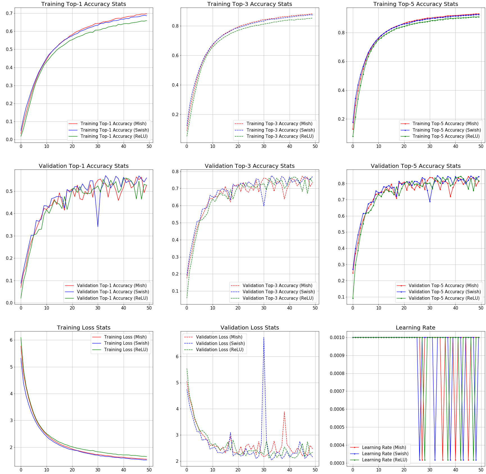

#### ResNet-v2:

##### ResNet-20:

|Activation Function|Top-1 Accuracy|Top-3 Accuracy|Top-5 Accuracy|Loss|
|---|---|---|---|---|
|Mish|**70.86%**|86.6%|91.26%|16.373051%|
|Swish-1|70.23%|86.95%|91.44%|16.6179051%|
|ReLU|70.54%|**86.96%**|**91.5%**|**15.7801898%**|

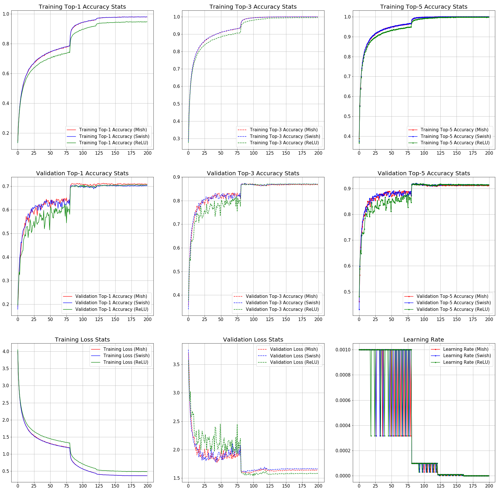

##### ResNet-56: 

|Activation Function |Accuracy (50*)|Loss(50*)|
|---|---|---|
|ReLU|57.25%|22.9%|
|Swish-1|60.28%|22.06%|
|Mish|**60.67%**|**21.54%**|

<em> *This indicates the number of epochs
</em> 

##### ResNet-110:

|Activation Function|Top-1 Accuracy|Top-3 Accuracy|Top-5 Accuracy|Loss|
|---|---|---|---|---|
|Mish|**74.41%**|**89.63%**|**93.54%**|**14.33819%**|
|ReLU|73%|88.92%|93.38%|14.50664%|
|Swish-1|74.13%|89.16%|93.15%|14.48717%|

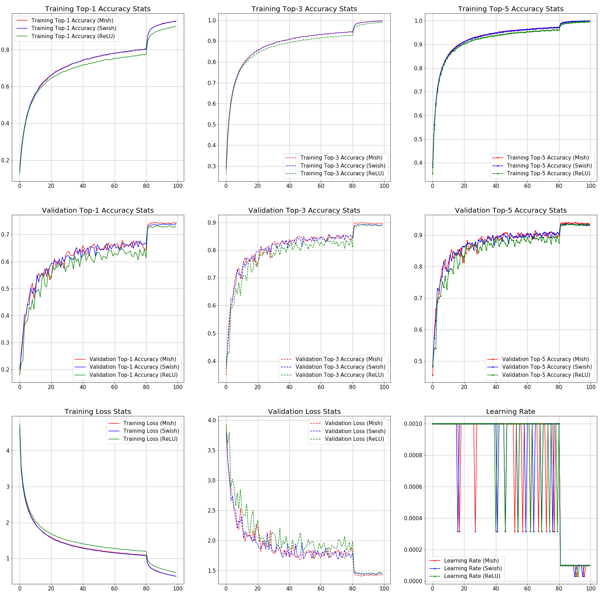

##### ResNet-164:

|Activation Function|Top-1 Accuracy|Top-3 Accuracy|Top-5 Accuracy|Loss|
|---|---|---|---|---|
|Mish|64.16%|83.73%|89.87%|17.63771%|
|ReLU|63.73%|82.75%|89.07%|18.4057462%|
|Swish-1|**64.48%**|**83.94%**|**90.13%**|**17.1700199%**|

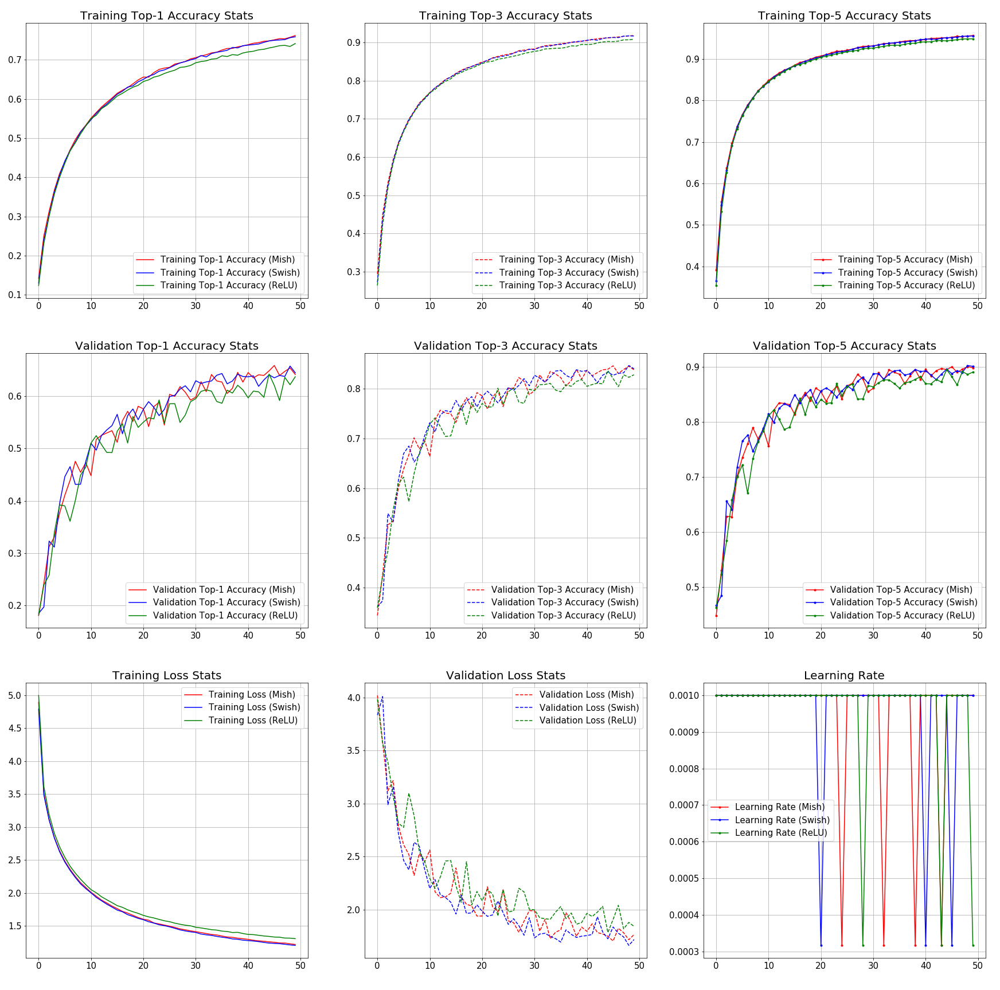

#### Wide Residual Networks (WRN):

##### WRN 10-2:

|Activation Function |Accuracy (Mean of 3 Runs)|
|---|---|
|ReLU|62.5567%|
|Swish-1|66.98%|
|Mish|**67.157%**|

<em> *Number of Epochs=125, Batch Size= 128.
</em> 

##### WRN 16-4:

|Activation Function |Accuracy|
|---|---|
|ReLU|74.60%|
|Swish-1|74.60%|
|Mish|**74.92%**|

<em> *Number of Epochs=125, Batch Size= 128.
</em> 

##### WRN 22-10:

|Activation Function |Accuracy|
|---|---|
|ReLU|72.2%|
|Swish-1|71.89%|
|Mish|**72.32%**|

<em> *Number of Epochs=50, Batch Size= 128.
</em> 

##### WRN 40-4:

|Activation Function |Accuracy|
|---|---|
|ReLU|69.35%|
|Swish-1|**69.59%**|
|Mish|69.52%|

<em> *Number of Epochs=50, Batch Size= 128.
</em> 

#### VGG-16:

|Activation Function |Testing Top-1 Accuracy|Testing Top-3 Accuracy|Testing Top-5 Accuracy|Testing Loss|
|---|---|---|---|---|
|Mish|68.64%|84.15%|88.75%|22.62576%|
|Swish-1|**69.7%**|**84.98%**|**89.34%**|22.03713%|
|ReLU|69.36%|84.57%|89.25%|**21.14352%**|

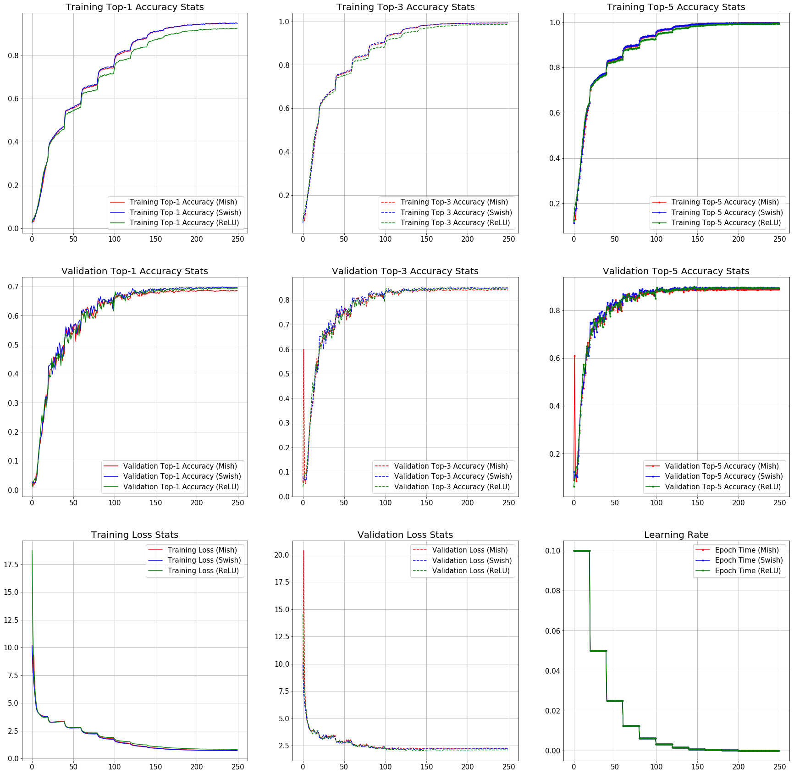

#### DenseNet

##### DenseNet-121:

|Activation Function | Testing Top-1 Accuracy|Loss|Testing Top-3 Accuracy|
|---|---|---|---|
|ReLU|65.5063%|**23.2664%**|83.5047%|
|Swish-1|65.9118%|23.70942%|83.396%|
|Mish|**66.3172%**|23.39932%|**83.6828%**|

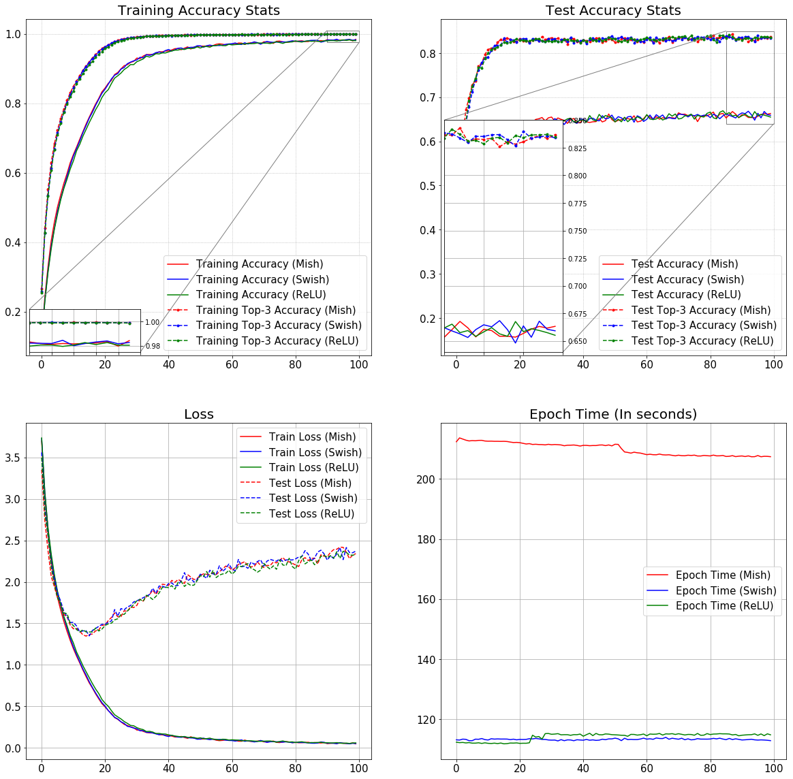

*Note: DenseNet 121 for Mish was run on Google Colab while for Swish and ReLU was run on Kaggle Kernel which accounts for the huge difference in epoch run time"

##### DenseNet-161:

|Activation Function | Testing Top-1 Accuracy|Loss|Testing Top-3 Accuracy|
|---|---|---|---|
|ReLU|63.9043%|27.0369%|81.2698%|
|Swish-1|**64.8042%**|**25.41814%**|**82.3873%**|
|Mish|63.8944%|27.88063%|81.161%|

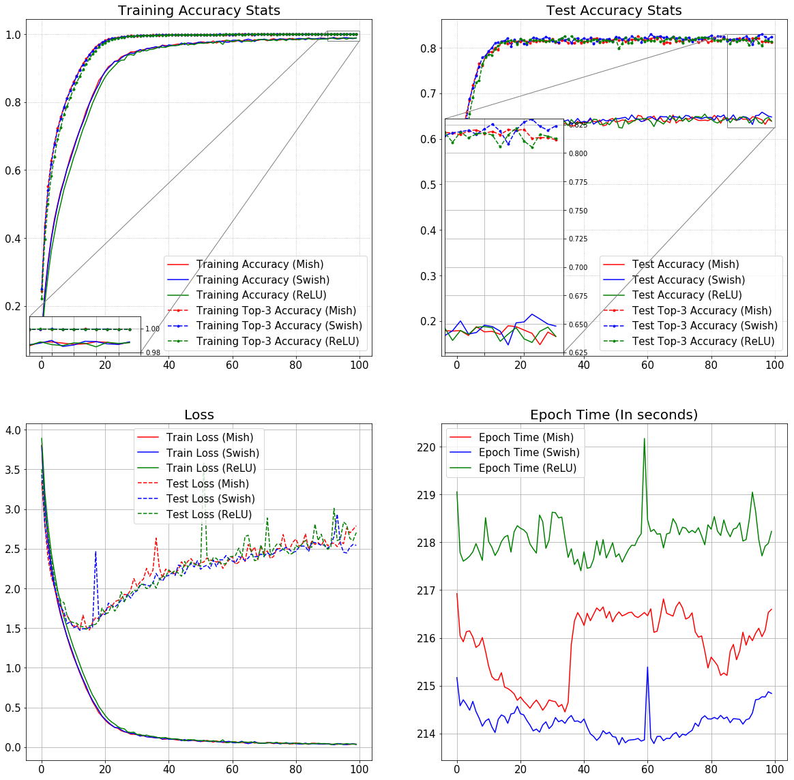

##### DenseNet-169:

|Activation Function | Testing Top-1 Accuracy|Loss|Testing Top-3 Accuracy|
|---|---|---|---|
|ReLU|64.9921%|25.74587%|81.8631%|
|Swish-1|**65.6942%**|**24.94666%**|**82.9114%**|
|Mish|65.3877%|25.30009%|81.9521%|

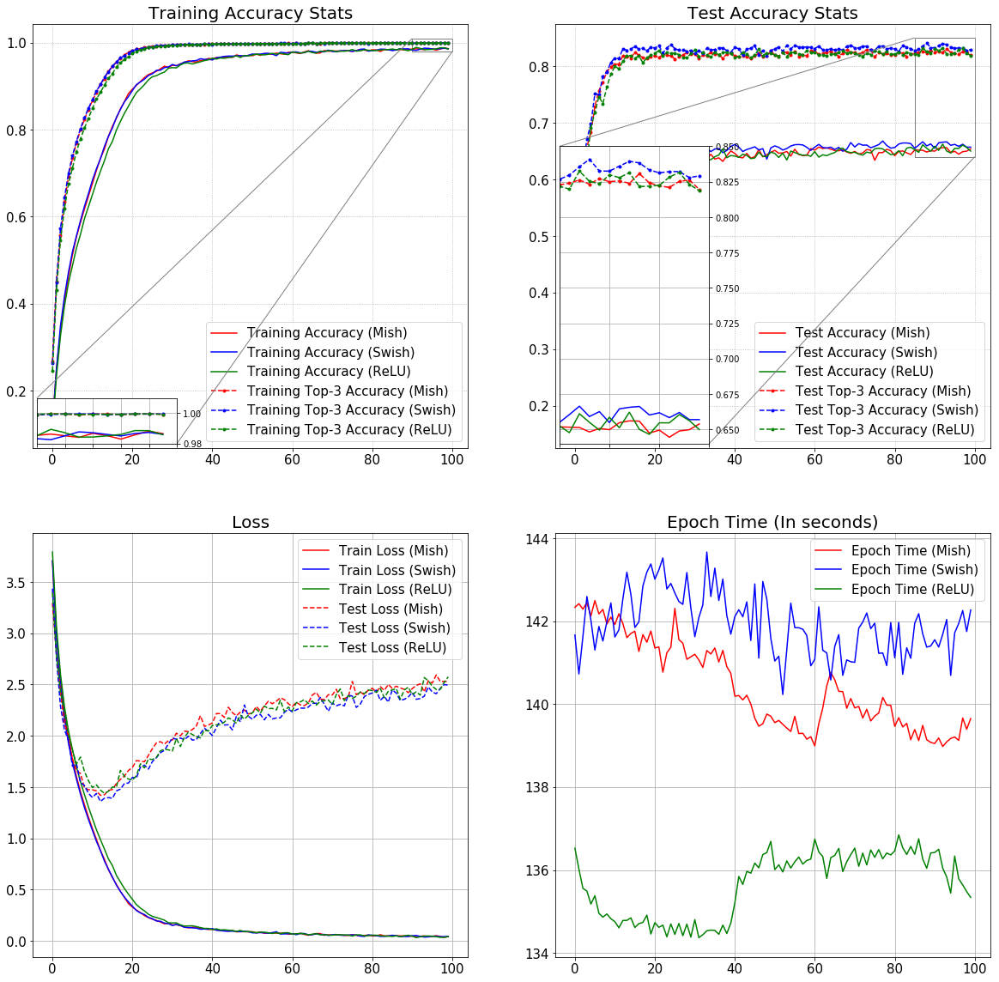

##### DenseNet-201: 

|Activation Function | Testing Top-1 Accuracy|Loss|Testing Top-3 Accuracy|
|---|---|---|---|
|ReLU|63.2516%|26.65269%|80.8643%|
|Swish-1|64.2504%|**25.86263%**|81.5269%|
|Mish|**64.4383%**|26.35366%|**81.8335%**|

#### MobileNet:

##### MobileNet V1:

|Activation Function | Testing Top-1 Accuracy|Loss|Testing Top-3 Accuracy|
|---|---|---|---|
|ReLU|49.2089%|36.70942%|68.0578%|
|Swish-1|49.9506%|37.62909%|68.2358%|
|Mish|51.93%|36.463%|69.65%|
|Tanhshrink|37.11%|39.92%|56.34%|
|Tanh|47.2%|35.182%|66.92%|
|Softsign|49.63%|33.112%|68.37%|
|Softshrink(λ=0.5)|42.96%|36.482%|62.19%|
|Softplus(β = 1)|51.87%|**35.867%**|**70.94%**|
|Sigmoid|51.67%|36.433%|70.32%|
|CELU(α=1.0)|51.06%|37.188%|69.10%|
|SELU|51.76%|36.285%|69.50%|
|RReLU|51.35%|36.649%|69.87%|
|ReLU6|51.26%|36.486%|70.18%|
|PReLU|51.15%|36.441%|69.41%|
|LogSigmoid|51.29%|37.280%|69.24%|
|LeakyReLU(α=0.3)|50.93%|37.168%|69.43%|
|Hardtanh|**52.37%**|35.93%|69.83%|
|HardShrink(λ=0.5)|49.26%|39.109%|67.1%|
|ELU (α=1.0)|51.32%|36.147%|40%|
|GELU|50.42%|37.07%|68.87%|
|E-Swish (β = 1.75)|49.59%|48.64%|68.34%|

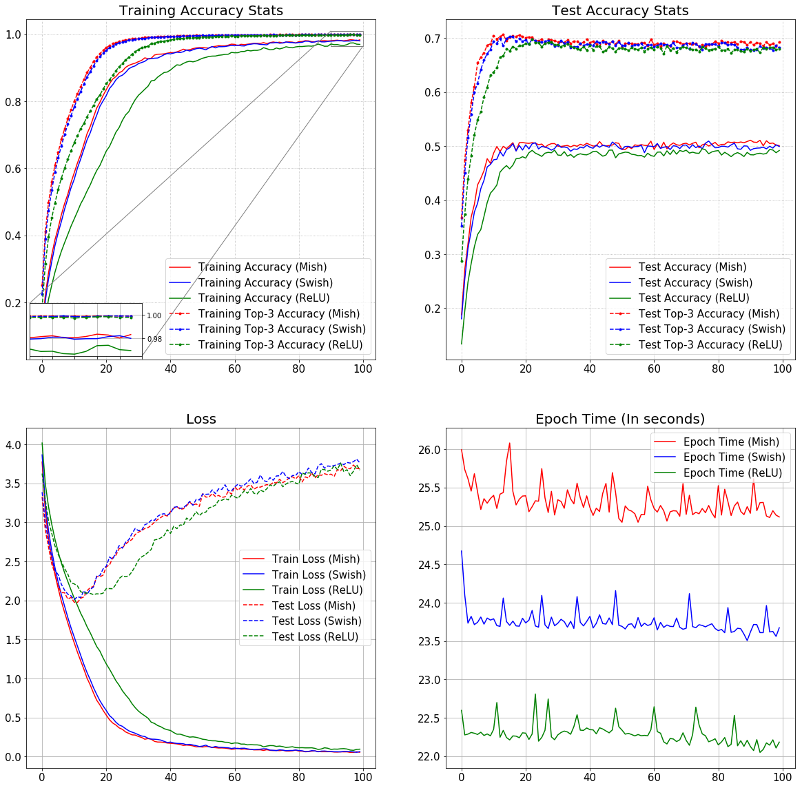

##### MobileNet V2:

|Activation Function | Testing Top-1 Accuracy|Loss|Testing Top-3 Accuracy|
|---|---|---|---|
|ReLU|56.1907%|24.01577%|75.8604%|
|Swish-1|55.6764%|27.90889%|74.7528%|
|Mish|57.0609%|25.96031%|76.2757%|
|Tanhshrink|45.39%|35.02%|54.33%|
|Tanh|49.61%|25.86%|70.2%|
|Softshrink(λ=0.5)|45.86%|30.32%|65.53%|
|Softsign|52.42%|21.85%|73.08%|
|ELU (α=1.0)|55.68%|23.84%|75.64%|
|HardShrink(λ=0.5)|37.95%|25.02%|57.82%|
|Hardtanh|50.46%|23.82%|71.40%|
|LogSigmoid|56.11%|20.733%|76.63%|
|RReLU|**58.4%**|22.43%|**77.65%**|
|PReLU|55.08%|26.912%|74.34%|
|ReLU6|55.87%|24.033%|76.05%|
|Sigmoid|47.01%|20.466%|68.86%|
|SELU|56.43%|**19.885%**|76.5%|
|CELU(α=1.0)|56.72%|23.15%|76.54%|
|Leaky ReLU(α=0.3)|57.8%|22.393%|77.11%|
|Softplus(β = 1)|55.03%|19.935%|75.9%|
|E-Swish (β = 1.75)|55.44%|28.506%|75.17%|
|GELU|55.64%|26.27%|75.18%|
|Aria-2(β = 1, α=1.5)|54.61%|19.067%|75.34%|

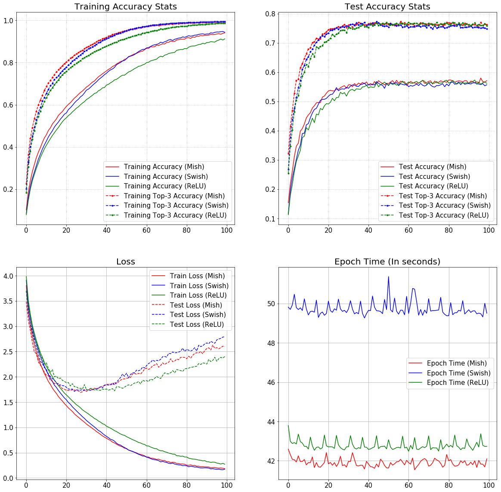

#### Shuffle Net:

##### Shuffle Net v1:

|Activation Function | Testing Top-1 Accuracy|Loss|Testing Top-3 Accuracy|
|---|---|---|---|
|Mish|59.1871%|28.08927%|77.0866%|
|Swish-1|58.4355%|28.2357%|77.1163%|
|ReLU|57.9806%|27.35182%|77.324%|
|ELU (α=1.0)|60.37%|25.35%|78.76%|
|HardShrink(λ=0.5)|49.98%|**19.9%**|70.34%|
|Hardtanh|46.17%|29.56%|66.4%|
|LogSigmoid|60.59%|27.34%|78.86%|
|RReLU|60.89%|24.3%|79.54%|
|ReLU6|58.53%|27.93%|76.29%|
|PReLU|57.4%|28.63%|76.37%|
|SELU|59.6%|25.58%|78.12%|
|Sigmoid|44.37%|28.4%|65.08%|
|Softplus(β = 1)|60.07%|26.94%|78.7%|
|Tanh|53.57%|25.95%|73.09%|
|Softshrink(λ=0.5)|56.45%|21.9%|75.68%|
|Tanhshrink|50.95%|27.51%|71.45%|
|Softsign|50.87%|24.07%|71.42%|
|Leaky ReLU(α=0.3)|**60.94%**|24.05%|**79.87%**|
|CELU(α=1.0)|60.67%|24.51%|79.27%|
|GELU|58.4%|28.31%|76.83%|
|E-Swish (β = 1.75)|55.2%|33.01%|73.64%|
|SQNL|51.44%|27.146%|71.47%|
|Bent's Identity|58.78%|29.623%|76.88%|
|Aria-2(β = 1, α=1.5)|52.74%|22.831%|72.43%|

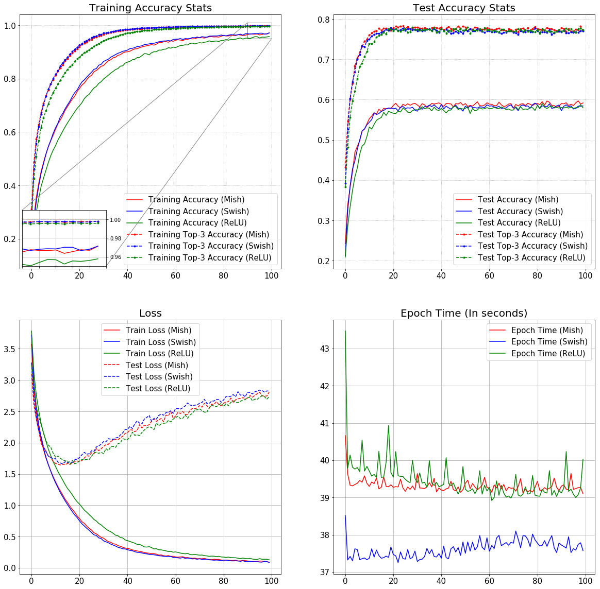

##### Shuffle Net v2:

|Activation Function | Testing Top-1 Accuracy|Loss|Testing Top-3 Accuracy|
|---|---|---|---|
|Mish|59.3552%|27.42081%|77.324%|
|Swish-1|58.9102%|27.65543%|77.5218%|
|ReLU|58.5641%|27.16777%|76.8493%|
|ELU (α=1.0)|60.16%|25.24%|78.36%|
|HardShrink(λ=0.5)|49.37%|19.94%|70.38%|
|Hardtanh|54.45%|23.83%|73.78%|
|LogSigmoid|61.42%|24.71%|79.64%|
|RReLU|61.34%|22.7%|80.25%|
|ReLU6|58.17%|26.99%|76.75%|
|PReLU|56.19%|30.15%|75.18%|
|SELU|58.87%|21.66%|77.74%|
|Sigmoid|57.9%|**17.93%**|77.51%|
|Softplus(β = 1)|60.81%|24.67%|79.27%|
|Softshrink(λ=0.5)|46.24%|32.53%|66.26%|
|Tanhshrink|49.33%|30.84%|69.43%|
|Leaky ReLU(α=0.3)|60.95%|22.97%|79.5%|
|CELU(α=1.0)|59.62%|24.72%|78.55%|
|GELU|58.41%|27.98%|77.13%|
|E-Swish (β = 1.75)|58.97%|27.33%|77.78%|
|Softsign|55.25%|23.37%|75.08%|
|Tanh|55.11%|24.62%|74.57%|
|Aria-2(β = 1, α=1.5)|59.36%|21.208%|78.48%|
|Bent's Identity|**61.84%**|22.06%|**80.30%**|
|SQNL|53.35%|25.681%|73.17%|

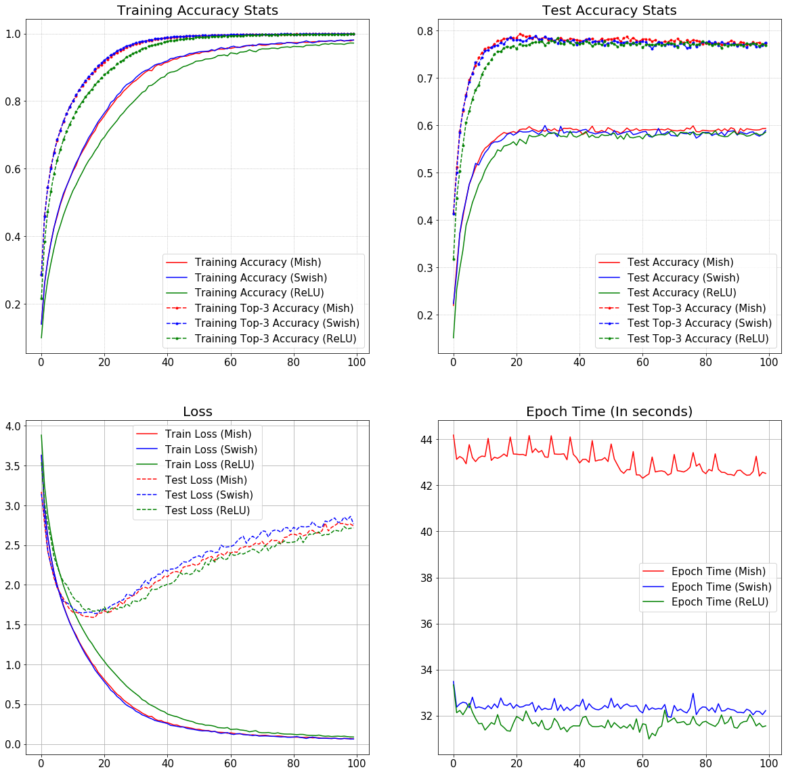

#### Squeeze Net:

|Activation Function | Testing Top-1 Accuracy|Loss|Testing Top-3 Accuracy|
|---|---|---|---|
|Mish|63.0736%|20.31478%|80.6566%|
|ReLU|60.9276%|19.8764%|79.8259%|
|Swish-1|62.1143%|20.82609%|80.983%|
|E-Swish(β = 1.75)|61.31%|20.860%|80.48%|
|GELU|60.98%|20.883%|79.87%|
|Hardtanh|58.26%|17.243%|78.01%|
|Leaky ReLU(α=0.3)|62.27%|17.277%|**81.88%**|
|LogSigmoid|58.44%|19.606%|77.63%|
|PReLU|56.89%|24.621%|76.32%|
|SELU|60.54%|**16.94%**|80.11%|
|CELU(α=1.0)|62.94%|17.535%|81.19%|
|Sigmoid|53.11%|18.815%|73.94%|
|Tanh|59.24%|17.103%|78.97%|
|Tanhshrink|57.54%|19.775%|77.09%|
|Softshrink(λ=0.5)|57.16%|18.39%|76.87%|
|Softsign|57.19%|17.48%|76.78%|
|ELU (α=1.0)|63.09%|18.32%|81.4%|
|HardShrink(λ=0.5)|52.36%|17.89%|73.65%|
|RReLU|**63.39%**|17.54%|81.85%|
|Softplus(β = 1)|61.41%|19.53%|80.38%|
|ReLU6|61.48%|19.75%|80.56%|

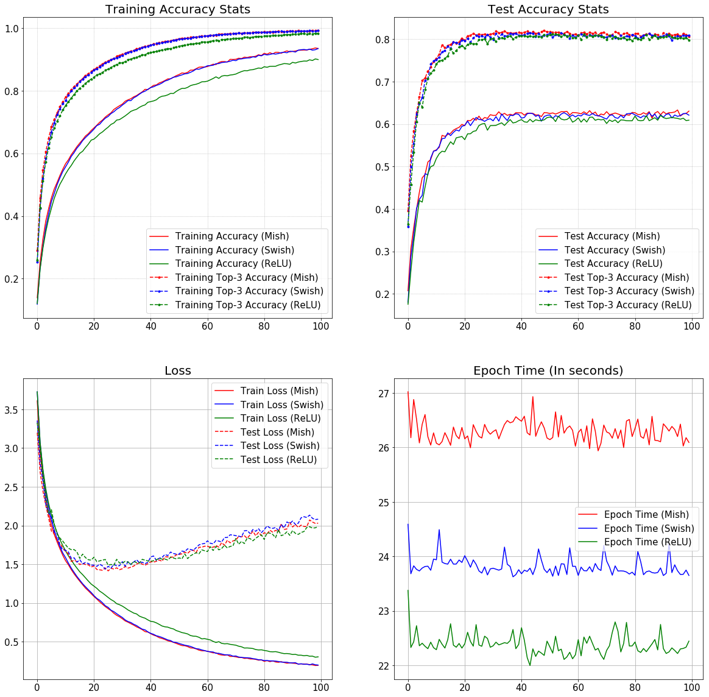

#### ResNext

##### ResNext-50:

|Activation Function | Testing Top-1 Accuracy|Loss|Testing Top-3 Accuracy|
|---|---|---|---|
|ReLU|67.5237%|22.82231%|**84.3058%**|
|Swish-1|66.7227%|22.97197%|83.4751%|
|Mish|**67.5831%**|**22.67923%**|84.2069%|

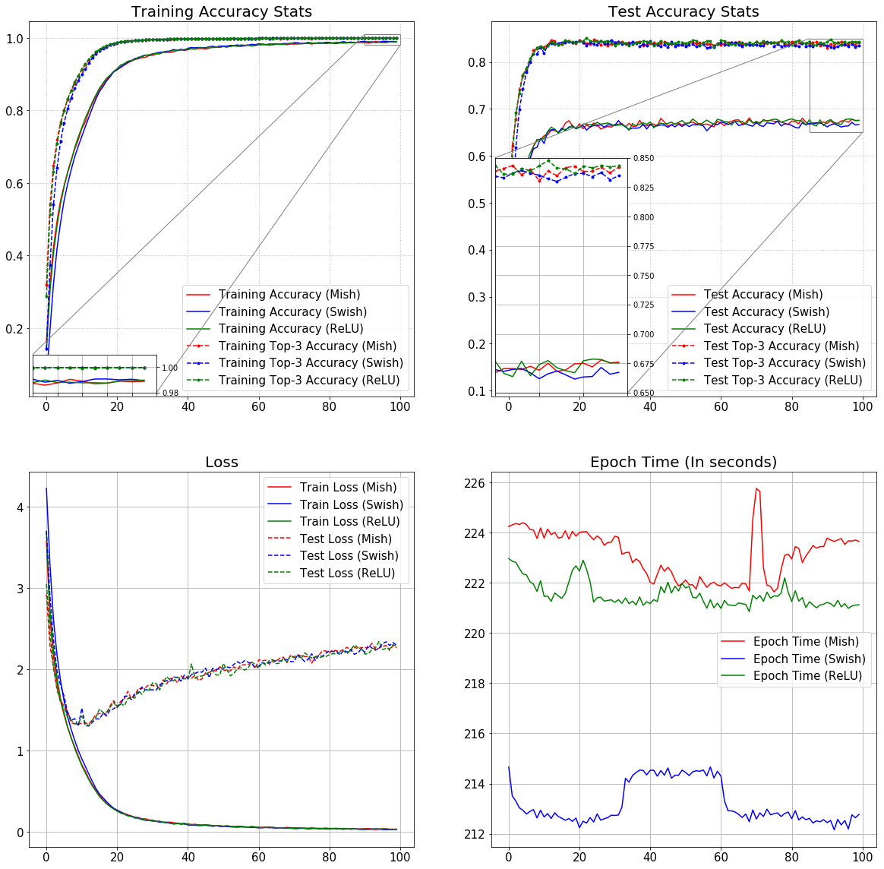

#### Inception Net:

##### Inception v3:

|Activation Function | Testing Top-1 Accuracy|Loss|Testing Top-3 Accuracy|
|---|---|---|---|
|Mish|68.3347%|20.8839%|84.7409%|
|ReLU|68.7797%|20.4812%|85.1365%|
|Swish-1|67.0095%|21.22539%|83.9201%|
|Leaky ReLU(α=0.3)|69.54%|**15.45%**|**86.43%**|
|ELU (α=1.0)|68.17%|18.39%|85.38%|
|HardShrink(λ=0.5)|51.48%|18.22%|72.39%|
|Hardtanh|62.68%|22.26%|80.24%|
|LogSigmoid|68.41%|19.22%|85.48%|
|PReLU|61.25%|28.53%|78.22%|
|RReLU|**69.63%**|17.04%|85.79%|
|ReLU6|68.84%|20.08%|85.45%|
|SELU|65.68%|17.9%|83.74%|
|CELU(α=1.0)|67.96%|18.87%|84.82%|
|Sigmoid|57.4%|20.77%|76.72%|
|Softplus(β = 1)|68.92%|18.3%|85.85%|
|TanH|62.47%|21.27%|80.42%|
|TanhShrink|62.21%|18.7%|80.47%|
|Softsign|58.61%|22.55%|77.46%|
|Softshrink|58.73%|22.91%|77.19%|
|E-Swish(β = 1.75)|68.3346%|21.7%|84.34%|
|GELU|66.4%|21.42%|83.43%|

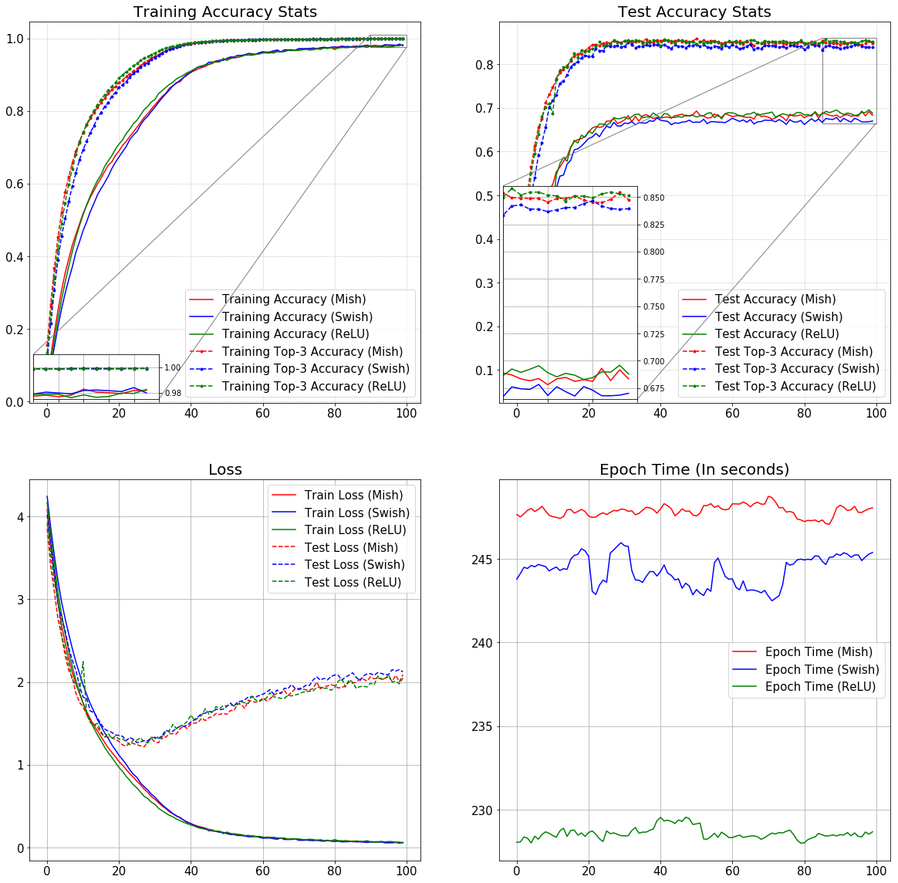

#### SE-Net (Squeeze Excite Network):

##### SE-Net 18: 

|Activation Function | Testing Top-1 Accuracy|Loss|Testing Top-3 Accuracy|
|---|---|---|---|
|Mish|**64.3888%**|25.08049%|**81.4775%**|
|ReLU|62.7176%|27.25935%|80.3995%|
|Swish-1|63.8944%|26.09737%|80.3995%|
|Tanhshrink|55.755%|29.052%|75.2373%|
|Tanh|54.3611%|27.952%|74.5549%|
|Softsign|56.17%|**24.293%**|76.2351%|
|Softshrink(λ=0.5)|55.31%|32.082%|73.931%|
|Softplus(β = 1)|62.381%|28.5233%|79.905%|
|Sigmoid|12.361%|68.558%|25.741%|
|CELU(α=1.0)|61.689%|26.1938%|79.786%|
|RReLU|63.123%|24.892%|81.3093%|
|SELU|59.434%|28.1371%|77.4642%|
|ReLU6|63.69%|26.609%|81.21%|
|PReLU|62.598%|27.231%|80.7159%|
|Leaky ReLU(α=0.3)|63.785%|26.3344%|80.9335%|
|LogSigmoid|62.984%|28.29%|80.5775%|
|HardShrink(λ=0.5)|47.221%|31.421%|67.6819%|
|Hardtanh|56.466%|25.36%|76.1965%|
|ELU (α=1.0)|61.53%|27.0255%|79.6821%|
|GELU|63.795%|25.756%|80.9533%|
|E-Swish(β = 1.75)|61.224%|28.637%|78.659%|

##### SE-Net 34:

|Activation Function | Testing Top-1 Accuracy|Loss|Testing Top-3 Accuracy|
|---|---|---|---|
|Mish|64.4778%|**24.05231%**|81.7741%|
|ReLU|64.5669%|25.20289%|81.3093%|
|Swish-1|64.8734%|24.13571%|81.9225%|
|ELU (α=1.0)|62.43%|25.53%|80.54%|
|HardShrink(λ=0.5)|47.24%|43.24%|66.8%|
|GELU|63.84%|25.16%|81.11%|
|Hardtanh|54.65%|29.2%|73.81%|
|Leaky ReLU(α=0.3)|62.3%|26.24%|80.09%|
|LogSigmoid|62.34%|30.56%|80.23%|
|PReLU|62.96%|27.94%|80.84%|
|RReLU|63.84%|24.61%|81.11%|
|ReLU6|**65.18%**|24.17%|**82.38%**|
|SELU|60.51%|27.47%|78.52%|
|CELU(α=1.0)|61.7%|26.42%|79.58%|
|Softplus(β = 1)|61.39%|32.9%|79.36%|
|Tanhshrink|56.7%|27.76%|75.35%|
|Tanh|54.49%|29.63%|73.67%|
|Softshrink(λ=0.5)|54.61%|32.37%|73.12%|
|Softsign|54.48%|27.38%|74.41%|
|E-Swish(β = 1.75)|61.74%|29%|79.59%|

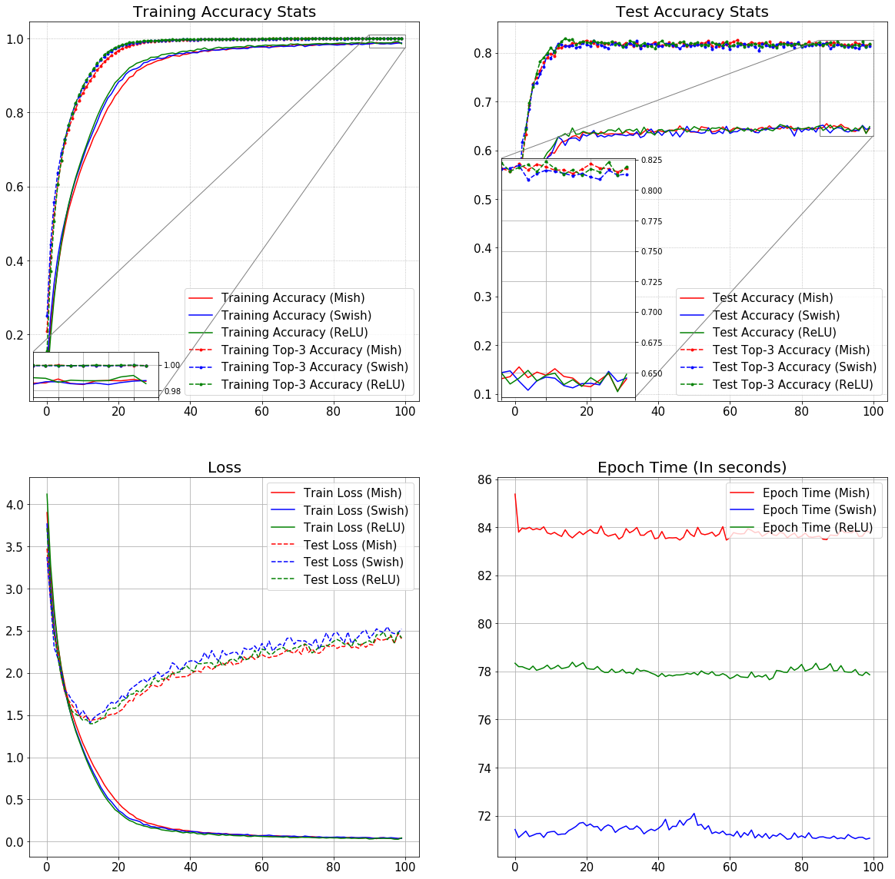

### CalTech - 256:

#### ShuffleNet v2-x1:

|Activation Function | Testing Top-1 Accuracy|Loss|
|---|---|---|
|Mish|71%|11.6515%|
|ReLU|70%|11.5748%|
|Swish-1|68%|12.8063%|
|SQNL|70%|12.1596%|
|Aria-2|55%|18.6368%|
|RReLU|69%|12.1658%|
|E-Swish(β=1.75)|**72%**|**11.1044%**|

### Custom Data-Sets:

#### ASL (American Sign Language):

| Activation Function  | Accuracy (10*) |  Loss (10*) |
| ------------- | ------------- | ---|
| ReLU  | 74.42%  |7.965%|
| Swish-1  | 68.84%  |10.464%|
| Mish  | **77.38%**|**7.078%**|

<em> *The number indicates the Number of Epochs
</em> 

#### Malaria Cells Dataset:

| Activation Function  | Accuracy (10*) |  Loss (10*) |
| ------------- | ------------- | ---|
| ReLU  | 94.21%  |**1.45%**|
| Swish-1  | **95.97%**  |**1.45%**|
| Mish  | 95.12%|1.56%|

<em> *The number indicates the Number of Epochs
</em> 

#### Caravan Image Masking Challenge Dataset:

| Activation Function  | Training Loss (5*) |  Training Dice-Loss (5*) | Validation Loss(5*)| Validation Dice-Loss(5*)| Average Epoch Time | Average Step Time|
| ------------- | ------------- | ---|---|---|---|---|
| ReLU  |  0.724% |0.119%|0.578%|0.096%|**343.2 seconds**|**253 milli-seconds**|
| Swish-1  | 0.665%|0.111%|0.639%|0.108%|379 seconds|279.2 milli-seconds|
| Mish  |**0.574%**|**0.097%**|**0.554%**|**0.092%**|411.2 seconds|303 milli-seconds|

<em> *The number indicates the Number of Epochs
</em> 

The following graph shows the Loss Plotting for U-Net with Mish: (Values Scaled to loss value/10)

 

### Generative Models

#### Auto-Encoders: 

|Activation Function|MSE|
|---|---|
|ReLU|0.0053245881572|
|Swish-1|0.00525206327438|
|Mish|**0.005139515735**|

Some samples obtained:

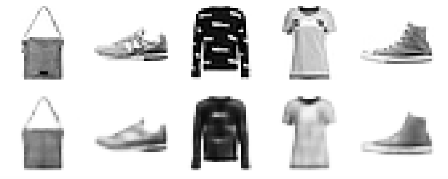

 

### GAN:

|Activation Function| Generator Loss| Discriminator Loss|
|---|---|---|
|ReLU|5.1214063%|**11.78977%**|
|Swish-1|**4.8570448%**|12.737954%|
|Mish|5.02091%|13.451806%|

Some samples generated over 100 epochs and the Discriminator and Generator Loss Curves: 

  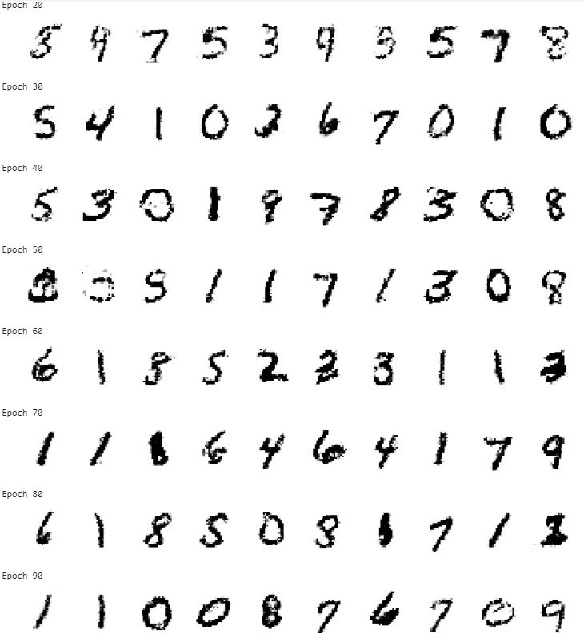
  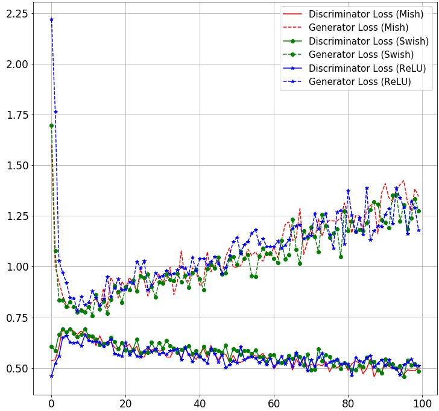 

### DCGAN (MNIST):

|Activation Function| Generator Loss| Discriminator Loss|
|---|---|---|
|Leaky ReLU|5.2213|**0.1261**|
|Mish|**2.2687**|0.3796|

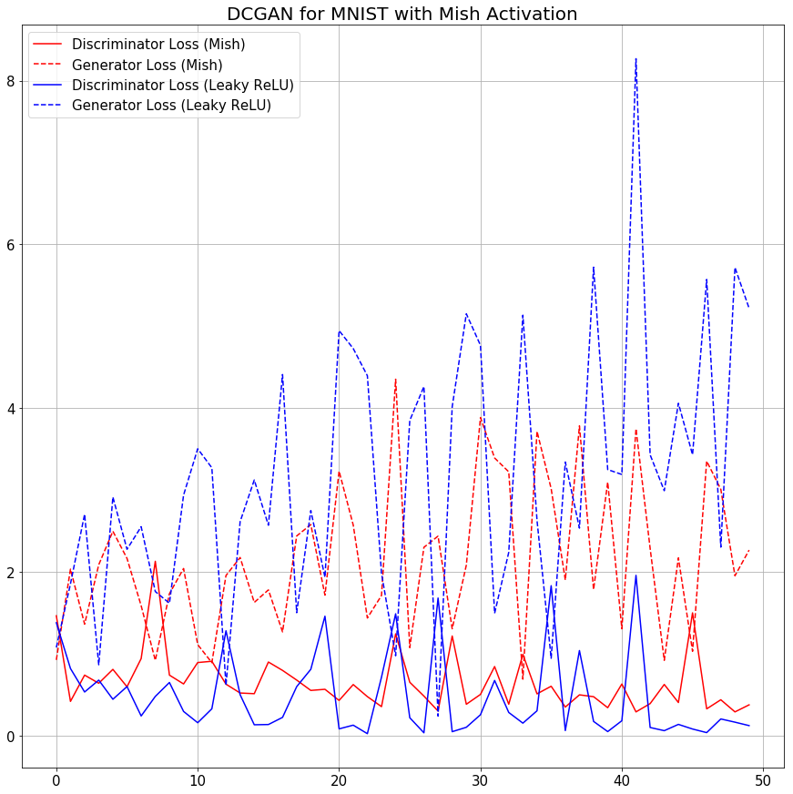

 

### Entity Embedding:

|Activation Function| AUC|
|---|---|
|ReLU|0.79477483|
|Swish-1|0.797871375706|
|Mish|**0.79815630082**|

