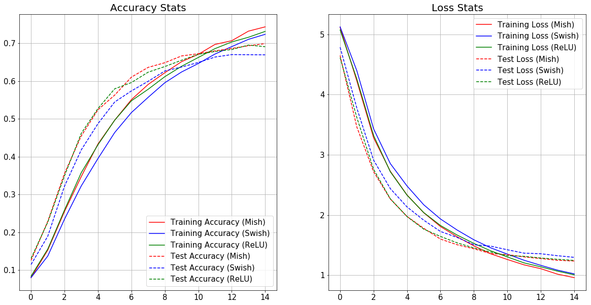

## Results:

### MNIST:

#### LeNet-4:

| Activation Function  | Accuracy (20*) |  Loss (20*) | GPU-Utilization (20*) |CPU-RAM Utilization** (20*)| Training Time (20*) | Inference Time (20*)| Top 5 Accuracy (20*) | Top 3 Accuracy (20*)|
| ------------- | ------------- | ---|---|---|---|---|---|---|
| ReLU  | **98.65%**  |**0.368%**|5%|**11.4GB**|**51.67 seconds**|**0.197 seconds**|**100%**|**99.94%**|
| Swish-1  | 98.42%  |0.385%|5%|**11.4GB**|65.11 seconds|0.2157 seconds|99.99%|99.9%|
| Mish  | 98.64%  |**0.368%**|5%|11.2GB|81.12 seconds|0.2967 seconds|**100%**|**99.94%**|

<em> *The number indicates the Number of Epochs
</em> 
<em> **This shows the amount of RAM Free.
</em> 

### SVHN: 

|Activation Function| Top-1 Accuracy|Loss| Top-3 Accuracy| Top-5 Accuracy| 
|---|---|---|---|---|
|Mish|89.639%|4.77854%|97.0497%|98.686%|
|Swish-1|90.56%|4.2518%|97.257%|98.759%|
|ReLU|**91.913%**|**4.21139%**|**97.6989%**|**98.935%**|

 

### K-MNIST:

|Activation Function| Top-1 Accuracy|
|---|---|
|Mish|95.41%|
|Swish-1|**95.78%**|
|ReLU|95.74%|

Samples obtained during inference of a Custom CNN using Mish:

 

Mish Training Graph:

 

### Fashion-MNIST:

#### Mini VGG-Net:

| Activation Function  | Accuracy (25*) |  Loss (25*) | GPU-Utilization (5*) |CPU-RAM Utilization** (5*)| Training Time (5*) | Inference Time (5*)|
| ------------- | ------------- | ---|---|---|---|---|
| ReLU  | 93.19%  |1.895%|33%|**10.1GB**|**261.88 seconds**|**3.51 seconds**|
| Swish-1  | 93.09%  |1.935%|33%|**10.1GB**|271.13 seconds|3.53 seconds|
| Mish  | **93.31%**|**1.859%**|33%|10GB|294.85 seconds|3.78 seconds|

<em> *The number indicates the Number of Epochs
</em> 
<em> **This shows the amount of RAM Free.
</em> 

The evaluation metrics for the Mini-VGG Network with Mish Activation Function is given below: 

| Class Labels  | Precision |  Recall | F1-Score |
| ------------- | ------------- | ---|---|
| top  | 0.90  |0.87|0.88|
| trouser  | 0.99 |0.98|0.99|
| pullover  | 0.93|0.89|0.91|
| dress  | 0.93 |0.94|0.93|
| coat | 0.88  |0.93|0.90|
| sandal | 0.99|0.99|0.99|
| shirt  | 0.79 |0.80|0.80|
| sneaker  | 0.96 |0.98|0.97|
| bag  | 0.99  |0.99|0.99|
| ankle-boot  | 0.98  |0.97|0.97|
| **Average** | **Precision** |**Recall** |**F1-Score**|
| micro average  | 0.93  |0.93|0.93|
| macro average  | 0.93  |0.93|0.93|
| weighted average  | 0.93  |0.93|0.93|

### Iris:

| Activation Function  | Accuracy (4000*) |  Loss (4000*) |
| ------------- | ------------- | ---|
| ReLU  | 96.67%  |2.84%|
| Swish-1  | 97.33%  |**2.32%**|
| Mish  | **98%**|2.66%|

<em> *The number indicates the Number of Epochs
</em> 

### CIFAR-10:

#### ResNet v1:

##### ResNet-20:

|Activation Function| Top-1 Accuracy| Loss|
|---|---|---|
|Mish|91.81%|4.47284%|
|Swish-1|**91.95%**|**4.440651%**|
|ReLU|91.5%|4.94356%|

 

##### ResNet-32: 

|Activation Function| Top-1 Accuracy| Loss|
|---|---|---|
|Mish|92.29%|4.3543639%|
|Swish-1|**92.3%**|**4.31110565%**|
|ReLU|91.78%|4.51267568%|

 

##### ResNet-44:

|Activation Function| Top-1 Accuracy|Loss| Top-3 Accuracy| Top-5 Accuracy| 
|---|---|---|---|---|
|Mish|92.46%|4.4195%|**99%**|**99.82%**|
|Swish-1|**92.84%**|**4.1272%**|98.96%|**99.82%**|
|ReLU|92.33%|4.30961%|98.89%|99.73%|

 

##### ResNet-56:

|Activation Function| Top-1 Accuracy|Loss| Top-3 Accuracy| Top-5 Accuracy| 
|---|---|---|---|---|
|Mish|**92.21%**|4.3387%|**99.09%**|**99.85%**|
|Swish-1|91.85%|**4.33817%**|98.92%|**99.85%**|
|ReLU|91.97%|4.34036%|98.91%|99.74%|
|ELU(α=1.0)|91.48%|4.39%|98.88%|99.78%|
|SELU|90.41%|4.56946%|98.8%|99.75%|

##### ResNet-110:

|Activation Function| Top-1 Accuracy| Loss|Top-3 Accuracy| Top-5 Accuracy| 
|---|---|---|---|---|
|Mish|91.44%|4.672%|98.75%|99.6%|
|Swish-1|91.34%|4.7418%|98.86%|99.76%|
|ReLU|**91.69%**|4.4194%|98.9%|**99.77%**|
|ELU(α=1.0)|91.66%|**4.171%**|**98.92%**|99.67%|

##### ResNet-164:

|Activation Function| Top-1 Accuracy| Loss|Top-3 Accuracy| Top-5 Accuracy| 
|---|---|---|---|---|
|Mish|**83.62%**|**7.7867%**|**96.81%**|99.11%|
|Swish-1|82.19%|9.046%|96.43%|**99.18%**|
|ReLU|82.37%|8.09783%|95.48%|98.48%|

#### ResNet v2:

##### ResNet-20:

|Activation Function|Testing Top-1 Accuracy|Testing Loss|
|---|---|---|
|Aria-2(β = 1, α=1.5)|91.73%|4.25074%|
|Bent's Identity|89.1%|4.52398%|
|ELU(α=1.0)|91.58%|**4.05194%**|
|Hard Sigmoid|87.42%|4.86469%|
|Leaky ReLU(α=0.3)|90.57%|4.093131%|
|Mish|**92.02%**|4.19176%|
|PReLU(Default Parameters)|91.25%|4.403224%|
|ReLU|91.71%|4.08291%|
|SELU|90.59%|4.36311%|
|Sigmoid|89.27%|4.474636%|
|SoftPlus|91.39%|4.2238%|
|SoftSign|90.45%|4.402751%|
|Swish-1|91.61%|4.295542%|
|TanH|90.99%|4.3992%|
|Thresholded ReLU(θ=1.0)|76.22%|7.37498%|

##### ResNet-56:

Number of Epochs were varied to observe the computational cost and training time of the networks. The table below provides all the information regarding the same. 

- For Batch Size = 32, Number of Steps= 1563, Number of Epochs= 10:

|Activation Function |Training Accuracy|Training Loss|Validation Accuracy|Validation Loss|Testing Accuracy|Testing Loss|Average Per Epoch Time|Inference Time (Per Sample)|Average Per Step Time|Average Forward Pass Time|
|---|---|---|---|---|---|---|---|---|---|---|
|ReLU|73.10%|15.1%|71.9%|15.35%|73.34%|15.34%|**130.8 seconds**|**2 seconds (487 micro seconds)**|**83.8 milli seconds**|**669.9 micro- seconds**|
|Swish-1|**77.65%**|**14.04%**|75.58%|14.77%|75.88%|14.68%|155.1 seconds|3 seconds (550 micro-seconds)|99.3 milli-seconds|775.2 micro-seconds|
|Mish|76.93%|14.08%|**76.58%**|**14%**|**76.46%**|**13.98%**|158.5 seconds|3 seconds (590 micro-seconds)|101.4 milli-seconds|830.4 micro-seconds|

- For Batch Size = 32, Number of Steps= 1563, Number of Epochs= 50: (Best of 2 runs)

|Activation Function |Testing Accuracy|Testing Loss|Inference Time (Per Sample)| 
|---|---|---|---|
|ReLU|83.86%|9.945%|3 seconds (559 micro-seconds)|
|Swish-1|86.36%|8.81%|3 seconds (618 micro-seconds)|
|Mish|**87.18%**|**8.62%**|3 seconds (653 micro-seconds)|

 

The Confusion Matrix obtained after 100 epoch training of ResNet v2 with Mish on CIFAR-10 is shown below:

 

##### ResNet-110:

|Activation Function| Top-1 Accuracy| Loss|Top-3 Accuracy| Top-5 Accuracy| 
|---|---|---|---|---|
|Mish|**92.58%**|4.16525%|98.97%|99.72%|
|Swish-1|92.22%|**4.16021%**|**98.99%**|**99.75%**|
|ReLU|91.93%|4.22357%|98.85%|99.75%|

##### ResNet-164: 

|Activation Function| Top-1 Accuracy| Loss|Top-3 Accuracy| Top-5 Accuracy| 
|---|---|---|---|---|
|Mish|**87.74%**|**5.7284%**|**98.07%**|**99.61%**|
|Swish-1|86.13%|6.4354%|97.55%|99.4%|
|ReLU| 83.59%| 7.3899%|96.86%|99.41%|

##### ResNet-245:

|Activation Function| Top-1 Accuracy| Loss|Top-3 Accuracy| Top-5 Accuracy| 
|---|---|---|---|---|
|Swish-1|85.41%|6.6752%|97.56%|99.38%|
|Mish|**86.87%**|**6.07021%**|**97.88%**|**99.53%**|
|ReLU|86.32%|6.11834%|97.64%|99.45%|

#### Wide Residual Networks (WRN):

##### WRN 10-2:

|Activation Function |Accuracy|Loss|
|---|---|---|
|ReLU|84.52%|6.298%|
|Swish-1|86.56%|5.726%|
|Mish|**86.83%**|**5.712%**|

<em> *Number of Epochs=50, Batch Size= 128.
</em> 

##### WRN 16-4:

|Activation Function |Accuracy|Loss|
|---|---|---|
|ReLU|**90.74%**|5.644%|
|Swish-1|90.07%|**5.014%**|
|Mish|90.54%|5.104%|

<em> *Number of Epochs=50, Batch Size= 128.
</em> 

##### WRN 22-10:

|Activation Function |Accuracy|Loss|
|---|---|---|
|ReLU|**91.28%**|5.588%|
|Swish-1|90.17%|5.136%|
|Mish|90.38%|**4.961%**|

<em> *Number of Epochs=50, Batch Size= 128.
</em> 

#### SimpleNet:

|Activation Function |Accuracy|Loss| Top 3 Accuracy| Top 5 Accuracy|
|---|---|---|---|---|
|ReLU|91.16%|2.897%|98.62%|99.65%|
|Swish-1|91.44%|2.944%|**98.87%**|**99.77%**|
|Mish|**91.70%**|**2.759%**|98.85%|99.75%|

<em> *Number of Epochs=50, Batch Size=128, Network Parameters= 5.59 M
</em> 

#### Xception Network:

|Activation Function |Testing Top-1 Accuracy|Testing Loss|
|---|---|---|
|Mish|**88.73%**|5.44975%|
|Swish-1|88.56%|5.410996%|
|ReLU|88.38%|**5.400312%**|

#### Capsule Network:

|Activation Function |Testing Top-1 Accuracy|Testing Top-3 Accuracy|Testing Top-5 Accuracy|Testing Loss (Margin Loss)|
|---|---|---|---|---|
|ELU(α=1.0)|71.7%|90.72%|95.85%|2.3819%|
|Mish|83.15%|94.62%|97.2%|1.51671%|
|Swish-1|82.48%|94.7%|97.11%|1.5232%|
|ReLU|82.19%|94.88%|97.48%|**1.51009%**|
|SELU|80.24%|94.3%|97.56%|1.9122%|
|Leaky ReLU(α=0.3)|**83.42%**|**95.48%**|**97.96%**|1.5393%|

#### Inception-ResNet-v2:

|Activation Function |Testing Top-1 Accuracy|Testing Top-3 Accuracy|Testing Top-5 Accuracy|Testing Loss|
|---|---|---|---|---|
|Mish|**85.21%**|97.13%|99.22%|4.6409%|
|Swish-1|84.96%|97.29%|99.29%|4.8955%|
|ELU(α=1.0)|83.93%|96.96%|99.11%|4.884%|
|ReLU|82.22%|95.87%|98.65%|5.3729%|
|Leaky ReLU(α=0.3)|84.67%|**97.35%**|**99.42%**|**4.5577%**|
|TanH|76.29%|94.65%|98.42%|6.7464%|
|PReLU(Default Parameters)|81.99%|96.01%|99.04%|5.50853%|
|SELU|83.27%|96.61%|99.04%|5.1101%|
|Softsign|79.76%|95.15%|98.61%|6.0377%|

#### DenseNet

##### DenseNet-121:

|Activation Function | Testing Top-1 Accuracy|Loss|Testing Top-3 Accuracy|
|---|---|---|---|
|ReLU|91.0997%|**4.40764%**|98.6946%|
|Swish-1|90.9217%|4.54128%|**98.7144%**|
|Mish|**91.2678%**|4.60893%|98.665%|

##### DenseNet-161:

|Activation Function | Testing Top-1 Accuracy|Loss|Testing Top-3 Accuracy|
|---|---|---|---|
|ReLU|**91.0206%**|4.89679%|98.6452%|
|Swish-1|90.1602%|**4.85416%**|98.665%|
|Mish|90.8228%|4.95727%|**98.8034%**|

##### DenseNet-169:

|Activation Function | Testing Top-1 Accuracy|Loss|Testing Top-3 Accuracy|
|---|---|---|---|
|ReLU|**91.6535%**|**4.30486%**|**98.8726%**|
|Swish-1|90.6744%|4.8451%|98.5562%|
|Mish|90.5063%|4.74986%|98.6353%|

##### DenseNet-201: 

|Activation Function | Testing Top-1 Accuracy|Loss|Testing Top-3 Accuracy|
|---|---|---|---|
|ReLU|90.7239%|5.02072%|**98.6946%**|
|Swish-1|**91.0107%**|**4.76944%**|98.665%|
|Mish|90.7338%|4.81563%|98.5364%|

#### ResNext

##### ResNext-50:

|Activation Function | Testing Top-1 Accuracy|Loss|Testing Top-3 Accuracy|
|---|---|---|---|
|ReLU|89.3592%|5.55392%|98.4771%|
|Swish-1|**91.6238%**|**4.18871%**|**98.665%**|
|Mish|90.8327%|4.61261%|98.5364%|

#### MobileNet:

##### MobileNet V1:

|Activation Function | Testing Top-1 Accuracy|Loss|Testing Top-3 Accuracy|
|---|---|---|---|
|ReLU|84.1179%|**6.71502%**|96.9937%|
|Swish-1|**85.6903%**|7.05216%|96.9937%|
|Mish|85.2749%|6.99848%|**97.0926%**|

##### MobileNet V2:

|Activation Function | Testing Top-1 Accuracy|Loss|Testing Top-3 Accuracy|
|---|---|---|---|
|ReLU|86.0463%|**5.06381%**|**97.5574%**|
|Swish-1|86.0759%|5.43845%|97.4684%|
|Mish|**86.254%**|5.26875%|97.5376%|

#### SE-Net (Squeeze Excite Network):

##### SE-Net 18: 

|Activation Function | Testing Top-1 Accuracy|Loss|Testing Top-3 Accuracy|
|---|---|---|---|
|Mish|89.913%|5.4431%|98.4078%|
|ReLU|**90.1602%**|**4.75929%**|**98.5562%**|
|Swish-1|89.4284%|5.47937%|98.3485%|

##### SE-Net 34:

|Activation Function | Testing Top-1 Accuracy|Loss|Testing Top-3 Accuracy|
|---|---|---|---|
|Mish|90.5162%|5.1516%|98.6056%|
|ReLU|**91.6733%**|**4.22846%**|**98.825%**|
|Swish-1|89.9624%|5.39445%|98.4177%|

#### Shuffle Net:

##### Shuffle Net v1:

|Activation Function | Testing Top-1 Accuracy|Loss|Testing Top-3 Accuracy|
|---|---|---|---|
|Mish|**87.3121%**|5.89664%|**97.7354%**|
|Swish-1|86.9462%|6.05925%|97.6859%|
|ReLU|87.0451%|**5.81928%**|97.5277%|

##### Shuffle Net v2:

|Activation Function | Testing Top-1 Accuracy|Loss|Testing Top-3 Accuracy|
|---|---|---|---|
|Mish|86.6297%|5.84306%|97.5376%|
|Swish-1|86.9363%|5.55479%|97.6958%|
|ReLU|**87.0055%**|**5.35336%**|**97.854%**|

#### Squeeze Net:

|Activation Function | Testing Top-1 Accuracy|Loss|Testing Top-3 Accuracy|
|---|---|---|---|
|Mish|87.767%|5.15197%|97.9529%|
|ReLU|87.8461%|4.94529%|98.2002%|
|Swish-1|**88.3703%**|**4.66536%**|**98.2793%**|

#### Inception Net:

##### Inception v3:

|Activation Function | Testing Top-1 Accuracy|Loss|Testing Top-3 Accuracy|
|---|---|---|---|
|Mish|**91.1986%**|4.14335%|**98.8627%**|
|ReLU|90.8426%|4.54385%|98.4968%|
|Swish-1|91.1788%|**3.80319%**|98.6551%|

#### EfficientNet:

##### EfficientNet B0:

|Activation Function | Testing Top-1 Accuracy|Loss|Testing Top-3 Accuracy|
|---|---|---|---|
|Mish|**80.7358%**|**6.36222%**|**96.0542%**|
|ReLU|79.3117%|7.41779%|95.2828%|
|Swish-1|79.371%|7.69936%|95.3718%|

##### EfficientNet B1:

|Activation Function | Testing Top-1 Accuracy|Loss|Testing Top-3 Accuracy|
|---|---|---|---|
|Mish|80.9632%|14.67869%|94.8477%|
|ReLU|**82.4367%**|**6.01114%**|96.1926%|
|Swish-1|81.9818%|6.49295%|**96.2718%**|

##### EfficientNet B2:

|Activation Function | Testing Top-1 Accuracy|Testing Top-3 Accuracy|
|---|---|---|
|Mish|81.2006%|95.6586%|
|ReLU|**81.7148%**|**95.9454%**|
|Swish-1|80.9039%|95.5696%|

### CIFAR-100:

#### ResNet-v1:

##### ResNet-20:

|Activation Function|Top-1 Accuracy|Top-3 Accuracy|Top-5 Accuracy|Loss|
|---|---|---|---|---|
|Mish|**67.26%**|84.77%|90.08%|16.10206%|
|Swish-1|67.1%|84.68%|90.24%|16.11301634%|
|ReLU|67%|**85.08%**|**90.28%**|**15.653861%**|

##### ResNet-32:

|Activation Function|Top-1 Accuracy|Top-3 Accuracy|Top-5 Accuracy|Loss|
|---|---|---|---|---|
|Mish|**69.44%**|**86.25%**|**91.27%**|16.9508%|
|Swish-1|68.84%|85.89%|90.96%|17.09074%|
|ReLU|68.45%|85.94%|91.05%|**16.64781%**|

##### ResNet-44:

|Activation Function|Top-1 Accuracy|Top-3 Accuracy|Top-5 Accuracy|Loss|
|---|---|---|---|---|
|Mish|69.37%|85.87%|90.97%|18.04521%|
|ReLU|**69.73%**|86%|**91.13%**|**16.77497%**|
|Swish-1|69.62%|**86.22%**|91.08%|18.04978%|

 

##### ResNet-56:

|Activation Function|Top-1 Accuracy|Top-3 Accuracy|Top-5 Accuracy|Loss|
|---|---|---|---|---|
|Mish|**70.13%**|**86.7%**|**91.56%**|18.06037%|
|Swish-1|70.02%|86.09%|91.03%|17.73429%|
|ReLU|69.6%|86.06%|91.07%|**17.32434%**|

 

##### ResNet-110:

|Activation Function|Top-1 Accuracy|Top-3 Accuracy|Top-5 Accuracy|Loss|
|---|---|---|---|---|
|Mish|67.64%|85.02%|90.65%|17.18773%|
|ReLU|**68.43%**|**86.43%**|**91.2%**|**16.68934%**|
|Swish-1|67.76%|85.48%|90.74%|17.1041962%|

 

##### ResNet-164:

|Activation Function|Top-1 Accuracy|Top-3 Accuracy|Top-5 Accuracy|Loss|
|---|---|---|---|---|
|Mish|52.7%|73.56%|81.25%|24.75166%|
|Swish-1|**55.96%**|**77.2%**|**84.3%**|**21.59843%**|
|ReLU|52.6%|73.58%|81.63%|23.473348%|

#### ResNet-v2:

##### ResNet-20:

|Activation Function|Top-1 Accuracy|Top-3 Accuracy|Top-5 Accuracy|Loss|
|---|---|---|---|---|
|Mish|**70.86%**|86.6%|91.26%|16.373051%|
|Swish-1|70.23%|86.95%|91.44%|16.6179051%|
|ReLU|70.54%|**86.96%**|**91.5%**|**15.7801898%**|

##### ResNet-56: 

|Activation Function |Accuracy (50*)|Loss(50*)|
|---|---|---|
|ReLU|57.25%|22.9%|
|Swish-1|60.28%|22.06%|
|Mish|**60.67%**|**21.54%**|

<em> *This indicates the number of epochs
</em> 

##### ResNet-110:

|Activation Function|Top-1 Accuracy|Top-3 Accuracy|Top-5 Accuracy|Loss|
|---|---|---|---|---|
|Mish|**74.41%**|**89.63%**|**93.54%**|**14.33819%**|
|ReLU|73%|88.92%|93.38%|14.50664%|
|Swish-1|74.13%|89.16%|93.15%|14.48717%|

##### ResNet-164:

|Activation Function|Top-1 Accuracy|Top-3 Accuracy|Top-5 Accuracy|Loss|
|---|---|---|---|---|
|Mish|64.16%|83.73%|89.87%|17.63771%|
|ReLU|63.73%|82.75%|89.07%|18.4057462%|
|Swish-1|**64.48%**|**83.94%**|**90.13%**|**17.1700199%**|

#### Wide Residual Networks (WRN):

##### WRN 10-2:

|Activation Function |Accuracy (Mean of 3 Runs)|
|---|---|
|ReLU|62.5567%|
|Swish-1|66.98%|
|Mish|**67.157%**|

<em> *Number of Epochs=125, Batch Size= 128.
</em> 

##### WRN 16-4:

|Activation Function |Accuracy|
|---|---|
|ReLU|74.60%|
|Swish-1|74.60%|
|Mish|**74.92%**|

<em> *Number of Epochs=125, Batch Size= 128.
</em> 

##### WRN 22-10:

|Activation Function |Accuracy|
|---|---|
|ReLU|72.2%|
|Swish-1|71.89%|
|Mish|**72.32%**|

<em> *Number of Epochs=50, Batch Size= 128.
</em> 

##### WRN 40-4:

|Activation Function |Accuracy|
|---|---|
|ReLU|69.35%|
|Swish-1|**69.59%**|
|Mish|69.52%|

<em> *Number of Epochs=50, Batch Size= 128.
</em> 

#### VGG-16:

|Activation Function |Testing Top-1 Accuracy|Testing Top-3 Accuracy|Testing Top-5 Accuracy|Testing Loss|
|---|---|---|---|---|
|Mish|68.64%|84.15%|88.75%|22.62576%|
|Swish-1|**69.7%**|**84.98%**|**89.34%**|22.03713%|
|ReLU|69.36%|84.57%|89.25%|**21.14352%**|

#### DenseNet

##### DenseNet-121:

|Activation Function | Testing Top-1 Accuracy|Loss|Testing Top-3 Accuracy|
|---|---|---|---|
|ReLU|65.5063%|**23.2664%**|83.5047%|
|Swish-1|65.9118%|23.70942%|83.396%|
|Mish|**66.3172%**|23.39932%|**83.6828%**|

*Note: DenseNet 121 for Mish was run on Google Colab while for Swish and ReLU was run on Kaggle Kernel which accounts for the huge difference in epoch run time"

##### DenseNet-161:

|Activation Function | Testing Top-1 Accuracy|Loss|Testing Top-3 Accuracy|
|---|---|---|---|
|ReLU|63.9043%|27.0369%|81.2698%|
|Swish-1|**64.8042%**|**25.41814%**|**82.3873%**|
|Mish|63.8944%|27.88063%|81.161%|

##### DenseNet-169:

|Activation Function | Testing Top-1 Accuracy|Loss|Testing Top-3 Accuracy|
|---|---|---|---|
|ReLU|64.9921%|25.74587%|81.8631%|
|Swish-1|**65.6942%**|**24.94666%**|**82.9114%**|
|Mish|65.3877%|25.30009%|81.9521%|

##### DenseNet-201: 

|Activation Function | Testing Top-1 Accuracy|Loss|Testing Top-3 Accuracy|
|---|---|---|---|
|ReLU|63.2516%|26.65269%|80.8643%|
|Swish-1|64.2504%|**25.86263%**|81.5269%|
|Mish|**64.4383%**|26.35366%|**81.8335%**|

#### MobileNet:

##### MobileNet V1:

|Activation Function | Testing Top-1 Accuracy|Loss|Testing Top-3 Accuracy|
|---|---|---|---|
|ReLU|49.2089%|**36.70942%**|68.0578%|
|Swish-1|49.9506%|37.62909%|68.2358%|
|Mish|**50.0989%**|36.86589%|**69.2642%**|

##### MobileNet V2:

|Activation Function | Testing Top-1 Accuracy|Loss|Testing Top-3 Accuracy|
|---|---|---|---|
|ReLU|56.1907%|**24.01577%**|75.8604%|
|Swish-1|55.6764%|27.90889%|74.7528%|
|Mish|**57.0609%**|25.96031%|**76.2757%**|

#### Shuffle Net:

##### Shuffle Net v1:

|Activation Function | Testing Top-1 Accuracy|Loss|Testing Top-3 Accuracy|
|---|---|---|---|
|Mish|**59.1871%**|28.08927%|77.0866%|
|Swish-1|58.4355%|28.2357%|77.1163%|
|ReLU|57.9806%|**27.35182%**|**77.324%**|

##### Shuffle Net v2:

|Activation Function | Testing Top-1 Accuracy|Loss|Testing Top-3 Accuracy|
|---|---|---|---|
|Mish|**59.3552%**|27.42081%|77.324%|
|Swish-1|58.9102%|27.65543%|**77.5218%**|
|ReLU|58.5641%|**27.16777%**|76.8493%|

#### Squeeze Net:

|Activation Function | Testing Top-1 Accuracy|Loss|Testing Top-3 Accuracy|
|---|---|---|---|
|Mish|**63.0736%**|20.31478%|80.6566%|
|ReLU|60.9276%|**19.8764%**|79.8259%|
|Swish-1|62.1143%|20.82609%|**80.983%**|

#### ResNext

##### ResNext-50:

|Activation Function | Testing Top-1 Accuracy|Loss|Testing Top-3 Accuracy|
|---|---|---|---|
|ReLU|67.5237%|22.82231%|**84.3058%**|
|Swish-1|66.7227%|22.97197%|83.4751%|
|Mish|**67.5831%**|**22.67923%**|84.2069%|

#### Inception Net:

##### Inception v3:

|Activation Function | Testing Top-1 Accuracy|Loss|Testing Top-3 Accuracy|
|---|---|---|---|
|Mish|68.3347%|20.8839%|84.7409%|
|ReLU|**68.7797%**|**20.4812%**|**85.1365%**|
|Swish-1|67.0095%|21.22539%|83.9201%|

#### SE-Net (Squeeze Excite Network):

##### SE-Net 18: 

|Activation Function | Testing Top-1 Accuracy|Loss|Testing Top-3 Accuracy|
|---|---|---|---|
|Mish|**64.3888%**|**25.08049%**|**81.4775%**|
|ReLU|62.7176%|27.25935%|80.3995%|
|Swish-1|63.8944%|26.09737%|80.3995%|

##### SE-Net 34:

|Activation Function | Testing Top-1 Accuracy|Loss|Testing Top-3 Accuracy|
|---|---|---|---|
|Mish|64.4778%|**24.05231%**|81.7741%|
|ReLU|64.5669%|25.20289%|81.3093%|
|Swish-1|**64.8734%**|24.13571%|**81.9225%**|

### CalTech - 256:

#### ShuffleNet v2-x1:

|Activation Function | Testing Top-1 Accuracy|Loss|
|---|---|---|
|Mish|**71%**|11.6515%|
|ReLU|70%|**11.5748%**|
|Swish-1|68%|12.8063%|

### Custom Data-Sets:

#### ASL (American Sign Language):

| Activation Function  | Accuracy (10*) |  Loss (10*) |
| ------------- | ------------- | ---|
| ReLU  | 74.42%  |7.965%|
| Swish-1  | 68.84%  |10.464%|
| Mish  | **77.38%**|**7.078%**|

<em> *The number indicates the Number of Epochs
</em> 

#### Malaria Cells Dataset:

| Activation Function  | Accuracy (10*) |  Loss (10*) |
| ------------- | ------------- | ---|
| ReLU  | 94.21%  |**1.45%**|
| Swish-1  | **95.97%**  |**1.45%**|
| Mish  | 95.12%|1.56%|

<em> *The number indicates the Number of Epochs
</em> 

#### Caravan Image Masking Challenge Dataset:

| Activation Function  | Training Loss (5*) |  Training Dice-Loss (5*) | Validation Loss(5*)| Validation Dice-Loss(5*)| Average Epoch Time | Average Step Time|
| ------------- | ------------- | ---|---|---|---|---|
| ReLU  |  0.724% |0.119%|0.578%|0.096%|**343.2 seconds**|**253 milli-seconds**|
| Swish-1  | 0.665%|0.111%|0.639%|0.108%|379 seconds|279.2 milli-seconds|
| Mish  |**0.574%**|**0.097%**|**0.554%**|**0.092%**|411.2 seconds|303 milli-seconds|

<em> *The number indicates the Number of Epochs
</em> 

The following graph shows the Loss Plotting for U-Net with Mish: (Values Scaled to loss value/10)

 

### Generative Models

#### Auto-Encoders: 

|Activation Function|MSE|
|---|---|
|ReLU|0.0053245881572|
|Swish-1|0.00525206327438|
|Mish|**0.005139515735**|

Some samples obtained:

 

### GAN:

|Activation Function| Generator Loss| Discriminator Loss|
|---|---|---|
|ReLU|5.1214063%|**11.78977%**|
|Swish-1|**4.8570448%**|12.737954%|
|Mish|5.02091%|13.451806%|

Some samples generated over 100 epochs and the Discriminator and Generator Loss Curves: 

  
   

### DCGAN (MNIST):

|Activation Function| Generator Loss| Discriminator Loss|
|---|---|---|
|Leaky ReLU|5.2213|**0.1261**|
|Mish|**2.2687**|0.3796|

 
