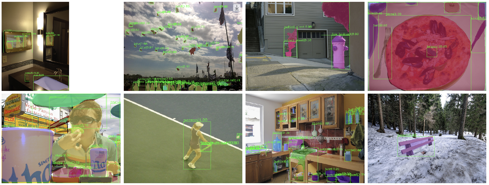
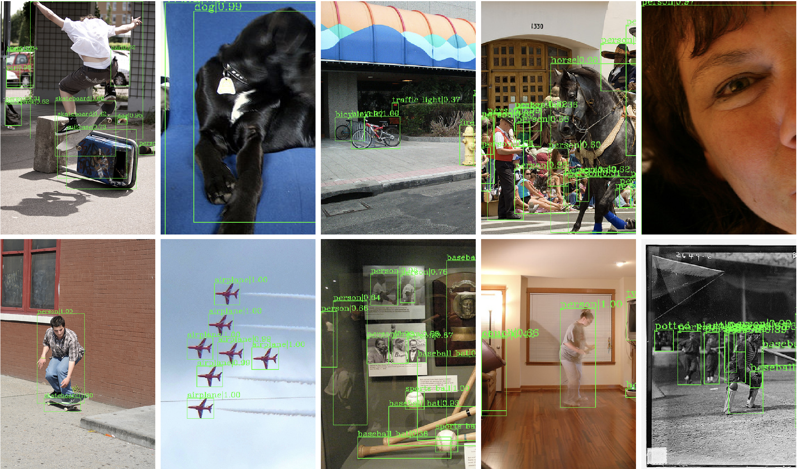

# PyTorch Benchmarks:

<p align="left">
    <a href="https://wandb.ai/diganta/Mish" alt="Dashboard">
        </a>
</p>

*Note: All detectors and segmentation models except YOLO models were trained using [MMDetection](https://github.com/open-mmlab/mmdetection). To reproduce the training, please follow the instructions in [this repository](https://github.com/digantamisra98/Reproducibilty-Challenge-ECANET) and make appropriate changes.*

## ImageNet Scores:

*Please follow the instructions in [this repository](https://github.com/LandskapeAI/imagenet) to download and setup the ImageNet dataset.*

Run ResNet-50 + Mish with the following command:
```
python train_imagenet.py --project='Mish'
```
|Network|Activation|Top-1 Accuracy|Top-5 Accuracy|Weights|
|:---:|:---:|:---:|:---:|:---:|
|ResNet-18|Mish|71.2%|89.9%|[weights](https://drive.google.com/file/d/1abh59CTIMI1IWbMCv00lwEhTsz_nL9he/view?usp=sharing)|
|ResNet-50|Mish|76.1%|92.8%|[weights](https://drive.google.com/file/d/1PURz224P00GLAyXM4-EYwBJHq4U_qLp0/view?usp=sharing)|

## MS-COCO:

*Additional MS-COCO benchmarks can be found [here](https://github.com/WongKinYiu/PyTorch_YOLOv4#pretrained-models--comparison).*

### YOLO Series:

| Model | Test Size | AP<sup>val</sup> | AP<sub>50</sub><sup>val</sup> | AP<sub>75</sub><sup>val</sup> | AP<sub>S</sub><sup>val</sup> | AP<sub>M</sub><sup>val</sup> | AP<sub>L</sub><sup>val</sup> | cfg | weights |
| :-- | :-: | :-: | :-: | :-: | :-: | :-: | :-: | :-: | :-: | 
| **YOLOv4**<sub>pacsp-s</sub> | 736 | 36.0% | 54.2% | 39.4% | 18.7% | 41.2% | 48.0% | [cfg](https://github.com/WongKinYiu/PyTorch_YOLOv4/blob/master/cfg/yolov4-pacsp-s.cfg) | [weights](https://drive.google.com/file/d/1saE6CEvNDPA_Xv34RdxYT4BbCtozuTta/view?usp=sharing) |
| **YOLOv4**<sub>pacsp</sub> | 736 | 46.4% | 64.8% | 51.0% | 28.5% | 51.9% | 59.5% | [cfg](https://github.com/WongKinYiu/PyTorch_YOLOv4/blob/master/cfg/yolov4-pacsp.cfg) | [weights](https://drive.google.com/file/d/1SPCjPnMgA8jlfIGsAnFsMPdJU8dJeo7E/view?usp=sharing) |
| **YOLOv4**<sub>pacsp-x</sub> | 736 | **47.6%** | **66.1%** | **52.2%** | **29.9%** | **53.3%** | **61.5%** | [cfg](https://github.com/WongKinYiu/PyTorch_YOLOv4/blob/master/cfg/yolov4-pacsp-x.cfg) | [weights](https://drive.google.com/file/d/1MtwO5tvXvvyloc12-wZ2lMBzGKd9hsof/view?usp=sharing) |
|  |  |  |  |  |  |  |
| **YOLOv4**<sub>pacsp-s-mish</sub> | 736 | 37.4% | 56.3% | 40.0% | 20.9% | 43.0% | 49.3% | [cfg](https://github.com/WongKinYiu/PyTorch_YOLOv4/blob/master/cfg/yolov4-pacsp-s-mish.cfg) | [weights](https://drive.google.com/file/d/1Gmy2Q6af1DQ5CAb6415cVFkIgtOIt9xs/view?usp=sharing) |
| **YOLOv4**<sub>pacsp-mish</sub> | 736 | 46.5% | 65.7% | 50.2% | 30.0% | 52.0% | 59.4% | [cfg](https://github.com/WongKinYiu/PyTorch_YOLOv4/blob/master/cfg/yolov4-pacsp-mish.cfg) | [weights](https://drive.google.com/file/d/10pw28weUtOceEexRQQrdpOjxBb79sk3u/view?usp=sharing) |
| **YOLOv4**<sub>pacsp-x-mish</sub> | 736 | **48.5%** | **67.4%** | **52.7%** | **30.9%** | **54.0%** | **62.0%** | [cfg](https://github.com/WongKinYiu/PyTorch_YOLOv4/blob/master/cfg/yolov4-pacsp-x-mish.cfg) | [weights](https://drive.google.com/file/d/1GsLaQLfl54Qt2C07mya00S0_FTpcXBdy/view?usp=sharing) |

### Mask RCNN:

<p align="left">
    
    </br>
    <em>Bounding Box and Segmentation Maps of ResNet-50+Mish-Mask-RCNN using samples from the test set of MS-COCO 2017 dataset. More visualizations available on the WandB dashboard.</em>
</p>

|Backbone|BBox_AP|BBox_AP<sub>50</sub>|BBox_AP<sub>75</sub>|BBox_AP<sub>S</sub>|BBox_AP<sub>M</sub>|BBox_AP<sub>L</sub>|Segm_AP|Segm_AP<sub>50</sub>|Segm_AP<sub>75</sub>|Segm_AP<sub>S</sub>|Segm_AP<sub>M</sub>|Segm_AP<sub>L</sub>|Weights|Logs|
|:---:|:---:|:---:|:---:|:---:|:---:|:---:|:---:|:---:|:---:|:---:|:---:|:---:|:---:|:---:|
|ResNet-50 + Mish|**38.1**|**58.8**|**41.4**|**22.1**|**41.7**|**49.3**|**34.5**|**55.4**|**36.6**|**18.6**|**37.7**|**46.6**|[Google Drive](https://drive.google.com/file/d/1-Bo9obGNDv5k3egba2tnyERb1dpra65J/view?usp=sharing)|[Raw](https://raw.githubusercontent.com/digantamisra98/Mish/master/PyTorch%20Benchmarks/logs/mrcnn_mish50.log)|

### Faster RCNN:

<p align="left">
    <a href="https://wandb.ai/diganta/mmdetection-tools?workspace=user-diganta" alt="Logs Dashboard">
        </a>
</p>

*Note: The above dashboard links is for the per epoch logs and is not the same dashboard pasted at the start of this page.*

*To enable WandB Logger Hook during MMDetection based training, simply go to ```mmdetection/configs/_base_/default_runtime.py``` and in the `hooks` key of the `log_config` dictionary, add the following line ```dict(type='WandbLoggerHook')```*

<p align="left">
    
    </br>
    <em>Bounding Box of ResNet-50+Mish-Faster-RCNN using samples from the test set of MS-COCO 2017 dataset. More visualizations available on the WandB dashboard.</em>
</p>

|Backbone|BBox_AP|BBox_AP<sub>50</sub>|BBox_AP<sub>75</sub>|BBox_AP<sub>S</sub>|BBox_AP<sub>M</sub>|BBox_AP<sub>L</sub>|Weights|Logs|
|:---:|:---:|:---:|:---:|:---:|:---:|:---:|:---:|:---:|
|ResNet-50 + Mish|**37.7**|**58.3**|**40.9**|**22.0**|**41.4**|**48.6**|[Google Drive](https://drive.google.com/file/d/1eloq9rOAZSvfAIqxMf1izAo5TMyDFWcF/view?usp=sharing)|[Raw](https://raw.githubusercontent.com/digantamisra98/Mish/master/PyTorch%20Benchmarks/logs/frcnn_mish50.log)|
