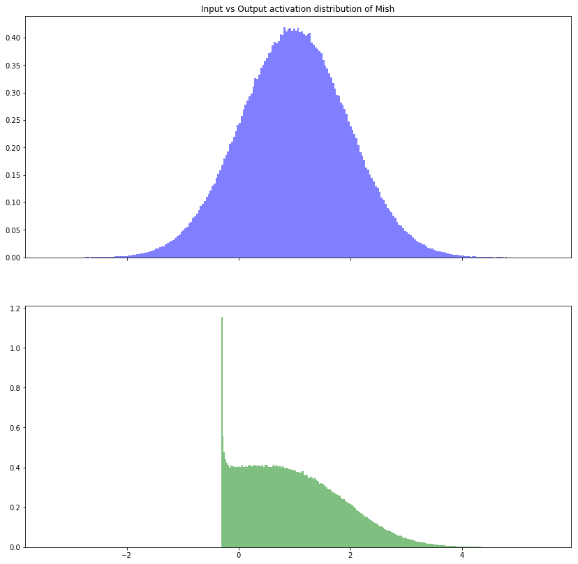
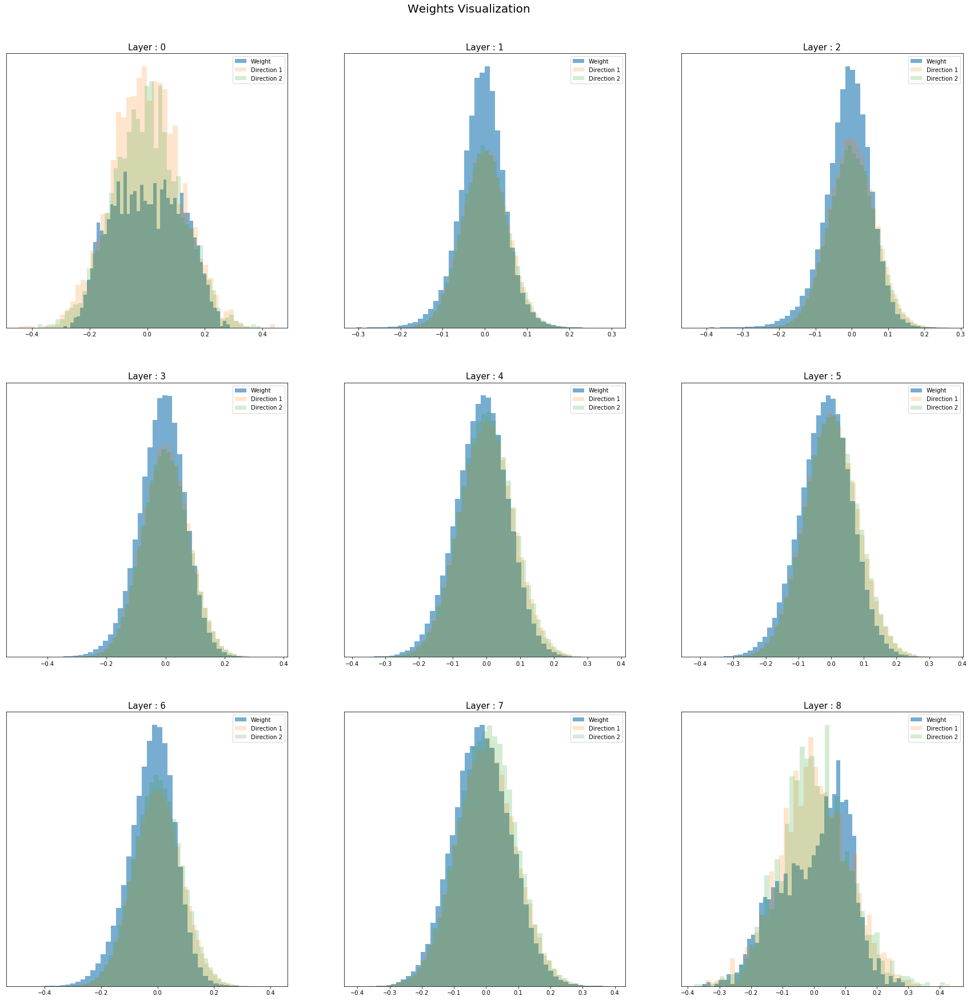
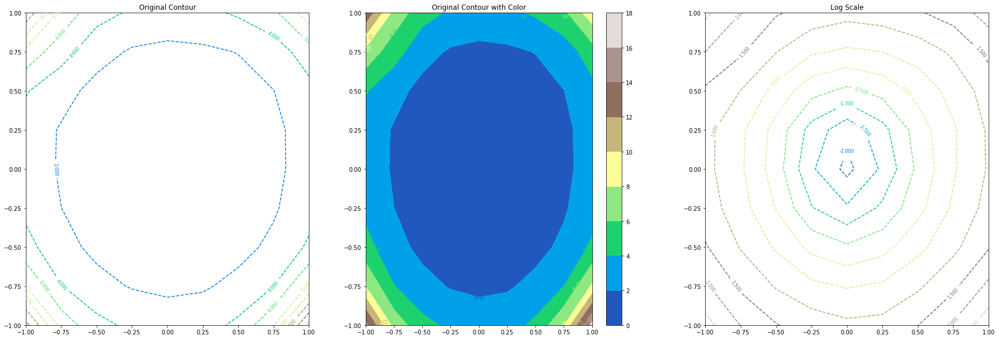

<p align="center">
  
</p>

[](LICENSE)
[](http://hits.dwyl.io/digantamisra98/Mish)
[](https://github.com/digantamisra98/Mish/issues)
[](https://paypal.me/DigantaMisra?locale.x=en_GB)
[](https://www.codacy.com?utm_source=github.com&amp;utm_medium=referral&amp;utm_content=digantamisra98/Mish&amp;utm_campaign=Badge_Grade)
[](https://circleci.com/gh/digantamisra98/Mish)
[](https://arxiv.org/abs/1908.08681)

# Mish: Self Regularized Non-Monotonic Activation Function

## Read the paper here - https://arxiv.org/abs/1908.08681

Inspired by *Swish* Activation Function ([Paper](https://arxiv.org/abs/1710.05941)), **Mish** is a Self Regularized Non-Monotonic Neural Activation Function. Activation Function serves a core functionality in the training process of a Neural Network Architecture and is represented by the basic mathematical representation: 
<div style="text-align:center"></div>
<em> Image Credits: https://en.wikibooks.org/wiki/Artificial_Neural_Networks/Activation_Functions
</em><br>
<br>
An Activation Function is generally used to introduce non-linearity and over the years of theoretical machine learning research, many activation functions have been constructed with the 2 most popular amongst them being: 

- ReLU (Rectified Linear Unit; f(x)=max(0,x)) <br>
- TanH <br>

Other notable ones being: <br> 
- Softmax (Used for Multi-class Classification in the output layer) <br> 
- Sigmoid (f(x)=(1+e<sup>-x</sup>)<sup>-1</sup>;Used for Binary Classification and Logistic Regression) <br>
- Leaky ReLU (f(x)=0.001x (x<0) or x (x>0)) <br>

## Mathematics under the hood:

Mish Activation Function can be mathematically represented by the following formula:<br> 
<div style="text-align:center"></div>
It can also be represented by using the SoftPlus Activation Function as shown:<br><br>
<div style="text-align:center"></div>
<div style="text-align:center"></div><br>
And it's 1<sup>st</sup> and 2<sup>nd</sup> derivatives are given below:<br>
<div style="text-align:center"></div>
<div style="text-align:center"></div><br>
Where:<br>
<div style="text-align:center"></div>
<div style="text-align:center"></div>
<br>

The Taylor Series Expansion of *f(x)* at *x=0* is given by: <br>
<div style="text-align:center"></div><br>

The Taylor Series Expansion of *f(x)* at *x=∞* is given by: <br>
<div style="text-align:center"></div><br>

Minimum of *f(x)* is observed to be ≈-0.30884 at *x*≈-1.1924<br>

When visualized, Mish Activation Function closely resembles the function path of Swish having a small decay (preserve) in the negative side while being near linear on the positive side. It is a Non-Monotonic Function and as observed from it's derivatives functions shown above and graph shown below, it can be noted that it has a Non-Monotonic 1<sup>st</sup> derivative and 2<sup>nd</sup> derivative. <br>

**Mish** ranges between ≈-0.31 to ∞.<br>
<div style="text-align:center"></div>
<div style="text-align:center"></div>

Following image shows the effect of Mish being applied on random noise. This is a replication of the effect of the activation function on the image tensor inputs in CNN models. 

<div style="text-align:center"></div>

Here, Mish activation function was applied on a standard normal distribution. The output distribution shows Mish to be preserving information of the original distribution in the negative axis. 

<div style="text-align:center"></div>

Based on mathematical analysis, it is also confirmed that the function has a parametric order of continuity of: C<sup>∞</sup>

**Mish** has a very sharp global minima similar to Swish, which might account to gradients updates of the model being stuck in the region of sharp decay thus may lead to bad performance levels as compared to ReLU. Mish, also being mathematically heavy, is more computationally expensive as compared to the time complexity of Swish Activation Function. 

The output landscape of 5 layer randomly initialized neural network was compared for ReLU, Swish, and Mish. The observation clearly shows the sharp transition between the scalar magnitudes for the co-ordinates of ReLU as compared to Swish and Mish. Smoother transition results in smoother loss functions which are easier to optimize and hence the network generalizes better. 

<div style="text-align:center"></div>

The Pre-Activations (ωx + b) distribution was observed for the final convolution layer in a ResNet v1-20 with Mish activation function before and after training for 20 epochs on CIFAR-10. As shown below, units are being preserved in the negative side which improves the network capacity to generalize well due to less loss of information. 

<div style="text-align:center"></div>

A 9 layer Network was trained for 50 epochs on CIFAR-10 to visualize the Loss Contour and Weights Distribution Histograms by following Filter Normalization process: 

<div style="text-align:center"></div>
<div style="text-align:center"></div>

Complex Analysis of Mish Activation Function: 

<div style="text-align:center"></div>

## Variation of Parameter Comparison:

To observe how increasing the number of layers in a network while maintaining other parameters constant affect the test accuracy, fully connected networks of varying depths on MNIST, with each layer having 500 neurons were trained. Residual Connections were not used because they enable the training of arbitrarily deep networks. BatchNorm was used to lessen the dependence on initialization along with a dropout of 25%. The network is optimized using SGD on a batch size of 128, and for fair comparison, the same learning rates for each activation function was maintained. In the experiments, all 3 activations maintained nearly the same test accuracy for 15 layered Network. Increasing number of layers from 15 gradually resulted in a sharp decrease in test accuracy for Swish and ReLU, however, Mish outperformed them both in large networks where optimization becomes difficult.

The consistency of Mish providing better test top-1 accuracy as compared to Swish and ReLU was also observed by increasing Batch Size for a ResNet v2-20 on CIFAR-10 for 50 epochs while keeping all other network parameters to be constant for fair comparison.

<p float="left">
  
   
</p>

Gaussian Noise with varying standard deviation was added to the input in case of MNIST classification using a simple conv net to observe the trend in decreasing test top-1 accuracy for Mish and compare it to that of ReLU and Swish. Mish mostly maintained a consistent lead over that of Swish and ReLU (Less than ReLU in just 1 instance and less than Swish in 3 instance) as shown below. The trend for test loss was also observed following the same procedure. (Mish has better loss than both Swish and ReLU except in 1 instance)

<p float="left">
  
   
</p>

## Edge of Chaos and Rate of Convergence (EOC & ROC): 

**Coming Soon**

## Properties Summary:

|Activation Function Name| Function Graph | Equation | Range | Order of Continuity | Monotonic | Monotonic Derivative | Approximates Identity Near Origin| Dead Neurons | Saturated |
|---|---|---|---|---|---|---|---|---|---|
|Mish|<div style="text-align:center"></div>|<div style="text-align:center"></div>| ≈-0.31 to ∞| C<sup>∞</sup> | No :negative_squared_cross_mark:| No :negative_squared_cross_mark: | Yes :heavy_check_mark:| No :negative_squared_cross_mark: | No :negative_squared_cross_mark: |

## Results:

All results and comparative analysis are present in the [Readme](https://github.com/digantamisra98/Mish/blob/master/Notebooks/Readme.md) file present in the [Notebooks Folder](https://github.com/digantamisra98/Mish/tree/master/Notebooks).

### Summary of Results: 

*Comparison is done based on the high priority metric, for image classification the Top-1 Accuracy while for Generative Networks and Image Segmentation the Loss Metric. Therefore, for the latter, Mish > Baseline is indicative of better loss and vice versa. For Embeddings, the AUC metric is considered.*

|Activation Function| Mish > Baseline Model | Mish < Baseline Model |
|---|---|---|
|ReLU|51|23|
|Swish-1|51|23|
|ELU(α=1.0)|7|2|
|Aria-2(β = 1, α=1.5)|2|0|
|Bent's Identity|1|0|
|Hard Sigmoid|1|0|
|RReLU|2|2|
|Leaky ReLU(α=0.3)|2|4|
|PReLU(Default Parameters)	|4|1|
|SELU|6|0|
|Sigmoid|4|0|
|SoftPlus|2|0|
|Softsign|2|0|
|TanH|2|0|
|SQNL|1|0|
|Thresholded ReLU(θ=1.0)|1|0|
|E-Swish (β=1.75)|4|7|
|GELU|2|2|
|CELU|1|0|
|HardShrink(λ = 0.5)|4|0|
|Hardtanh|3|0|
|ReLU6|3|1|
|LogSigmoid|2|1|

#### CIFAR Results (Top-1 Testing Accuracy):

|Models|Mish|Swish|ReLU|
|:---:|:---:|:---:|:---:|
|ResNet v1-20| <p>CIFAR 10: 91.81%<br>CIFAR 100: <b>67.26%</b></p> | <p>CIFAR 10: <b>91.95%</b><br>CIFAR 100: 67.1%</p> | <p>CIFAR 10: 91.5%<br>CIFAR 100: 67%</p> |
|ResNet v1-32| <p>CIFAR 10: 92.29%<br>CIFAR 100: <b>69.44%</b></p> | <p>CIFAR 10: <b>92.3%</b><br>CIFAR 100: 68.84%</p> | <p>CIFAR 10: 91.78%<br>CIFAR 100: 68.45%</p> |
|ResNet v1-44|<p>CIFAR 10: 92.46%<br>CIFAR 100: 69.34%</p> | <p>CIFAR 10: <b>92.84%</b><br>CIFAR 100: 69.62%</p> | <p>CIFAR 10: 92.33%<br>CIFAR 100: <b>69.73%</b></p> |
|ResNet v1-56|<p>CIFAR 10: <b>92.21%</b><br>CIFAR 100: <b>70.13%</b></p> | <p>CIFAR 10: 91.85%<br>CIFAR 100: 70.02%</p> | <p>CIFAR 10: 91.97%<br>CIFAR 100: 69.6%</p> |
|ResNet v1-110|<p>CIFAR 10: 91.44%<br>CIFAR 100: 67.64%</p> | <p>CIFAR 10: 91.34%<br>CIFAR 100: 67.76%</p> | <p>CIFAR 10: <b>91.69%</b><br>CIFAR 100: </b>68.43%</b></p> |
|ResNet v1-164|<p>CIFAR 10: <b>83.62%</b><br>CIFAR 100: 52.7%</p> | <p>CIFAR 10: 82.19%<br>CIFAR 100: <b>55.96%</b></p> | <p>CIFAR 10: 82.37%<br>CIFAR 100: 52.6%</p> |
|ResNet v2-20|<p>CIFAR 10: <b>92.02%</b><br>CIFAR 100: <b>70.86%</b></p> | <p>CIFAR 10: 91.61%<br>CIFAR 100: 70.23%</p> | <p>CIFAR 10: 91.71%<br>CIFAR 100: 70.54%</p> |
|ResNet v2-56|<p>CIFAR 10: <b>87.18%</b><br>CIFAR 100: <b>60.67%</b></p> | <p>CIFAR 10: 86.36%<br>CIFAR 100: 60.28%</p> | <p>CIFAR 10: 83.86%<br>CIFAR 100: 57.25%</p> |
|ResNet v2-110|<p>CIFAR 10: <b>92.58%</b><br>CIFAR 100: <b>74.41%</b></p> | <p>CIFAR 10: 92.22%<br>CIFAR 100: 74.13%</p> | <p>CIFAR 10: 91.93%<br>CIFAR 100: 73%</p> |
|ResNet v2-164|<p>CIFAR 10: <b>87.74%</b><br>CIFAR 100: 64.16%</p> | <p>CIFAR 10: 86.13%<br>CIFAR 100: <b>64.48%</b></p> | <p>CIFAR 10: 83.59%<br>CIFAR 100: 63.73%</p> |
|ResNet v2-245|<p>CIFAR 10: <b>86.67%</b><br>CIFAR 100: NA</p> | <p>CIFAR 10: 85.41%<br>CIFAR 100: NA</p> | <p>CIFAR 10: 86.32%<br>CIFAR 100: NA</p> |
|WRN 10-2|<p>CIFAR 10: <b>86.83%</b><br>CIFAR 100: <b>67.157%</b></p> | <p>CIFAR 10: 86.56%<br>CIFAR 100: 66.98%</p> | <p>CIFAR 10: 84.52%<br>CIFAR 100: 62.5567%</p> |
|WRN 16-4|<p>CIFAR 10: 90.54%<br>CIFAR 100: 72.92%</p> | <p>CIFAR 10: 90.07%<br>CIFAR 100: <b>74.60%</b></p> | <p>CIFAR 10: <b>90.74%</b><br>CIFAR 100: <b>74.60%</b></p> |
|WRN 22-10|<p>CIFAR 10: 90.38%<br>CIFAR 100: <b>72.32%</b></p> | <p>CIFAR 10: 90.17%<br>CIFAR 100: 71.89%</p> | <p>CIFAR 10: <b>91.28%</b><br>CIFAR 100: 72.2%</p> |
|WRN 40-4|<p>CIFAR 10: NA<br>CIFAR 100: 69.52%</p> | <p>CIFAR 10: NA<br>CIFAR 100: <b>69.59%</b></p> | <p>CIFAR 10: NA<br>CIFAR 100: 69.35%</p> |
|VGG 16|<p>CIFAR 10: NA<br>CIFAR 100: 68.64%</p> | <p>CIFAR 10: NA<br>CIFAR 100: <b>69.7%</b></p> | <p>CIFAR 10: NA<br>CIFAR 100: 69.36%</p> |
|SimpleNet|<p>CIFAR 10: <b>91.70%</b><br>CIFAR 100: NA</p> | <p>CIFAR 10: 91.44%<br>CIFAR 100: NA</p> | <p>CIFAR 10: 91.16%<br>CIFAR 100: NA</p> |
|Xception Net|<p>CIFAR 10: <b>88.73%</b><br>CIFAR 100: NA</p> | <p>CIFAR 10: 88.56%<br>CIFAR 100: NA</p> | <p>CIFAR 10: 88.38%<br>CIFAR 100: NA</p> |
|Capsule Network|<p>CIFAR 10: <b>83.15%</b><br>CIFAR 100: NA</p> | <p>CIFAR 10: 82.48%<br>CIFAR 100: NA</p> | <p>CIFAR 10: 82.19%<br>CIFAR 100: NA</p> |
|Inception ResNet v2|<p>CIFAR 10: <b>85.21%</b><br>CIFAR 100: NA</p> | <p>CIFAR 10: 84.96%<br>CIFAR 100: NA</p> | <p>CIFAR 10: 82.22%<br>CIFAR 100: NA</p> |
|DenseNet-121|<p>CIFAR 10: <b>91.2678%</b><br>CIFAR 100: <b>66.3172%</b></p> | <p>CIFAR 10: 90.9217%<br>CIFAR 100: 65.9118%</p> | <p>CIFAR 10: 91.0997%<br>CIFAR 100: 65.5063%</p> |
|DenseNet - 161|<p>CIFAR 10: 90.8228%<br>CIFAR 100: 63.8944%</p> | <p>CIFAR 10: 90.1602%<br>CIFAR 100: <b>64.8042%</b></p> | <p>CIFAR 10: <b>91.0206%</b><br>CIFAR 100: 63.9043%</p> |
|DenseNet - 169|<p>CIFAR 10: 90.5063%<br>CIFAR 100: 65.3877%</p> | <p>CIFAR 10: 90.6744%<br>CIFAR 100: <b>65.6942%</b></p> | <p>CIFAR 10: <b>91.6535%</b><br>CIFAR 100: 64.9921%</p> |
|DenseNet - 201|<p>CIFAR 10: 90.7338%<br>CIFAR 100: <b>64.4383%</b></p> | <p>CIFAR 10: <b>91.0107%</b><br>CIFAR 100: 64.2504%</p> | <p>CIFAR 10: 90.7239%<br>CIFAR 100: 63.2516%</p> |
|ResNext - 50|<p>CIFAR 10: 90.8327%<br>CIFAR 100: <b>67.5831%</b></p> | <p>CIFAR 10: <b>91.6238%</b><br>CIFAR 100: 66.7227%</p> | <p>CIFAR 10: 89.3592%<br>CIFAR 100: 67.5237%</p> |
|MobileNet v1|<p>CIFAR 10: 85.2749%<br>CIFAR 100: <b>50.0989%</b></p> | <p>CIFAR 10: <b>85.6903%</b><br>CIFAR 100: 49.9506%</p> | <p>CIFAR 10: 84.1179%<br>CIFAR 100: 49.2089%</p> |
|MobileNet v2|<p>CIFAR 10: <b>86.254%</b><br>CIFAR 100: <b>57.0609%</b></p> | <p>CIFAR 10: 86.0759%<br>CIFAR 100: 55.6764%</p> | <p>CIFAR 10: 86.0463%<br>CIFAR 100: 56.1907%</p> |
|SENet - 18|<p>CIFAR 10: 89.913%<br>CIFAR 100: <b>64.3888%</b></p> | <p>CIFAR 10: 89.4284%<br>CIFAR 100: 63.8944%</p> | <p>CIFAR 10: <b>90.1602%</b><br>CIFAR 100: 62.7176%</p> |
|SENet - 34|<p>CIFAR 10: 90.5162%<br>CIFAR 100: 64.4778%</p> | <p>CIFAR 10: 89.9624%<br>CIFAR 100: <b>64.8734%</b></p> | <p>CIFAR 10: <b>91.6733%</b><br>CIFAR 100: 64.5669%</p> |
|ShuffleNet v1|<p>CIFAR 10: <b>87.3121%</b><br>CIFAR 100: <b>59.1871%</b></p> | <p>CIFAR 10: 86.9462%<br>CIFAR 100: 58.4355%</p> | <p>CIFAR 10: 87.0451%<br>CIFAR 100: 57.9806%</p> |
|ShuffleNet v2|<p>CIFAR 10: 86.6297%<br>CIFAR 100: <b>59.3552%</b></p> | <p>CIFAR 10: 86.9363%<br>CIFAR 100: 58.9102%</p> | <p>CIFAR 10: <b>87.0055%</b><br>CIFAR 100: 58.5641%</p> |
|SqueezeNet|<p>CIFAR 10: 87.767%<br>CIFAR 100: <b>63.0736%</b></p> | <p>CIFAR 10: <b>88.3703%</b><br>CIFAR 100: 62.1143%</p> | <p>CIFAR 10: 87.8461%<br>CIFAR 100: 60.9276%</p> |
|Inception v3|<p>CIFAR 10: <b>91.1986%</b><br>CIFAR 100: 68.3347%</p> | <p>CIFAR 10: 91.1788%<br>CIFAR 100: 67.0095%</p> | <p>CIFAR 10: 90.8426%<br>CIFAR 100: <b>68.7797%</b></p> |
|Efficient Net B0|<p>CIFAR 10: <b>80.7358%</b><br>CIFAR 100: NA</p> | <p>CIFAR 10: 79.371%<br>CIFAR 100: NA</p> | <p>CIFAR 10: 79.3117%<br>CIFAR 100: NA</p> |
|Efficient Net B1|<p>CIFAR 10: 80.9632%<br>CIFAR 100: NA</p> | <p>CIFAR 10: 81.9818%<br>CIFAR 100: NA</p> | <p>CIFAR 10: <b>82.4367%</b><br>CIFAR 100: NA</p> |
|Efficient Net B2|<p>CIFAR 10: 81.2006%<br>CIFAR 100: NA</p> | <p>CIFAR 10: 80.9039%<br>CIFAR 100: NA</p> | <p>CIFAR 10: <b>81.7148%</b><br>CIFAR 100: NA</p> |


## Try It! 

### Demo Jupyter Notebooks:

All demo jupyter notebooks are present in the [Notebooks Folder](https://github.com/digantamisra98/Mish/tree/master/Notebooks).

### For Source Code Implementation: 

#### Torch:

Torch Implementation of Mish Activation Function can be found [here](https://github.com/digantamisra98/Mish/tree/master/Mish/Torch)

#### Keras:

Keras Implementation of Mish activation function can be found [here](https://github.com/digantamisra98/Mish/blob/master/Mish/Keras/mish.py)

#### Tensorflow:

TensorFlow - Keras Implementation of Mish Activation function can be found [here](https://github.com/digantamisra98/Mish/blob/master/Mish/TF-Keras/mish.py)

## Future Work (Coming Soon):

- Additional STL-10, CalTech-101 & 256 Benchmarks.
- Image Net Benchmarks.
- GANs Benchmarks.
- Transformer Model Benchmarks.
- Fix ResNext Benchmarks.
- Comparison of Convergence Rates.

## Cite this work:

```
@misc{Mish: A Self Regularized Non-Monotonic Neural Activation Function},
  author = {Diganta Misra},
  title = {Mish: A Self Regularized Non-Monotonic Neural Activation Function},
  year = {2019},
  url = {https://github.com/digantamisra98/Mish},
}
```

## Contact: 
- [LinkedIn](https://www.linkedin.com/in/misradiganta/)<br>
- Email: mishradiganta91@gmail.com
