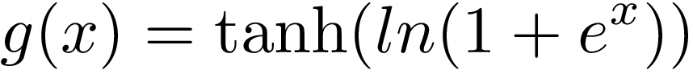
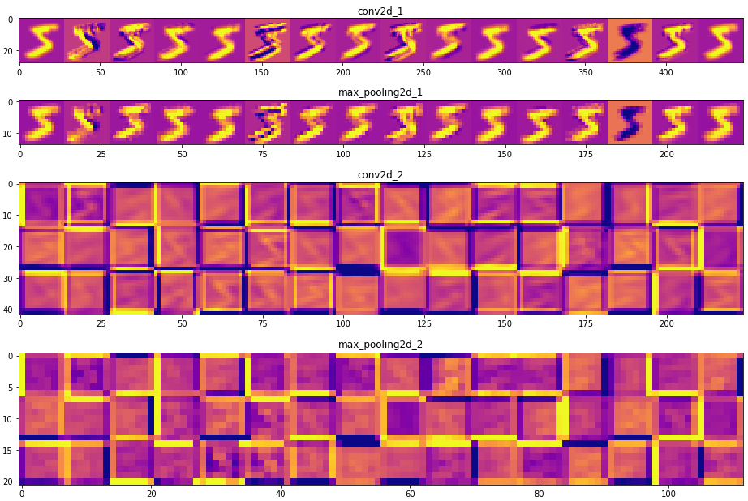

  

# Mish: Self Regularized Non-Monotonic Activation Function

Inspired by *Swish* Activation Function ([Paper](https://arxiv.org/abs/1710.05941)), **Mish** is a Self Regularized Non-Monotonic Neural Activation Function. Activation Function serves a core functionality in the training process of a Neural Network Architecture and is represented by the basic mathematical representation: 

<em> Image Credits: https://en.wikibooks.org/wiki/Artificial_Neural_Networks/Activation_Functions
</em> 
 
An Activation Function is generally used to introduce non-linearity and over the years of theoretical machine learning research, many activation functions have been constructed with the 2 most popular amongst them being: 

-ReLU (Rectified Linear Unit; f(x)=max(0,x))  
-TanH  

Other notable ones being:   
-Softmax (Used for Multi-class Classification in the output layer)   
-Sigmoid (f(x)=(1+e-x)-1;Used for Binary Classification and Logistic Regression)  
-Leaky ReLU (f(x)=0.001x (x<0) or x (x>0))  

## Dependencies:
- TensorFlow = 1.12.x or higher
- Keras = 2.2.x or higher
- Python = 3x

## Mathematics under the hood:

Mish Activation Function can be mathematically represented by the following formula:  

 
And it's 1st and 2nd derivatives are given below: 

 
Where: 

 
When visualized, Mish Activation Function closely resembles the function path of Swish having a small decay (preserve) in the negative side while being near linear on the positive side. It is a Monotonic Function and as observed from it's derivatives functions shown above and graph shown below, it can be noted that it has a Monotonic 1st derivative while it's 2nd derivative is non-monotonic in nature.  

**Mish** ranges between ≈-0.31 to ∞. 

Based on mathematical analysis, it is also confirmed that the function has a parametric order of continuity of:

**Mish** has a very sharp global minima similar to Swish, which might account to gradients updates of the model being stuck in the region of sharp decay thus may lead to bad performance levels as compared to ReLU. Mish, also being mathematically heavy, is more computationally expensive as compared to the time complexity of Swish Activation Function. 

## Set-Up:

All Experiments were performed on [Google Colab](https://colab.research.google.com/notebooks/welcome.ipynb#recent=true) with NVIDIA Tesla T4 GPU.

## Results:

During the research of Mish Activation Function, comparative study of Mish against Swish and ReLU was performed on datasets including MNIST, Fashion-MNIST, CIFAR10, CIFAR100, Caravan Challenge Dataset, ASL (American Sign Language), IRIS and some custom datasets including Malaria Cells Image Dataset using architectures including ResNet (v2-50), WRN (Wide Residual Networks, 10-2, 16-8, 28-10, 40-4), Mini VGG Net, LeNeT, Custom Deep CNN, ANN, SimpleNet, U-Net, DenseNet, etc.

### MNIST:
Google LeNet ([Paper](http://yann.lecun.com/exdb/publis/pdf/lecun-01a.pdf)) was used for MNIST - A database of Hand-written digits ([Dataset](http://yann.lecun.com/exdb/mnist/)) classification. The Accuracies table along with the inference time and computational analysis is provided below. The reason why LeNet was deployed for this task is because of the network being extremely small (Here, while referring to LeNet, it means LeNet-4 having a pair of Conv+Pool layers) and is extremely robust in MNIST classification, it also takes very less time to train due to the size of the network. 

| Activation Function  | Accuracy (20*) |  Loss (20*) | GPU-Utilization (5*) |CPU-RAM Utilization** (5*)| Training Time (5*) | Inference Time (5*)|
| ------------- | ------------- | ---|---|---|---|---|
| ReLU  | **98.65%**  |**0.368%**|33%|**10.2GB**|**54.47 seconds**|**0.85 seconds**|
| Swish  | 98.42%  |0.385%|33%|10.1GB|57.06 seconds|0.86 seconds|
| Mish  | 98.64%  |**0.368%**|33%|10.1GB|63.82 seconds|0.91 seconds|

<em> *The number indicates the Number of Epochs
</em> 
<em> **This shows the amount of RAM Free.
</em> 
The activation maps of the hidden layers were also visualized to understand the generalization the network was adopting to.

 

### Fashion-MNIST:

| Activation Function  | Accuracy (25*) |  Loss (25*) | GPU-Utilization (5*) |CPU-RAM Utilization** (5*)| Training Time (5*) | Inference Time (5*)|
| ------------- | ------------- | ---|---|---|---|---|
| ReLU  | 93.19%  |1.895%|33%|10153MB / 15079MB|**54.47 seconds**|**0.85 seconds**|
| Swish  | 93.09%  |1.935%|33%|10.1GB|271.13 seconds|3.53 seconds|
| Mish  | **93.31%**|**1.859%**|33%|9.9GB|294.85 seconds|3.41 seconds|

<em> *The number indicates the Number of Epochs
</em> 
<em> **This shows the amount of RAM Free.
</em> 

## Contact: 
-[LinkedIn](https://www.linkedin.com/in/misradiganta/) 
-Email: mishradiganta91@gmail.com
