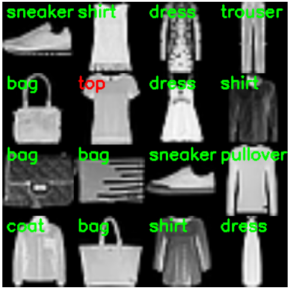

  

# Mish: Self Regularized Non-Monotonic Activation Function

Inspired by *Swish* Activation Function ([Paper](https://arxiv.org/abs/1710.05941)), **Mish** is a Self Regularized Non-Monotonic Neural Activation Function. Activation Function serves a core functionality in the training process of a Neural Network Architecture and is represented by the basic mathematical representation: 

<em> Image Credits: https://en.wikibooks.org/wiki/Artificial_Neural_Networks/Activation_Functions
</em> 
 
An Activation Function is generally used to introduce non-linearity and over the years of theoretical machine learning research, many activation functions have been constructed with the 2 most popular amongst them being: 

-ReLU (Rectified Linear Unit; f(x)=max(0,x))  
-TanH  

Other notable ones being:   
-Softmax (Used for Multi-class Classification in the output layer)   
-Sigmoid (f(x)=(1+e-x)-1;Used for Binary Classification and Logistic Regression)  
-Leaky ReLU (f(x)=0.001x (x<0) or x (x>0))  

## Dependencies:
- TensorFlow = 1.12.x or higher
- Keras = 2.2.x or higher
- Python = 3x

## Mathematics under the hood:

Mish Activation Function can be mathematically represented by the following formula:  

 
And it's 1st and 2nd derivatives are given below: 

 
Where: 

 
When visualized, Mish Activation Function closely resembles the function path of Swish having a small decay (preserve) in the negative side while being near linear on the positive side. It is a Monotonic Function and as observed from it's derivatives functions shown above and graph shown below, it can be noted that it has a Monotonic 1st derivative while it's 2nd derivative is non-monotonic in nature.  

**Mish** ranges between ≈-0.31 to ∞. 

Based on mathematical analysis, it is also confirmed that the function has a parametric order of continuity of:

**Mish** has a very sharp global minima similar to Swish, which might account to gradients updates of the model being stuck in the region of sharp decay thus may lead to bad performance levels as compared to ReLU. Mish, also being mathematically heavy, is more computationally expensive as compared to the time complexity of Swish Activation Function. 

## Set-Up:

All Experiments were performed on [Google Colab](https://colab.research.google.com/notebooks/welcome.ipynb#recent=true) with NVIDIA Tesla T4 GPU. Initial Results were ran on a local machine equipped with an 64-bit, Intel i7-8750H CPU clocked at 2.2GHz, 16GB RAM with a NVIDIA GTX-1060 having the following specifications: 

<table>
  <tr><th colspan=2>GPU Specification Sheet</th></tr>
  <tr><td>Driver Version</td><td>418.81</td></tr>
  <tr><td>Driver Type</td><td>Standard</td></tr>
  <tr><td>CUDA Cores</td><td>1280</td></tr>
  <tr><td>Graphics Clock</td><td>1455 MHz</td></tr>
  <tr><td>Memory Data Rate</td><td>8.01 Gbps</td></tr>
  <tr><td>Memory Interface</td><td>192-bit</td></tr>
  <tr><td>Memory Bandwidth</td><td>192.19 GB/s</td></tr>
  <tr><td>Available Graphic Memory</td><td>14258 MB</td></tr>
</table>

## Results:

During the research of Mish Activation Function, comparative study of Mish against Swish and ReLU was performed on datasets including MNIST, Fashion-MNIST, CIFAR10, CIFAR100, Caravan Challenge Dataset, ASL (American Sign Language), IRIS and some custom datasets including Malaria Cells Image Dataset using architectures including ResNet (v2-50), WRN (Wide Residual Networks, 10-2, 16-8, 28-10, 40-4), Mini VGG Net, LeNeT, Custom Deep CNN, ANN, SimpleNet, U-Net, DenseNet, etc.

### MNIST:
Google LeNet ([Paper](http://yann.lecun.com/exdb/publis/pdf/lecun-01a.pdf)) was used for MNIST - A database of Hand-written digits ([Dataset](http://yann.lecun.com/exdb/mnist/)) classification. The Accuracies table along with the inference time and computational cost analysis is provided below. The reason why LeNet was deployed for this task is because of the network being extremely small (Here, while referring to LeNet, it means LeNet-4 having a pair of Conv+Pool layers) and is extremely robust in MNIST classification, it also takes very less time to train due to the size of the network. 

| Activation Function  | Accuracy (20*) |  Loss (20*) | GPU-Utilization (20*) |CPU-RAM Utilization** (20*)| Training Time (20*) | Inference Time (20*)| Top 5 Accuracy (20*) | Top 3 Accuracy (20*)|
| ------------- | ------------- | ---|---|---|---|---|---|---|
| ReLU  | **98.65%**  |**0.368%**|5%|**11.4GB**|**51.67 seconds**|**0.197 seconds**|**100%**|**99.94%**|
| Swish  | 98.42%  |0.385%|5%|**11.4GB**|65.11 seconds|0.2157 seconds|99.99%|99.9%|
| Mish  | 98.64%  |**0.368%**|5%|11.2GB|81.12 seconds|0.2967 seconds|**100%**|**99.94%**|

<em> *The number indicates the Number of Epochs
</em> 
<em> **This shows the amount of RAM Free.
</em> 
The activation maps of the hidden layers were also visualized to understand the generalization the network was adopting to.

 

### Fashion-MNIST:

Mini VGG-Net ([Paper](https://arxiv.org/pdf/1409.1556.pdf)) was used for classification problem of Fashion MNIST/ F-MNIST ([Dataset](https://research.zalando.com/welcome/mission/research-projects/fashion-mnist/)) which contains 28x28 sized images of fashion apparel.  The Accuracies table along with the inference time and computational cost analysis is provided below.

| Activation Function  | Accuracy (25*) |  Loss (25*) | GPU-Utilization (5*) |CPU-RAM Utilization** (5*)| Training Time (5*) | Inference Time (5*)|
| ------------- | ------------- | ---|---|---|---|---|
| ReLU  | 93.19%  |1.895%|33%|**10.1GB**|**261.88 seconds**|**3.51 seconds**|
| Swish  | 93.09%  |1.935%|33%|**10.1GB**|271.13 seconds|3.53 seconds|
| Mish  | **93.31%**|**1.859%**|33%|10GB|294.85 seconds|3.78 seconds|

<em> *The number indicates the Number of Epochs
</em> 
<em> **This shows the amount of RAM Free.
</em> 

The evaluation metrics for the Mini-VGG Network with Mish Activation Function is given below: 

| Class Labels  | Precision |  Recall | F1-Score |
| ------------- | ------------- | ---|---|
| top  | 0.90  |0.87|0.88|
| trouser  | 0.99 |0.98|0.99|
| pullover  | 0.93|0.89|0.91|
| dress  | 0.93 |0.94|0.93|
| coat | 0.88  |0.93|0.90|
| sandal | 0.99|0.99|0.99|
| shirt  | 0.79 |0.80|0.80|
| sneaker  | 0.96 |0.98|0.97|
| bag  | 0.99  |0.99|0.99|
| ankle-boot  | 0.98  |0.97|0.97|
| **Average** | **Precision** |**Recall** |**F1-Score**|
| micro average  | 0.93  |0.93|0.93|
| macro average  | 0.93  |0.93|0.93|
| weighted average  | 0.93  |0.93|0.93|

Test Samples obtained from the network:

 

### Iris

A 3-layered Feed Forward Neural Network was used for IRIS ([Dataset](https://archive.ics.uci.edu/ml/datasets/iris)) classification. The metrics scores are provided in the table below. Here, in place of ReLU, Mish was tested against Swish and Sigmoid. 

| Activation Function  | Accuracy (4000*) |  Loss (4000*) |
| ------------- | ------------- | ---|
| ReLU  | 96.67%  |2.84%|
| Swish  | 97.33%  |**2.32%**|
| Mish  | **98%**|2.66%|

<em> *The number indicates the Number of Epochs
</em> 

### CIFAR-10:

CIFAR-10 ([Dataset](https://www.cs.toronto.edu/~kriz/cifar.html)) is an extensive labelled dataset of 60000, 32x32 Images belonging to 10 classes which have 6000 images per class. A comprehensive labelled subset of [TinyImages Dataset](http://groups.csail.mit.edu/vision/TinyImages/), the CIFAR-10 has been expansively used for benchmarking different architectures, frameworks and novel approaches mainly in the field of Image Classification. In this research, 3 primary kinds of Neural Networks have been used with varying parameters to test how Mish fares against Swish and ReLU. All of these details has been provided subsequently.

#### ResNet v2:

ResNet ([Paper](https://arxiv.org/abs/1512.03385)) v2 with 56 layers was used for CIFAR-10 classification task. Number of Epochs were varied to observe the computational cost and training time of the networks. The table below provides all the information regarding the same. 

- For Batch Size = 32, Number of Steps= 1563, Number of Epochs= 10:

|Activation Function |Training Accuracy|Training Loss|Validation Accuracy|Validation Loss|Testing Accuracy|Testing Loss|Average Per Epoch Time|Inference Time (Per Sample)|Average Per Step Time|Average Forward Pass Time|Top-3 accuracy|Top-5 accuracy|
|---|---|---|---|---|---|---|---|---|---|---|---|---|
|ReLU|73.10%|15.1%|71.9%|15.35%|73.34%|15.34%|**130.8 seconds**|**2 seconds (487 micro seconds)**|**83.8 milli seconds**|**669.9 micro- seconds**|**42.18%**|60.51%|
|Swish|**77.65%**|**14.04%**|75.58%|14.77|75.88%|14.68%|155.1 seconds|3 seconds (550 micro-seconds)|99.3 milli-seconds|775.2 micro-seconds|33.04%|49.32%|
|Mish|76.93%|14.08%|**76.58%**|**14%**|**76.46%**|**13.98%**|158.5 seconds|3 seconds (590 micro-seconds)|101.4 milli-seconds|830.4 micro-seconds|38.02%|**62.82%**|

- For Batch Size = 32, Number of Steps= 1563, Number of Epochs= 50:

|Activation Function |Testing Accuracy|Testing Loss|Inference Time (Per Sample)| Top 3 Accuracy| Top 5 Accuracy|
|---|---|---|---|---|---|
|ReLU|83.86%|9.945%|3 seconds (618 micro-seconds)|49.94%|30.99%|
|Swish|86.36%|8.81%|3 seconds (559 micro-seconds)|51.59%|31.29%|
|Mish|**87.18%**|**8.62%**|3 seconds (595 micro-seconds)|||

- For Batch Size = 32, Number of Steps= 1563, Number of Epochs= 100: (Only *Mish*)

Additionally, ResNet v2 with Mish was also used for training on 100 epochs to confirm that the network doesn't face Gradient Death problem when epochs increases. The observations are provided in the table below:

|Training Accuracy|Training Loss|Validation Accuracy|Validation Loss|Testing Accuracy|Testing Loss|Average Per Epoch Time|Inference Time (Per Sample)|Average Per Step Time|Average Forward Pass Time|
|---|---|---|---|---|---|---|---|---|---|
|97.41%|3.99%|89.16%|7.337%|89.28%|7.61%|157.7 seconds|3 seconds (612 micro-seconds)|100.9 milli-seconds|797.64 micro-seconds|

The Confusion Matrix obtained after 100 epoch training of ResNet v2 with Mish on CIFAR-10 is shown below:

 

The classification accuracies for the individual class labels are: 

|Class Labels| Classification Accuracy|
|---|---|
|Aeroplane|73.167%|
|Automobile|80.33%|
|Bird|70.33%|
|Cat|69.33%|
|Deer|74.33%|
|Dog|66.83%|
|Frog|75%|
|Horse|76.16%|
|Ship|77.667%|
|Truck|80.83%|

#### Wide Residual Networks (WRN):

##### WRN 10-2:

##### WRN 16-4:

##### WRN 22-10:

##### WRN 40-4:

#### SimpleNet:

SimpleNet ([Paper](https://arxiv.org/abs/1608.06037)) was used similarly for CIFAR-10 classification. The findings are provided in the table below:

|Activation Function |Accuracy|Loss| Top 3 Accuracy| Top 5 Accuracy|
|---|---|---|---|---|
|ReLU|91.16%|2.897%|98.62%|99.65%|
|Swish|91.44%|2.944%|98.87%|99.77%|
|Mish|||||

<em> *Number of Epochs=50, Batch Size=128, Network Parameters= 5.59 M
</em> 

### CIFAR-100:

CIFAR-100  ([Dataset](https://www.cs.toronto.edu/~kriz/cifar.html)) is another subset of the Tiny Image Dataset similar to CIFAR-10, however containing 60000 images belonging to 100 classes with 600 images per class. All these images are 32x32 RGB images. These 100 classes are then grouped into 20 super-classes. The images are annotated with 2 labels- Fine Label (The class it belongs to) and Coarse Label (The super-class it belongs to). CIFAR-100 is also used extensively for Image Classification benchmarks, and here ResNet and WRN (Wide Residual Network) of various variants were used to benchmark Mish Activation Function against the likes of ReLU and Swish.

#### ResNet-50:

ResNet v2-50 was used for CIFAR-100 as similar to the CIFAR-10 classification. Here, however, Batch Size and Epochs were varied. Batch Size was varied to accelerate training and Epochs were varied to observe the changes in the evaluation metrics. All details have been provided subsequently. 

#### Wide Residual Networks (WRN):

Wide Residual Networks(WRN)([Paper](https://arxiv.org/abs/1605.07146)) of 4 variants were used for classification of CIFAR-100 similar to the classification task of CIFAR-10 dataset. The variants used and their corresponding evaluation metrics are observed below:

##### WRN 10-2:

|Activation Function |Accuracy (Mean of 3 Runs)|
|---|---|
|ReLU|62.5567%|
|Swish|66.98%|
|Mish|**67.157%**|

<em> *Number of Epochs=125, Batch Size= 128.
</em> 

##### WRN 16-4:

|Activation Function |Accuracy|
|---|---|
|ReLU|74.60%|
|Swish|74.60%|
|Mish|**74.92%**|

<em> *Number of Epochs=125, Batch Size= 128.
</em> 

##### WRN 22-10:

|Activation Function |Accuracy|
|---|---|
|ReLU|72.2%|
|Swish|71.89%|
|Mish|**72.32%**|

<em> *Number of Epochs=50, Batch Size= 128.
</em> 

##### WRN 40-4:

### Custom Data-Sets:

#### ASL (American Sign Language):

Custom CNN (Convolutional Neural Network) was used for classification ASL ([American Sign Language Dataset](https://www.kaggle.com/datamunge/sign-language-mnist)). The Evaluation Metrics table is given below:

| Activation Function  | Accuracy (10*) |  Loss (10*) |
| ------------- | ------------- | ---|
| ReLU  | 74.42%  |7.965%|
| Swish  | 68.84%  |10.464%|
| Mish  | **77.38%**|**7.078%**|

<em> *The number indicates the Number of Epochs
</em> 

#### Malaria Cells Dataset:

Deep Conv Net was used for classifying microscopic cellular images of healthy cells and malaria paracitized cells present in the Malaria Cells Dataset ([Dataset](https://ceb.nlm.nih.gov/repositories/malaria-datasets/)). The comparative analysis of the metrics scores obtained from the network using Mish against ReLU and Swish is given in the table below:

| Activation Function  | Accuracy (10*) |  Loss (10*) |
| ------------- | ------------- | ---|
| ReLU  | 94.21%  |**1.45%**|
| Swish  | **95.97%**  |**1.45%**|
| Mish  | 95.12%|1.56%|

<em> *The number indicates the Number of Epochs
</em> 

#### Caravan Image Masking Challenge Dataset:

U-Net ([Paper](https://arxiv.org/abs/1505.04597)) was deployed for the Caravan Image Masking Challenge ([Challenge/Dataset](https://www.kaggle.com/c/carvana-image-masking-challenge)) on [Kaggle](https://www.kaggle.com/). The evaluation metrics are given below in the table where the Loss and Dice Losses are being compared: 

| Activation Function  | Training Loss (5*) |  Training Dice-Loss (5*) | Validation Loss(5*)| Validation Dice-Loss(5*)| Average Epoch Time | Average Step Time|
| ------------- | ------------- | ---|---|---|---|---|
| ReLU  |  0.724% |0.119%|0.578%|0.096%|**343.2 seconds**|**253 milli-seconds**|
| Swish  | 0.665%|0.111%|0.639%|0.108%|379 seconds|279.2 milli-seconds|
| Mish  |**0.574%**|**0.097%**|**0.554%**|**0.092%**|411.2 seconds|303 milli-seconds|

<em> *The number indicates the Number of Epochs
</em> 

The following graph shows the Loss Plotting for U-Net with Mish: (Values Scaled to loss value/10)

 

Some Test Samples obtained from the network:

 

## Contact: 
-[LinkedIn](https://www.linkedin.com/in/misradiganta/) 
-Email: mishradiganta91@gmail.com
