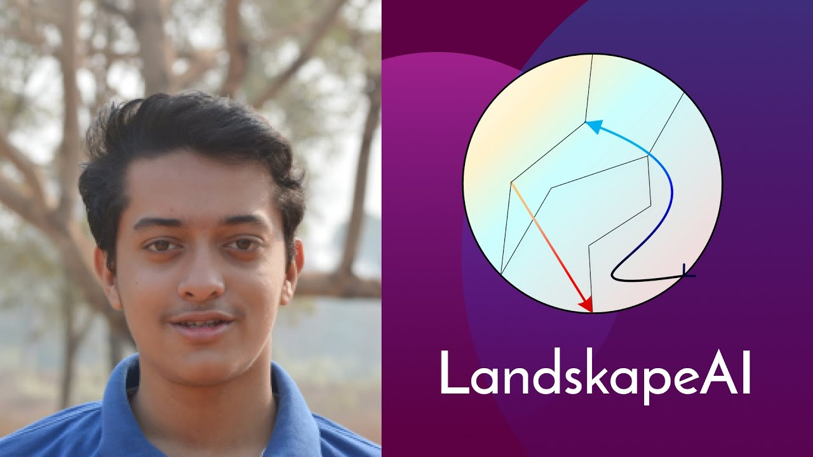
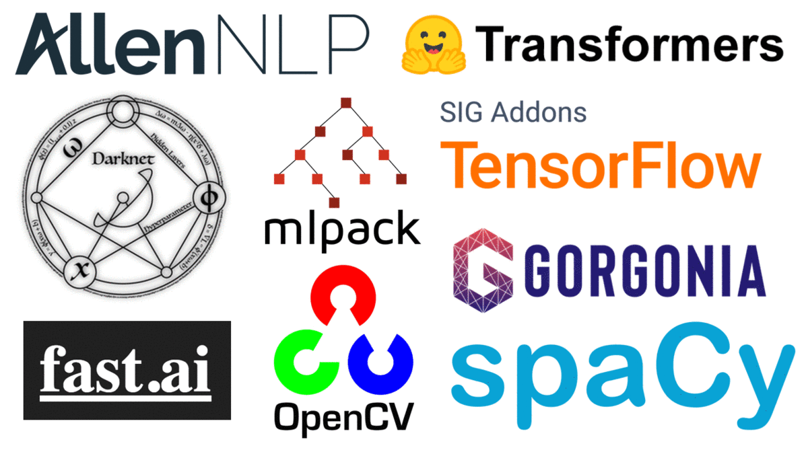
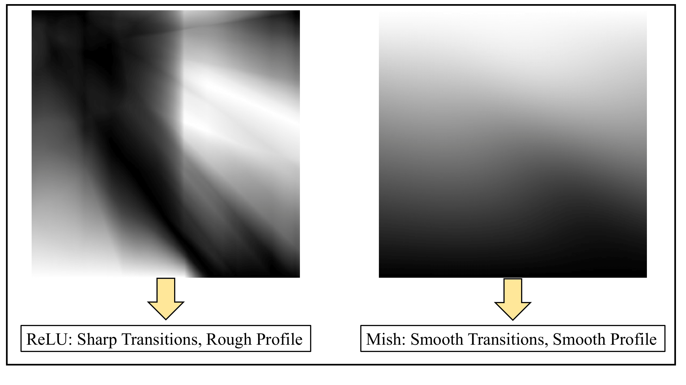

<p align="center">
  
</p>

<p align="center">
    <a href="LICENSE" alt="License">
        </a>
    <a href="http://hits.dwyl.io/digantamisra98/Mish" alt="HitCount">
        </a>
    <a href="https://arxiv.org/abs/1908.08681v3" alt="ArXiv">
        </a>
    <a href="https://scholar.googleusercontent.com/scholar.bib?q=info:j0C1gbodjP4J:scholar.google.com/&output=citation&scisdr=CgX0hbDMEOzUo74J6TM:AAGBfm0AAAAAX1QM8TNcu4tND6FEofKsXzM3cs1uCAAW&scisig=AAGBfm0AAAAAX1QM8Y5elaJ1IW-BKOuU1zFTYNp-QaNQ&scisf=4&ct=citation&cd=-1&hl=en" alt="Cite">
          </a>
     <a href=" " alt="Citations">
          </a>
    <a href="https://www.bmvc2020-conference.com/conference/papers/paper_0928.html" alt="Publication">
          </a>
     <a href="https://twitter.com/DigantaMisra1" alt="Twitter">
          </a>
</p>


<h1 align="center">Mish: Self Regularized <br> Non-Monotonic Activation Function</h1>
<p align="center">BMVC 2020 <a href="https://www.bmvc2020-conference.com/assets/papers/0928.pdf" target="_blank">(Official Paper)</a></p>

<br>
<br>

<details>
  <summary>Notes: (Click to expand)</summary>
  
  * A considerably faster version based on CUDA can be found here - [Mish CUDA](https://github.com/thomasbrandon/mish-cuda) (All credits to Thomas Brandon for the same) 
  * Memory Efficient Experimental version of Mish can be found [here](https://github.com/rwightman/gen-efficientnet-pytorch/blob/8795d3298d51ea5d993ab85a222dacffa8211f56/geffnet/activations/activations_autofn.py#L41)  
  * Faster variants for Mish and H-Mish by [Yashas Samaga](https://github.com/YashasSamaga) can be found here - [ConvolutionBuildingBlocks](https://github.com/YashasSamaga/ConvolutionBuildingBlocks) 
  * Alternative (experimental improved) variant of H-Mish developed by [Páll Haraldsson](https://github.com/PallHaraldsson) can be found here - [H-Mish](https://github.com/PallHaraldsson/H-Mish/blob/master/README.md) (Available in Julia)   
  * Variance based initialization method for Mish (experimental) by [Federico Andres Lois](https://twitter.com/federicolois) can be found here - [Mish_init](https://gist.github.com/redknightlois/b5d36fd2ae306cb8b3484c1e3bcce253)
</details>


<details>
  <summary>Changelogs/ Updates: (Click to expand)</summary>
  
  * [07/17] Mish added to [OpenVino](https://github.com/openvinotoolkit/openvino) - [Open-1187](https://github.com/openvinotoolkit/openvino/pull/1187), [Merged-1125](https://github.com/openvinotoolkit/openvino/pull/1125)
  * [07/17] Mish added to [BetaML.jl](https://github.com/sylvaticus/BetaML.jl) 
  * [07/17] Loss Landscape exploration progress in collaboration with [Javier Ideami](https://ideami.com/ideami/) and [Ajay Uppili Arasanipalai](https://github.com/iyaja) <br>
  * [07/17] Poster accepted for presentation at [DLRLSS](https://dlrlsummerschool.ca/) hosted by [MILA](https://mila.quebec/en/), [CIFAR](https://www.cifar.ca/), [Vector Institute](https://vectorinstitute.ai/) and [AMII](https://www.amii.ca/)
  * [07/20] Mish added to [Google's AutoML](https://github.com/google/automl) - [502](https://github.com/google/automl/commit/28cf011689dacda90fe1ae6da59b92c0d3f2c9d9)
  * [07/27] Mish paper accepted to [31st British Machine Vision Conference (BMVC), 2020](https://bmvc2020.github.io/index.html). ArXiv version to be updated soon. 
  * [08/13] New updated PyTorch benchmarks and pretrained models available on [PyTorch Benchmarks](https://github.com/digantamisra98/Mish/tree/master/PyTorch%20Benchmarks). 
  * [08/14] New updated [Arxiv](https://arxiv.org/abs/1908.08681v3) version of the paper is out. 
  * [08/18] Mish added to [Sony Nnabla](https://github.com/sony/nnabla) - [Merged-700](https://github.com/sony/nnabla/pull/700)
  * [09/02] Mish added to [TensorFlow Swift APIs](https://github.com/tensorflow/swift-apis) - [Merged - 1068](https://github.com/tensorflow/swift-apis/commit/c1d822535c458a925087298289aa63b3535c0196)
  * [06/09] Official paper and presentation video for BMVC is released at this [link](https://www.bmvc2020-conference.com/conference/papers/paper_0928.html).
  * [23/09] CSP-p7 + Mish (multi-scale) is currently the SOTA in Object Detection on MS-COCO test-dev while CSP-p7 + Mish (single-scale) is currently the 3rd best model in Object detection on MS-COCO test dev. Further details on [paperswithcode leaderboards](https://paperswithcode.com/sota/object-detection-on-coco).
  * [11/11] Mish added to [TFLearn](https://github.com/tflearn/tflearn) - [Merged 1159 (Follow up 1141)](https://github.com/tflearn/tflearn/pull/1159)
  * [17/11] Mish added to [MONAI](https://github.com/Project-MONAI/MONAI) - [Merged 1235](https://github.com/Project-MONAI/MONAI/pull/1235)
  * [20/11] Mish added to [plaidml](https://github.com/plaidml/plaidml) - [Merged 1566](https://github.com/plaidml/plaidml/pull/1566)
  * [10/12] Mish added to [Simd](http://ermig1979.github.io/Simd/) and [Synet](https://github.com/ermig1979/Synet) - [Docs](http://ermig1979.github.io/Simd/help/group__synet__activation.html#ga0dc8979a94ceaaf82dee82c4761e4afc)
  * [14/12] Mish added to [OneFlow](https://github.com/Oneflow-Inc/oneflow) - [Merged 3972](https://github.com/Oneflow-Inc/oneflow/pull/3972)
   
</details>

### News/ Media Coverage:

- (02/2020): Podcast episode on Mish at [Machine Learning Café](http://podcast.machinelearningcafe.org/website/mish-activation-function-with-diganta-misra-007) is out now. Listen on: 
<p float="center">
  &emsp;
  &emsp;
  <a href="https://podcasts.apple.com/hu/podcast/mish-activation-function-with-diganta-misra-007/id1490681799?i=1000464407163" alt="Apple Podcasts">
        </a>
  <a href="https://open.spotify.com/episode/4sT9sxjSbAKtvJ6hTFg9zc" alt="Spotify">
        </a>
</p>

- (02/2020): Talk on Mish and Non-Linear Dynamics at [Sicara](https://www.sicara.ai/) is out now. Watch on:
<p float="center">
  &emsp;
  &emsp;
  <a href="https://youtu.be/T2CRFROKcLM" alt="YouTube">
        </a>
</p>

- (07/2020): CROWN: A comparison of morphology for Mish, Swish and ReLU produced in collaboration with [Javier Ideami](https://ideami.com/ideami/). Watch on:
<p float="center">
  &emsp;
  &emsp;
  <a href="https://www.youtube.com/watch?v=XRGu23hfzaQ" alt="YouTube">
        </a>
</p>

- (08/2020): Talk on Mish and Non-Linear Dynamics at [Computer Vision Talks](https://computervisiontalks.github.io/). Watch on:
<p float="center">
  &emsp;
  &emsp;
  <a href="https://youtu.be/whOdg-yrgdI" alt="YouTube">
        </a>
</p>


- (12/2020): Talk on *From Smooth Activations to Robustness to Catastrophic Forgetting* at [Weights & Biases Salon](https://www.youtube.com/playlist?list=PLD80i8An1OEH3ejAj8R8dy74JeSzY8kGt) is out now. Watch on:
<p float="center">
  &emsp;
  &emsp;
  <a href="https://www.youtube.com/watch?v=1U-7TWysqIg" alt="YouTube">
        </a>
  <br>
  <br>
  <a href="https://www.youtube.com/watch?v=1U-7TWysqIg"></a>
  <a href="https://docs.google.com/presentation/d/e/2PACX-1vSzef6CPMt028oX-7NMRpg6UCvoVvsTkfpbTguF9H2iyzoQu98GMw6XZ6NCF4L7_yi9249WitMGzOX4/pub?start=false&loop=false&delayms=3000"></a>
</p>

- (12/2020) [Weights & Biases](https://www.wandb.com/) integration is now added 🔥. [Get started](https://github.com/digantamisra98/Mish/tree/master/exps).


## Official Package Based Implementations: 

<div style="text-align:center"></div>

<br>

<details>
  <summary><a href="https://dlrl.ca/"><b>MILA/ CIFAR 2020 DLRLSS</b></a> (Click on arrow to view)</summary>
  
  <div style="text-align:center"></div>

</details>

<br>

<details>
  <summary><b>Contents</b>: (Click to expand)</summary>

  1. [Mish](https://github.com/digantamisra98/Mish/blob/master/README.md#mish) <br>
     a. [Loss landscape](https://github.com/digantamisra98/Mish#loss-landscape) 
  2. [ImageNet Scores](https://github.com/digantamisra98/Mish#imagenet-scores)
  3. [MS-COCO](https://github.com/digantamisra98/Mish#ms-coco)
  4. [Variation of Parameter Comparison](https://github.com/digantamisra98/Mish#variation-of-parameter-comparison)<br>
     a. [MNIST](https://github.com/digantamisra98/Mish#mnist)<br>
     b. [CIFAR10](https://github.com/digantamisra98/Mish#cifar10)<br>
  5. [Significance Level](https://github.com/digantamisra98/Mish#significance-level) <br>
  6. [Results](https://github.com/digantamisra98/Mish#results)<br>
     a. [Summary of Results (Vision Tasks)](https://github.com/digantamisra98/Mish#summary-of-results-vision-tasks)<br>
     b. [Summary of Results (Language Tasks)](https://github.com/digantamisra98/Mish#summary-of-results-language-tasks)<br>
  7. [Try It!](https://github.com/digantamisra98/Mish#try-it)<br>
  8. Future Work
  9. Acknowledgements
  10. [Cite this work](https://github.com/digantamisra98/Mish#cite-this-work)

</details>

<br>

# Mish:

<p align="left">
  
</p>

<a href="https://www.codecogs.com/eqnedit.php?latex=f(x)&space;=&space;x\tanh&space;(softplus(x))&space;=&space;x\tanh(\ln&space;(1&space;&plus;&space;e^{x}))" target="_blank"></a>

Minimum of *f(x)* is observed to be ≈-0.30884 at *x*≈-1.1924<br>
Mish has a parametric order of continuity of: C<sup>∞</sup>

Derivative of Mish with respect to Swish and Δ(x) preconditioning:

<p align="left">
  
</p>

<a href="https://www.codecogs.com/eqnedit.php?latex=f'(x)&space;=&space;(sech^{2}(softplus(x)))(xsigmoid(x))&space;&plus;&space;\frac{f(x)}{x}" target="_blank"></a>

Further simplifying:

<a href="https://www.codecogs.com/eqnedit.php?latex=f'(x)&space;=&space;\Delta(x)swish(x)&space;&plus;&space;\frac{f(x)}{x}" target="_blank"></a>

Alternative derivative form:

<a href="https://www.codecogs.com/eqnedit.php?latex=f'(x)&space;=&space;\frac{e^{x}\omega}{\delta^{2}}" target="_blank"></a>

where:

<a href="https://www.codecogs.com/eqnedit.php?latex=\omega&space;=&space;4(x&plus;1)&plus;4e^{2x}&space;&plus;e^{3x}&space;&plus;e^{x}(4x&plus;6)" target="_blank"></a>

<a href="https://www.codecogs.com/eqnedit.php?latex=\delta&space;=&space;2e^{x}&space;&plus;e^{2x}&space;&plus;2" target="_blank"></a>

We hypothesize the Δ(x) to be exhibiting the properties of a pre-conditioner making the gradient more smoother. Further details are provided in the paper.

## Loss Landscape:

Loss landscape visualizations for a ResNet-20 for CIFAR 10 using ReLU, Mish and Swish (from L-R) for 200 epochs training: 

<div style="text-align:center"></div>

<br>

Mish provides much better accuracy, overall lower loss, smoother and well conditioned easy-to-optimize loss landscape as compared to both Swish and ReLU. For all loss landscape visualizations please visit this [readme](https://github.com/digantamisra98/Mish/blob/master/landscapes/Landscape.md). 

We also investigate the output landscape of randomly initialized neural networks as shown below. Mish has a much smoother profile than ReLU.

<div style="text-align:center"></div>

## ImageNet Scores:

[](https://paperswithcode.com/sota/image-classification-on-imagenet?p=mish-a-self-regularized-non-monotonic-neural)

*For Installing DarkNet framework, please refer to [darknet(Alexey AB)](https://github.com/AlexeyAB/darknet)*

*For PyTorch based ImageNet scores, please refer to this [readme](https://github.com/digantamisra98/Mish/tree/master/PyTorch%20Benchmarks)*

|Network|Activation|Top-1 Accuracy|Top-5 Accuracy|cfg|Weights|Hardware|
|:---:|:---:|:---:|:---:|:---:|:---:|:---:|
|ResNet-50|Mish|74.244%|92.406%|[cfg](https://github.com/digantamisra98/Mish/blob/master/cfg/resnet50-mish.cfg)|[weights](https://drive.google.com/file/d/12rZ3F570JJ5p2C_AHRP_dzlrdq5-liaj/view?usp=sharing)|[AWS p3.16x large, 8 Tesla V100](https://aws.amazon.com/ec2/instance-types/p3/)|
|DarkNet-53|Mish|77.01%|93.75%|[cfg](https://github.com/digantamisra98/Mish/blob/master/cfg/darknet53-mish.cfg)|[weights](https://drive.google.com/file/d/1rkM3Mz2Tf27IoSwFIMiwtgDfhT-MuF_u/view?usp=sharing)|[AWS p3.16x large, 8 Tesla V100](https://aws.amazon.com/ec2/instance-types/p3/)|
|DenseNet-201|Mish|76.584%|93.47%|[cfg](https://github.com/digantamisra98/Mish/blob/master/cfg/densenet201-mish.cfg)|[weights](https://drive.google.com/file/d/1RURL4JLbECYfHVArQ71lfFUiujFEYJvl/view?usp=sharing)|[AWS p3.16x large, 8 Tesla V100](https://aws.amazon.com/ec2/instance-types/p3/)|
|ResNext-50|Mish|77.182%|93.318%|[cfg](https://github.com/digantamisra98/Mish/blob/master/cfg/resnext50-mish.cfg)|[weights](https://drive.google.com/file/d/1IN4lpFfQYnaVtdnNPSl83vE4ew2OQPN_/view?usp=sharing)|[AWS p3.16x large, 8 Tesla V100](https://aws.amazon.com/ec2/instance-types/p3/)|

|Network|Activation|Top-1 Accuracy|Top-5 Accuracy|
|:---:|:---:|:---:|:---:|
|[CSPResNet-50](https://github.com/WongKinYiu/CrossStagePartialNetworks)|Leaky ReLU|77.1%|94.1%|
|[CSPResNet-50](https://github.com/WongKinYiu/CrossStagePartialNetworks)|Mish|**78.1%**|**94.2%**|
|||||
|[Pelee Net](https://arxiv.org/abs/1804.06882)|Leaky ReLU|70.7%|90%|
|[Pelee Net](https://arxiv.org/abs/1804.06882)|Mish|71.4%|90.4%|
|[Pelee Net](https://arxiv.org/abs/1804.06882)|Swish|**71.5%**|**90.7%**|
|||||
|[CSPPelee Net](https://github.com/WongKinYiu/CrossStagePartialNetworks)|Leaky ReLU|70.9%|90.2%|
|[CSPPelee Net](https://github.com/WongKinYiu/CrossStagePartialNetworks)|Mish|**71.2%**|**90.3%**|

Results on [CSPResNext-50](https://github.com/WongKinYiu/CrossStagePartialNetworks):

|[MixUp](https://arxiv.org/abs/1710.09412)|[CutMix](https://arxiv.org/abs/1905.04899)|Mosaic|Blur|Label Smoothing|Leaky ReLU|Swish|Mish|Top -1 Accuracy| Top-5 Accuracy|cfg|weights|
|:---:|:---:|:---:|:---:|:---:|:---:|:---:|:---:|:---:|:---:|:---:|:---:|
||||||:heavy_check_mark:|||77.9%(=)|94%(=)|||
|:heavy_check_mark:|||||:heavy_check_mark:|||77.2%(-)|94%(=)|||
||:heavy_check_mark:||||:heavy_check_mark:|||78%(+)|94.3%(+)|||
|||:heavy_check_mark:|||:heavy_check_mark:|||78.1%(+)|94.5%(+)|||
||||:heavy_check_mark:||:heavy_check_mark:|||77.5%(-)|93.8%(-)|||
|||||:heavy_check_mark:|:heavy_check_mark:|||78.1%(+)|94.4%(+)|||
|||||||:heavy_check_mark:||64.5%(-)|86%(-)|||
||||||||:heavy_check_mark:|78.9%(+)|94.5%(+)|||
||:heavy_check_mark:|:heavy_check_mark:||:heavy_check_mark:|:heavy_check_mark:|||78.5%(+)|94.8%(+)|||
||:heavy_check_mark:|:heavy_check_mark:||:heavy_check_mark:|||:heavy_check_mark:|**79.8%**(+)|**95.2%**(+)|[cfg](https://github.com/digantamisra98/Mish/blob/master/cfg/csresnext50-omega.cfg)|[weights](https://drive.google.com/file/d/11mQ6Avuh0eyRpg0rGTyoR-VmGF1ErTe7/view?usp=sharing)|

Results on [CSPResNet-50](https://github.com/WongKinYiu/CrossStagePartialNetworks):

[CutMix](https://arxiv.org/abs/1905.04899)|Mosaic|Label Smoothing|Leaky ReLU|Mish|Top -1 Accuracy| Top-5 Accuracy|cfg|weights|
|:---:|:---:|:---:|:---:|:---:|:---:|:---:|:---:|:---:|
||||:heavy_check_mark:||76.6%(=)|93.3%(=)|||
|:heavy_check_mark:|:heavy_check_mark:|:heavy_check_mark:|:heavy_check_mark:||77.1%(+)|94.1%(+)|||
|:heavy_check_mark:|:heavy_check_mark:|:heavy_check_mark:||:heavy_check_mark:|**78.1%**(+)|**94.2%**(+)|[cfg](https://github.com/digantamisra98/Mish/blob/master/cfg/csresnet50-omega.cfg)|[weights](https://drive.google.com/file/d/1h4KpfEF6M-BU7Fz2WBsFwtREW5DO3iGw/view?usp=sharing)|

Results on [CSPDarkNet-53](https://github.com/WongKinYiu/CrossStagePartialNetworks):

[CutMix](https://arxiv.org/abs/1905.04899)|Mosaic|Label Smoothing|Leaky ReLU|Mish|Top -1 Accuracy| Top-5 Accuracy|cfg|weights|
|:---:|:---:|:---:|:---:|:---:|:---:|:---:|:---:|:---:|
||||:heavy_check_mark:||77.2%(=)|93.6%(=)|||
|:heavy_check_mark:|:heavy_check_mark:|:heavy_check_mark:|:heavy_check_mark:||77.8%(+)|94.4%(+)|||
|:heavy_check_mark:|:heavy_check_mark:|:heavy_check_mark:||:heavy_check_mark:|**78.7%**(+)|**94.8%**(+)|[cfg](https://github.com/digantamisra98/Mish/blob/master/cfg/csdarknet53-omega.cfg)|[weights](https://drive.google.com/file/d/1iSQRfeh-Hl1Mp0_oUsGGbd8okoVvlQq0/view?usp=sharing)|

Results on [SpineNet-49](https://arxiv.org/abs/1912.05027):

[CutMix](https://arxiv.org/abs/1905.04899)|Mosaic|Label Smoothing|ReLU|Swish|Mish|Top -1 Accuracy| Top-5 Accuracy|cfg|weights|
|:---:|:---:|:---:|:---:|:---:|:---:|:---:|:---:|:---:|:---:|
||||:heavy_check_mark:|||77%(=)|93.3%(=)|-|-|
|||:heavy_check_mark:||:heavy_check_mark:||78.1%(+)|94%(+)|-|-|
|:heavy_check_mark:|:heavy_check_mark:|:heavy_check_mark:|||:heavy_check_mark:|**78.3%**(+)|**94.6%**(+)|-|-|

## MS-COCO:

[](https://paperswithcode.com/sota/real-time-object-detection-on-coco?p=scaled-yolov4-scaling-cross-stage-partial)
[](https://paperswithcode.com/sota/object-detection-on-coco?p=scaled-yolov4-scaling-cross-stage-partial)

*For PyTorch based MS-COCO scores, please refer to this [readme](https://github.com/digantamisra98/Mish/tree/master/PyTorch%20Benchmarks)*

|Model|Mish|AP50...95|mAP50|CPU - 90 Watt - FP32 (Intel Core i7-6700K, 4GHz, 8 logical cores) OpenCV-DLIE, FPS|VPU-2 Watt- FP16 (Intel MyriadX) OpenCV-DLIE, FPS|GPU-175 Watt- FP32/16 (Nvidia GeForce RTX 2070) DarkNet-cuDNN, FPS|
|:---:|:---:|:---:|:---:|:---:|:---:|:---:|
|[CSPDarkNet-53](https://github.com/WongKinYiu/CrossStagePartialNetworks) (512 x 512)||42.4%|64.5%|3.5|1.23|**43**|
|[CSPDarkNet-53](https://github.com/WongKinYiu/CrossStagePartialNetworks) (512 x 512)|:heavy_check_mark:|**43%**|**64.9%**|-|-|41|
|[CSPDarkNet-53](https://github.com/WongKinYiu/CrossStagePartialNetworks) (608 x 608)|:heavy_check_mark:|**43.5%**|**65.7%**|-|-|26|

|Architecture|Mish|[CutMix](https://arxiv.org/abs/1905.04899)|Mosaic|Label Smoothing|Size|AP|AP50|AP75|
|:---:|:---:|:---:|:---:|:---:|:---:|:---:|:---:|:---:|
|CSPResNext50-PANet-SPP|||||512 x 512|**42.4%**|**64.4%**|**45.9%**|
|CSPResNext50-PANet-SPP||:heavy_check_mark:|:heavy_check_mark:|:heavy_check_mark:|512 x 512|42.3%|64.3%|45.7%|
|CSPResNext50-PANet-SPP|:heavy_check_mark:|:heavy_check_mark:|:heavy_check_mark:|:heavy_check_mark:|512 x 512|42.3%|64.2%|45.8%|
||||||||||
|CSPDarkNet53-PANet-SPP||:heavy_check_mark:|:heavy_check_mark:|:heavy_check_mark:|512 x 512|42.4%|64.5%|46%|
|CSPDarkNet53-PANet-SPP|:heavy_check_mark:|:heavy_check_mark:|:heavy_check_mark:|:heavy_check_mark:|512 x 512|**43%**|**64.9%**|**46.5%**|

Credits to [AlexeyAB](https://github.com/AlexeyAB), [Wong Kin-Yiu](https://github.com/WongKinYiu) and [Glenn Jocher](https://github.com/glenn-jocher) for all the help with benchmarking MS-COCO and ImageNet. 

## Variation of Parameter Comparison:

### MNIST:

To observe how increasing the number of layers in a network while maintaining other parameters constant affect the test accuracy, fully connected networks of varying depths on MNIST, with each layer having 500 neurons were trained. Residual Connections were not used because they enable the training of arbitrarily deep networks. BatchNorm was used to lessen the dependence on initialization along with a dropout of 25%. The network is optimized using SGD on a batch size of 128, and for fair comparison, the same learning rates for each activation function was maintained. In the experiments, all 3 activations maintained nearly the same test accuracy for 15 layered Network. Increasing number of layers from 15 gradually resulted in a sharp decrease in test accuracy for Swish and ReLU, however, Mish outperformed them both in large networks where optimization becomes difficult.

The consistency of Mish providing better test top-1 accuracy as compared to Swish and ReLU was also observed by increasing Batch Size for a ResNet v2-20 on CIFAR-10 for 50 epochs while keeping all other network parameters to be constant for fair comparison.

<p float="left">
  
   
</p>

Gaussian Noise with varying standard deviation was added to the input in case of MNIST classification using a simple conv net to observe the trend in decreasing test top-1 accuracy for Mish and compare it to that of ReLU and Swish. Mish mostly maintained a consistent lead over that of Swish and ReLU (Less than ReLU in just 1 instance and less than Swish in 3 instance) as shown below. The trend for test loss was also observed following the same procedure. (Mish has better loss than both Swish and ReLU except in 1 instance)

<p float="left">
  
   
</p>

### CIFAR10:

<p float="left">
  
  
</p>

## Significance Level: 

The P-values were computed for different activation functions in comparison to that of Mish on terms of Top-1 Testing Accuracy of a Squeeze Net Model on CIFAR-10 for 50 epochs for 23 runs using Adam Optimizer at a Learning Rate of 0.001 and Batch Size of 128. It was observed that Mish beats most of the activation functions at a high significance level in the 23 runs, specifically it beats ReLU at a high significance of P < 0.0001. Mish also had a comparatively lower standard deviation across 23 runs which proves the consistency of performance for Mish.

|Activation Function| Mean Accuracy | Mean Loss| Standard Deviation of Accuracy | P-value | Cohen's d Score | 95% CI| 
|:---:|:---:|:---:|:---:|:---:|:---:|:---:|
|Mish|87.48%|4.13%|0.3967|-|-|-|
|Swish-1|87.32%|4.22%|0.414|P = 0.1973|0.386|-0.3975 to 0.0844|
|E-Swish (β=1.75)|**87.49%**|4.156%|0.411|P = 0.9075|0.034444|-0.2261 to 0.2539|
|GELU|87.37%|4.339%|0.472|P = 0.4003|0.250468|-0.3682 to 0.1499|
|ReLU|86.66%|4.398%|0.584|P < 0.0001|1.645536|-1.1179 to -0.5247|
|ELU(α=1.0)|86.41%|4.211%|**0.3371**|P < 0.0001|2.918232|-1.2931 to -0.8556|
|Leaky ReLU(α=0.3)|86.85%|**4.112%**|0.4569|P < 0.0001|1.47632|-0.8860 to -0.3774|
|RReLU|86.87%|4.138%|0.4478|P < 0.0001|1.444091|-0.8623 to -0.3595|
|SELU|83.91%|4.831%|0.5995|P < 0.0001|7.020812|-3.8713 to -3.2670|
|SoftPlus(β = 1)|83.004%|5.546%|1.4015|P < 0.0001|4.345453|-4.7778 to -4.1735|
|HardShrink(λ = 0.5)|75.03%|7.231%|0.98345|P < 0.0001|16.601747|-12.8948 to -12.0035|
|Hardtanh|82.78%|5.209%|0.4491|P < 0.0001|11.093842|-4.9522 to -4.4486|
|LogSigmoid|81.98%|5.705%|1.6751|P < 0.0001|4.517156|-6.2221 to -4.7753|
|PReLU|85.66%|5.101%|2.2406|P = 0.0004|1.128135|-2.7715 to -0.8590|
|ReLU6|86.75%|4.355%|0.4501|P < 0.0001| 1.711482|-0.9782 to -0.4740|
|CELU(α=1.0)|86.23%|4.243%|0.50941|P < 0.0001| 2.741669|-1.5231 to -0.9804|
|Sigmoid|74.82%|8.127%|5.7662|P < 0.0001|3.098289|-15.0915 to -10.2337|
|Softshrink(λ = 0.5)|82.35%|5.4915%|0.71959|P < 0.0001|8.830541|-5.4762 to -4.7856|
|Tanhshrink|82.35%|5.446%|0.94508|P < 0.0001|7.083564|-5.5646 to -4.7032|
|Tanh|83.15%|5.161%|0.6887|	P < 0.0001|7.700198|-4.6618 to -3.9938|
|Softsign|82.66%|5.258%|0.6697|P < 0.0001|8.761157|-5.1493 to -4.4951|
|Aria-2(β = 1, α=1.5)|81.31%|6.0021%|2.35475|P < 0.0001|3.655362|-7.1757 to -5.1687|
|Bent's Identity|85.03%|4.531%|0.60404|P < 0.0001|4.80211|-2.7576 to -2.1502|
|SQNL|83.44%|5.015%|0.46819|P < 0.0001|9.317237|-4.3009 to -3.7852|
|ELisH|87.38%|4.288%|0.47731|P = 0.4283|0.235784|-0.3643 to 0.1573|
|Hard ELisH|85.89%|4.431%|0.62245|P < 0.0001|3.048849|-1.9015 to -1.2811|
|SReLU|85.05%|4.541%|0.5826|P < 0.0001|4.883831|-2.7306 to -2.1381|
|ISRU (α=1.0)|86.85%|4.669%|0.1106|P < 0.0001|5.302987|-4.4855 to -3.5815|
|Flatten T-Swish|86.93%|4.459%|0.40047|P < 0.0001|1.378742|-0.7865 to -0.3127|
|SineReLU (ε = 0.001)|86.48%|4.396%|0.88062|P < 0.0001|1.461675|-1.4041 to -0.5924|
|Weighted Tanh (Weight = 1.7145)|80.66%|5.985%|1.19868|P < 0.0001|7.638298|-7.3502 to -6.2890|
|LeCun's Tanh|82.72%|5.322%|0.58256|P < 0.0001|9.551812|-5.0566 to -4.4642|
|Soft Clipping (α=0.5)|55.21%|18.518%|10.831994|P < 0.0001|4.210373|-36.8255 to -27.7154|
|ISRLU (α=1.0)|86.69%|4.231%|0.5788|P < 0.0001|1.572874|-1.0753 to -0.4856|

*Values rounded up which might cause slight deviation in the statistical values reproduced from these tests*

## Results:

[](https://paperswithcode.com/sota/image-classification-on-cifar-100?p=mish-a-self-regularized-non-monotonic-neural)
[](https://paperswithcode.com/sota/image-classification-on-cifar-10?p=mish-a-self-regularized-non-monotonic-neural)

*News: [Ajay Arasanipalai](https://github.com/iyaja) recently submitted benchmark for CIFAR-10 training for the [Stanford DAWN Benchmark](https://dawn.cs.stanford.edu/benchmark/#cifar10-train-time) using a [Custom ResNet-9 + Mish](https://github.com/iyaja/cifar-10-faster) which achieved 94.05% accuracy in just 10.7 seconds in 14 epochs on the [HAL Computing Cluster](https://wiki.ncsa.illinois.edu/display/ISL20/HAL+cluster). This is the current fastest training of CIFAR-10 in 4 GPUs and 2nd fastest training of CIFAR-10 overall in the world.*

### Summary of Results (Vision Tasks): 

*Comparison is done based on the high priority metric, for image classification the Top-1 Accuracy while for Generative Networks and Image Segmentation the Loss Metric. Therefore, for the latter, Mish > Baseline is indicative of better loss and vice versa. For Embeddings, the AUC metric is considered.*

|Activation Function| Mish > Baseline Model | Mish < Baseline Model |
|---|---|---|
|ReLU|55|20|
|Swish-1|53|22|
|SELU|26|1|
|Sigmoid|24|0|
|TanH|24|0|
|HardShrink(λ = 0.5)|23|0|
|Tanhshrink|23|0|
|PReLU(Default Parameters)	|23|2|
|Softsign|22|1|
|Softshrink (λ = 0.5)|22|1|
|Hardtanh|21|2|
|ELU(α=1.0)|21|7|
|LogSigmoid|20|4|
|GELU|19|3|
|E-Swish (β=1.75)|19|7|
|CELU(α=1.0)|18|5|
|SoftPlus(β = 1)|17|7|
|Leaky ReLU(α=0.3)|17|8|
|Aria-2(β = 1, α=1.5)|16|2|
|ReLU6|16|8|
|SQNL|13|1|
|Weighted TanH (Weight = 1.7145)|12|1|
|RReLU|12|11|
|ISRU (α=1.0)|11|1|
|Le Cun's TanH|10|2|
|Bent's Identity|10|5|
|Hard ELisH|9|1|
|Flatten T-Swish|9|3|
|Soft Clipping (α=0.5)|9|3|
|SineReLU (ε = 0.001)|9|4|
|ISRLU (α=1.0)|9|4|
|ELisH|7|3|
|SReLU|7|6|
|Hard Sigmoid|1|0|
|Thresholded ReLU(θ=1.0)|1|0|

### Summary of Results (Language Tasks): 

*Comparison is done based on the best metric score (Test accuracy) across 3 runs.*

|Activation Function| Mish > Baseline Model | Mish < Baseline Model |
|---|---|---|
|Penalized TanH|5|0|
|ELU|5|0|
|Sigmoid|5|0|
|SReLU|4|0|
|TanH|4|1|
|Swish|3|2|
|ReLU|2|3|
|Leaky ReLU|2|3|
|GELU|1|2|

## Try It! 

|Torch|DarkNet|MXNet|Julia|FastAI|TensorFlow|Keras|CUDA|
|:---:|:---:|:---:|:---:|:---:|:---:|:---:|:---:|
|[Source](https://github.com/digantamisra98/Mish/tree/master/Mish/Torch)|[Source](https://github.com/AlexeyAB/darknet/blob/master/src/activation_kernels.cu#L259)|[Source](https://github.com/digantamisra98/Mish/blob/master/Mish/MXNet/mish.py)|[Source](https://github.com/FluxML/NNlib.jl/blob/2e1fa5f330ba785b0adbaec5107ca85a8e181197/src/activation.jl)|[Source](https://github.com/lessw2020/mish)|[Source](https://www.tensorflow.org/addons/api_docs/python/tfa/activations/mish)|[Source](https://github.com/digantamisra98/Mish/blob/master/Mish/TFKeras/mish.py)|[Source](https://github.com/thomasbrandon/mish-cuda)|

<details>
  <summary><b>Future Work</b>: (Click to view)</summary>
  
  * Comparison of Convergence Rates.
  * Normalizing constant for Mish to eliminate the use of Batch Norm.
  * Regularizing effect of the first derivative of Mish with repect to Swish. 
  * Memory Efficient Fast implementation of Mish for PyTorch/ CUDA
  * Investigating the loss landscape for Mish.

</details>


<details>
  <summary><b>Acknowledgments:</b> (Click to expand)</summary>
  
  Thanks to all the people who have helped and supported me massively through this project who include:
  1. [Sparsha Mishra](https://github.com/SparshaMishra)
  2. [Alexandra Deis](https://github.com/Lexie88rus)
  3. [Alexey Bochkovskiy](https://github.com/AlexeyAB)
  4. [Chien-Yao Wang](https://github.com/WongKinYiu/CrossStagePartialNetworks)
  5. [Thomas Brandon](https://github.com/thomasbrandon)
  6. [Less Wright](https://github.com/lessw2020)
  7. [Manjunath Bhat](https://github.com/thebhatman)
  8. [Ajay Uppili Arasanipalai](https://github.com/iyaja)
  9. [Federico Lois](https://github.com/redknightlois)
  10. [Javier Ideami](https://github.com/javismiles)
  11. [Ioannis Anifantakis](https://github.com/ioannisa)
  12. [George Christopoulos](https://github.com/geochri)
  13. [Miklos Toth](https://hu.linkedin.com/in/miklostoth)

  And many more including the [Fast AI community](https://forums.fast.ai/t/meet-mish-new-activation-function-possible-successor-to-relu/53299/647), [Weights and Biases Community](https://www.wandb.com/), [TensorFlow Addons team](https://www.tensorflow.org/addons), [SpaCy/Thinc team](https://explosion.ai/), [Sicara team](https://www.sicara.fr/), [Udacity scholarships team](https://www.udacity.com/scholarships) to name a few. *Apologies if I missed out anyone.*

</details>

## Cite this work:

```
@article{misra2019mish,
  title={Mish: A self regularized non-monotonic neural activation function},
  author={Misra, Diganta},
  journal={arXiv preprint arXiv:1908.08681},
  year={2019}
}
```
