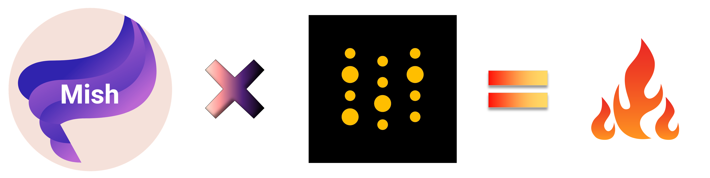

  

<h1 align="center">Mish Activation Function experiments with </h1>

    
       

To run, simply follow the Notebook linked above in the Colab badge. 
Additionally to benchmark ResNets with Mish on CIFAR, you can run this [notebook](https://github.com/digantamisra98/Mish/blob/master/exps/Mish_CIFAR.ipynb). 

Live Weights & Biases Dashboard for Mish can be found [here](https://wandb.ai/diganta/Mish?workspace=user-diganta).

    Made with ❤️ and ⚡

