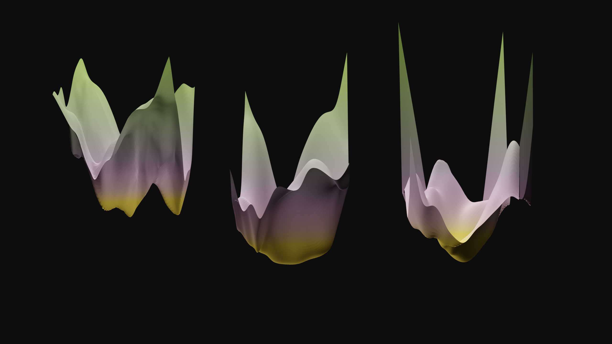
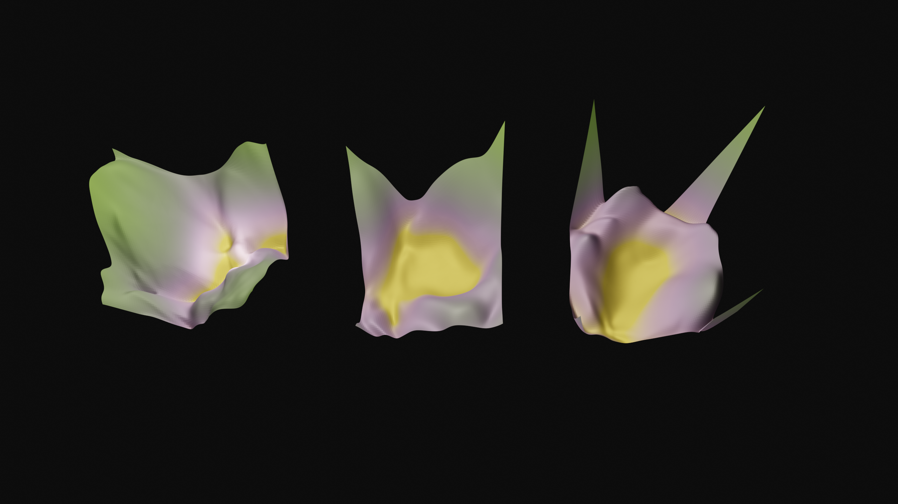
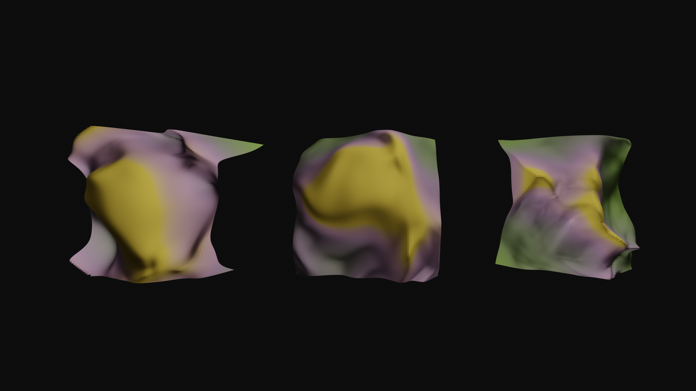
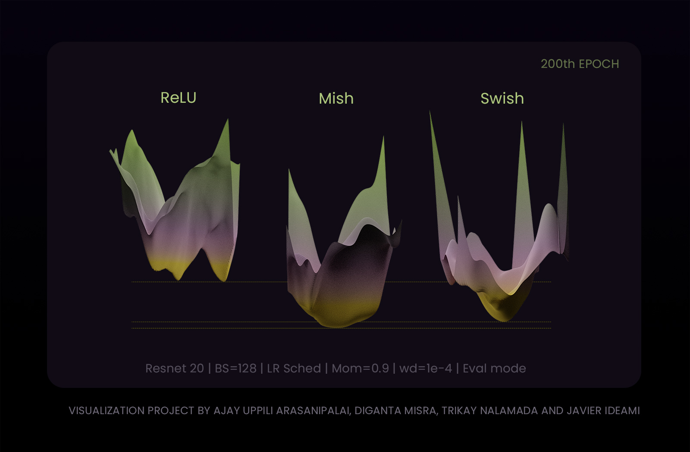
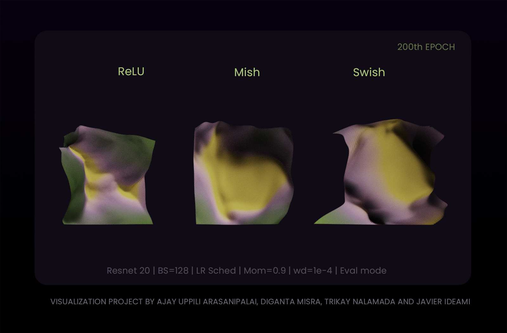

# Loss landscape visualizations 

Credits to [Ajay Arasanipalai](https://github.com/iyaja) for his help in this project and to [Javier Ideami](https://ideami.com/), founder of [losslandscape.com](https://losslandscape.com/) for creating the stunning visualizations

Check out Javier's talk at the [Synthetic Intelligence Forum](https://www.meetup.com/Toronto-Synthetic-Intelligence-Forum/) on more details regarding these observations. 

*Note - For unlabelled images, the order is ReLU -> Mish -> Swish (from left to right)*

